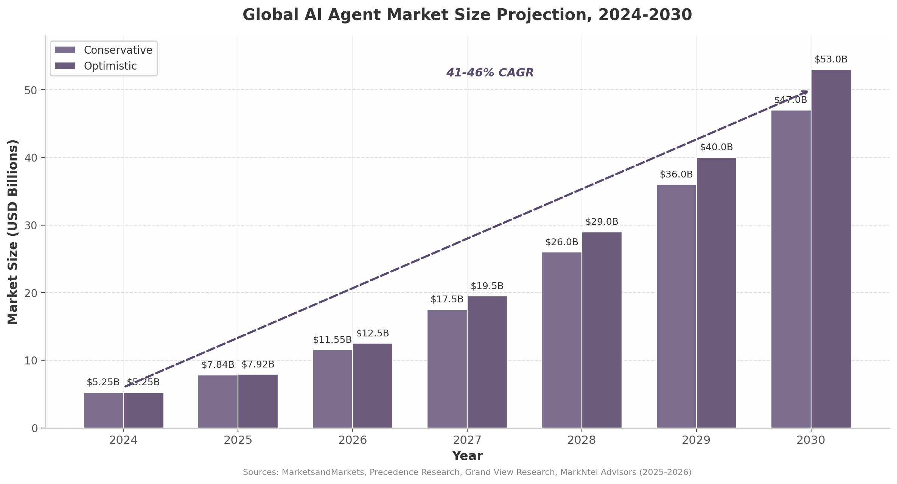
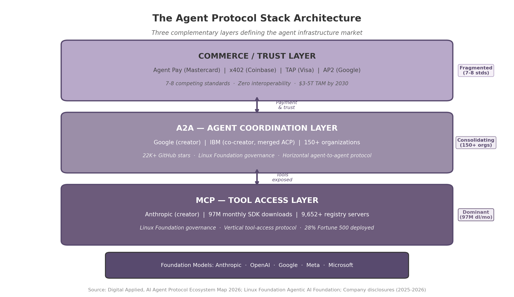
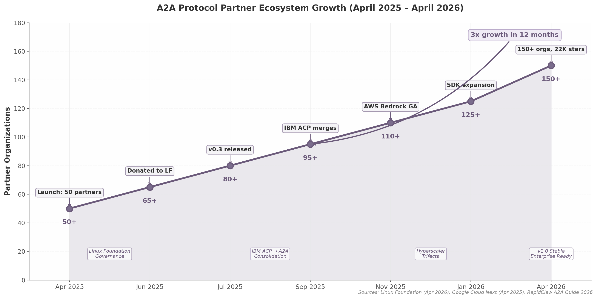
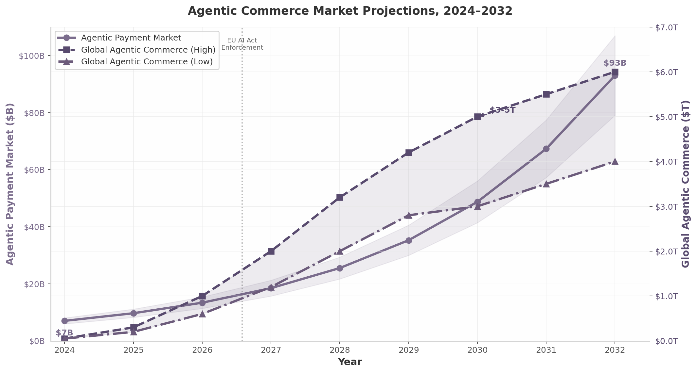
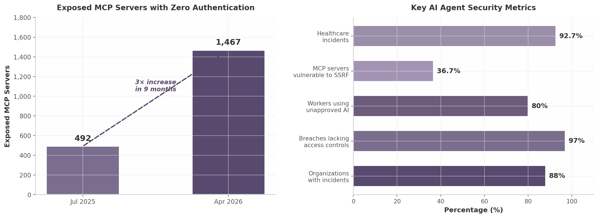
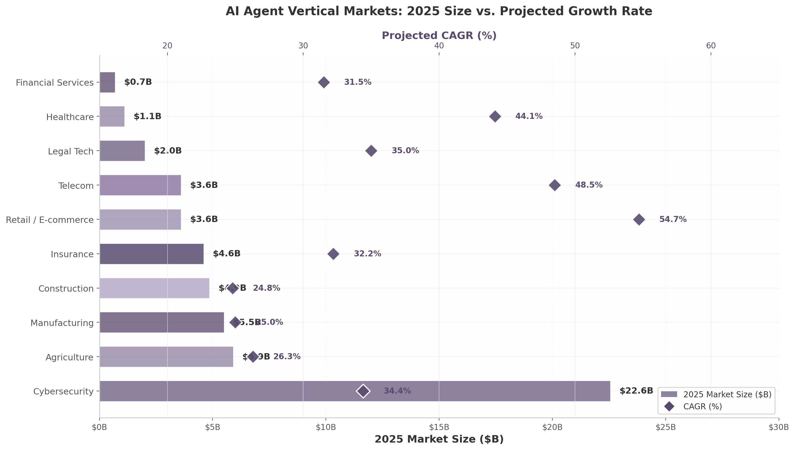
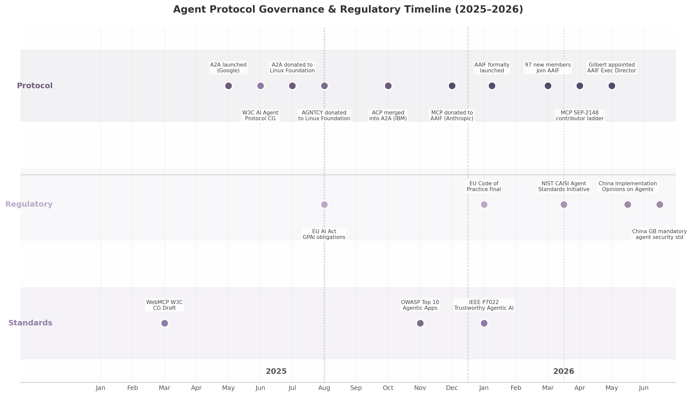
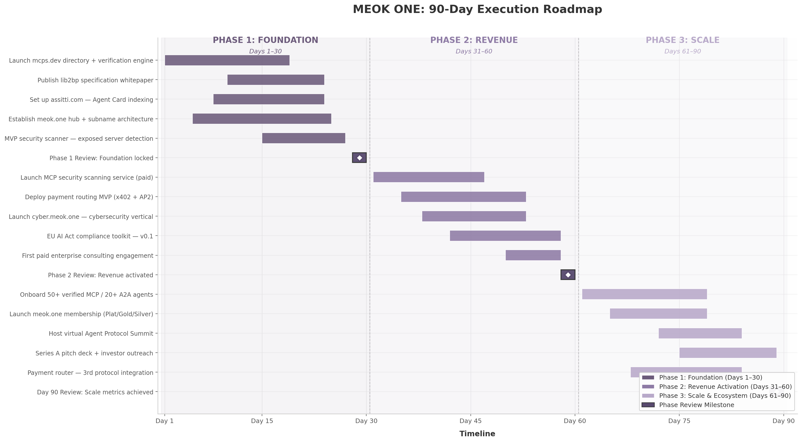

## Executive Summary

The AI agent infrastructure market is experiencing the fastest capital deployment and technology adoption cycle in the history of enterprise software. Global venture funding reached $300 billion in Q1 2026, with AI companies capturing $242 billion — 80% of all funding, the highest sector concentration in venture history [^1^][^25^]. Within this torrent of capital, a three-layer protocol architecture is crystallizing: the Model Context Protocol (MCP) for agent-to-tool connectivity, the Agent-to-Agent (A2A) protocol for inter-agent coordination, and a commerce layer for autonomous payment and trust. Together, these protocols will mediate an estimated $3–5 trillion in agentic commerce by 2030 [^135^]. The MEOK ONE domain portfolio — mcps, a2a, acp, lib2bp, assitti, vall, and meok.one — maps directly onto this architecture, creating a once-in-a-generation opportunity to own the canonical namespace for the infrastructure layer of the autonomous economy.

### The Strategic Landscape

MCP has won the tool-access layer. Created by Anthropic and donated to the Linux Foundation's Agentic AI Foundation in December 2025, MCP achieved 97 million monthly SDK downloads by early 2026, with over 9,652 registered servers in the official registry and tens of thousands more across third-party indexes [^166^][^11^]. All three hyperscalers have adopted it, as have Salesforce, ServiceNow, SAP, and 28% of Fortune 500 companies [^24^]. A2A has consolidated the agent-coordination layer. Google's protocol, launched with 50 partners in April 2025, expanded to 150+ organizations and 22,000+ GitHub stars within a year, with IBM merging its competing ACP into A2A in September 2025 [^2^][^51^]. Both protocols now sit under Linux Foundation governance, with the Agentic AI Foundation growing to over 170 member organizations in under four months — more than double CNCF's membership at the same stage [^13^].

The commerce layer, by contrast, remains the most contested and potentially the most valuable battleground. Seven to eight competing payment standards — Google's AP2, Mastercard's Agent Pay, Visa's TAP, Coinbase's x402, Stripe's MPP, OKX's APP, and American Express ACE — are vying for dominance with zero interoperability between them [^86^][^131^][^97^]. Analyst consensus projects consolidation to 2–3 survivors by 2028 [^97^]. McKinsey estimates the transaction volume at $3–5 trillion globally by 2030, with the US B2C retail segment alone reaching $900 billion to $1 trillion [^135^]. An aggregator that speaks all protocols and routes transactions optimally — the "Stripe for agent payments" — would capture value from fragmentation at 1–3% per transaction, yielding $3–5 billion in revenue at scale [^135^].

Security is simultaneously the binding constraint and the largest untapped opportunity. Eighty-eight percent of organizations experienced confirmed or suspected AI agent security incidents in the past year, 1,467 MCP servers were found exposed on the public internet (a near-tripling in nine months), and an estimated 1.5 million agents operate without monitoring across US and UK large firms alone [^377^][^185^][^388^]. Observability platforms command the highest margins in the ecosystem — 70–80%, per the LangSmith model — yet the segment remains dramatically undersupplied [^280^]. Enterprises cannot adopt agents at scale without solving security, but the tooling barely exists.

### The MEOK ONE Opportunity at a Glance

| Metric | Value | Source / Context |
|:---|:---:|:---|
| **Global AI agent market (2025)** | $7.84B [^3^] | 46.3% CAGR through 2030 |
| **Global AI agent market (2030 projection)** | $42.7B–$52.6B [^3^][^22^] | MarketsandMarkets high estimate: $52.62B |
| **Agentic commerce TAM (2030)** | $3.0T–$5.0T [^135^] | McKinsey global; Morgan Stanley: $190–385B US e-commerce |
| **MCP monthly SDK downloads** | 97M [^166^] | Universal platform adoption |
| **A2A partner organizations** | 150+ [^2^] | All 3 hyperscalers integrated |
| **Commerce protocols (competing)** | 7–8 [^97^] | Zero interoperability |
| **Exposed MCP servers** | 1,467 [^185^] | 3× increase in 9 months |
| **Organizations with agent security incidents** | 88% [^377^] | Gravitee 2026 enterprise survey |
| **Unmonitored agents (US/UK large firms)** | 1.5M [^388^] | Estimated active deployments |
| **Vertical agent CAGR (2025–2030)** | 62.7% [^583^] | 35% faster than horizontal platforms (46.3%) |
| **EU AI Act full enforcement** | August 2, 2026 [^536^] | 12-month compliance arbitrage window |
| **Domain portfolio: mcps valuation (protocol-aligned)** | $150K–$750K | 3× standalone multiplier |
| **Domain portfolio: a2a valuation (protocol-aligned)** | $150K–$900K | 3× standalone multiplier |
| **Year 1 revenue projection** | $95K–$200K | Namespace + consulting foundation |
| **Year 2 revenue projection** | $375K–$1.025M | Observability + payment router added |
| **Year 3 revenue projection** | $1.5M–$4.45M | Full platform economics at scale |
| **Combined 3-year revenue (optimistic)** | $5.7M+ | 22× growth from Year 1 to Year 3 |

The arithmetic is stark: a $3–5 trillion commerce market mediated by protocols that are still consolidating, secured by infrastructure that barely exists, and governed by standards that are still being written. The domain portfolio positions MEOK ONE at the intersection of all three forces — adoption velocity, security desperation, and standards ambiguity.

### Seven Strategic Initiatives

The blueprint organizes around seven initiatives sequenced by time-to-market. Initiatives 1, 5, 6, and 7 launch within six months — coordination and verification plays leveraging existing domain positioning. Initiatives 2 and 3 require twelve months of engineering. Initiative 4 carries the longest timeline because category creation demands specification writing and ecosystem cultivation before revenue materializes.

**Initiative 1 — Namespace Trust Layer (mcps, a2a, acp).** With 52% of registered MCP servers non-functional or dead and no canonical verification authority in existence, the verified registry opportunity is immediate [^166^]. The model draws from certificate authorities ($50–500/year for SSL verification) and ENS ($55 million in protocol revenue in 2022) [^337^]. Free basic listing plus premium verification captures developer mindshare no competitor has claimed.

**Initiative 2 — Security/Observability Hub (meok.one/security).** The convergence of 88% incident rates, 1.5 million unmonitored agents, and 70–80% margins creates the single largest revenue opportunity in the agent ecosystem [^168^][^280^]. LangSmith reached a $1.25 billion valuation on trace-based billing; HashiCorp built a $6.4 billion enterprise value on 82.1% gross margins by monetizing operational tools for open-source infrastructure [^232^].

**Initiative 3 — Payment Router (acp).** An aggregator across 7–8 fragmented commerce protocols, charging 1–3% per transaction. At $3–5 trillion in agentic commerce by 2030, even 0.1% capture yields $3–5 billion in revenue [^135^]. Nevermined raised $7 million to build "PayPal for AI" payment rails, confirming investor interest [^408^].

**Initiative 4 — lib2bp Process Protocol (lib2bp).** MCP connects tools. A2A connects agents. But no protocol connects software libraries to business processes. lib2bp defines an entirely new category — the "process protocol" — with zero direct competition, following the Kubernetes playbook of standard definition, foundation donation, and managed-service capture.

**Initiative 5 — Assitti Agent Discovery (assitti).** Every A2A agent publishes an Agent Card, but no central directory exists to search, filter, and verify them. assitti becomes the "LinkedIn for AI agents" — monetized through promoted listings, verification fees, and API access.

**Initiative 6 — Vertical Sub-brands (finance/legal/health.meok.one).** Vertical-specific agent solutions outperform horizontal platforms on every metric: 35% faster growth (62.7% vs. 46.3% CAGR), higher willingness to pay, shorter sales cycles, and stickier relationships [^583^]. Cybersecurity commands a $22.56 billion market [^619^]; insurance claims automation delivers 40–70% cycle reductions [^88^]; healthcare presents a $6.92 billion opportunity by 2030 [^535^].

**Initiative 7 — Ecosystem Hub (meok.one).** CNCF platinum membership costs $500,000 per year; meok.one positions as the "CNCF for agent protocols" — complementing AAIF with developer-facing coordination, certification programs, and community infrastructure [^663^][^544^].

### Two Windows Closing

Two time-bounded factors make immediate action essential. First, the EU AI Act reaches full enforcement on August 2, 2026 — a standards-free zone where compliant agent tooling has no established authority [^536^]. First movers that ship EU-compliant governance tools before this deadline define what "compliant" means and capture European enterprise budgets before competitors adapt. Second, protocol consolidation is happening now. MCP and A2A are already under Linux Foundation governance; the 7–8 commerce protocols are projected to consolidate to 2–3 survivors by 2028 [^97^]. The namespace authority that establishes itself while standards are still fluid becomes the default trust anchor when the ecosystem matures. Waiting 12 months means competing against entrenched authorities rather than defining the category.

The risk of inaction is quantified. Every month without the verified registry is a month in which malicious actors exploit 1,467 exposed MCP servers lacking any canonical verification authority [^185^]. Every quarter without the observability hub is a quarter in which competitors capture enterprise security budgets that the EU AI Act's August 2026 enforcement will unlock [^536^]. Every six months of delay on the payment router is six months in which Nevermined, Visa, or Stripe solidify their positions as the default aggregation layer [^408^].

### The Call to Action

The MEOK ONE blueprint spans all layers of the agent protocol stack — tool access (mcps), agent coordination (a2a), commerce and trust (acp), process orchestration (lib2bp), agent discovery (assitti), URL infrastructure (vall), and ecosystem coordination (meok.one) — creating a vertically integrated ecosystem where each layer reinforces all others. No single competitor owns all these layers. Anthropic owns MCP but not A2A. Google owns A2A but not MCP tooling or payment routing. The domain portfolio provides a structural headstart that no amount of capital can replicate.

The three-year revenue trajectory projects from $95,000–$200,000 in Year 1 to $375,000–$1.025 million in Year 2 to $1.5 million–$4.45 million in Year 3 — a 22× growth multiple in the optimistic scenario, with platform revenue carrying 70–80% margins growing from 37% to 67% of the total mix. The chapters that follow provide the complete evidence base: market sizing (Chapter 1), MCP ecosystem (Chapter 2), A2A protocol (Chapter 3), agent commerce (Chapter 4), competitive landscape (Chapter 5), business models (Chapter 6), security and trust (Chapter 7), vertical industries (Chapter 8), standards governance (Chapter 9), and the complete domination blueprint (Chapter 10). The data is extensive, the opportunity is quantified, and the window is open. The agent protocol economy has already emerged. The question is who will own the infrastructure layer that everything else depends upon.
-e 

---

## 1. The Agent Protocol Stack — Market Overview

The AI agent infrastructure market is experiencing the fastest capital deployment and technology adoption cycle in the history of enterprise software. What began as a narrow research domain inside a handful of San Francisco labs has, within eighteen months, attracted more than $300 billion in venture funding in a single quarter, spawned three competing protocol layers, and attracted every major technology and financial services conglomerate on the planet. For the domain owner evaluating strategic entry points, the market overview is not merely background — it is the battlefield map. This chapter quantifies the terrain: market size, growth trajectories, protocol architecture, investment concentration, and the regulatory and competitive forces that will determine winners between now and 2028.

### 1.1 Market Size and Growth Dynamics

#### 1.1.1 From $5.25 Billion to $47-53 Billion: The Agent Market Trajectory

The global AI agent market expanded from approximately $5.25 billion in 2024 to $7.84-7.92 billion in 2025, representing a year-one acceleration of roughly 50 percent [^132^][^3^]. Multiple independent research houses project a compound annual growth rate (CAGR) of 41-46 percent through 2030, yielding endpoint estimates ranging from $42.7 billion (MarkNtel Advisors) to $52.6 billion (MarketsandMarkets) [^3^][^22^]. Precedence Research, employing a longer time horizon, forecasts the market reaching $294.66 billion by 2035 at a 43.57 percent CAGR [^132^]. Even the most conservative of these projections implies a nearly tenfold expansion in six years — a pace that exceeds the early-phase growth of cloud computing, mobile applications, and SaaS combined.

Gartner's expenditure model adds further granularity. The firm projects worldwide AI spending to reach $2.59 trillion in 2026, a 47 percent increase over 2025, with AI infrastructure (servers, semiconductors, networking fabric) accounting for more than 45 percent of the total [^4^]. Within that total, AI agent software spending alone is forecast at $206.5 billion in 2026, surging to $376.3 billion in 2027 — an 82 percent single-year jump that signals the transition from experimental pilot budgets to production deployment commitments [^20^].

The chart above consolidates conservative and optimistic projections across six research sources. The divergence between the two scenarios widens meaningfully after 2027, reflecting uncertainty about enterprise adoption velocity, regulatory constraints, and the pace at which foundation model capabilities improve. The conservative track assumes continued but linear growth; the optimistic track embeds the assumption that agentic commerce (discussed in 1.1.2) accelerates adoption curves across retail, financial services, and manufacturing simultaneously. For strategic planning purposes, the midpoint — approximately $50 billion by 2030 — provides a defensible baseline for market sizing, while the $3-5 trillion agentic commerce figure (discussed below) represents the upside case if payment and trust infrastructure matures rapidly.

| Source | 2024 Baseline | 2025 Estimate | 2030 Forecast | CAGR | Projection Horizon |
|--------|--------------|---------------|---------------|------|-------------------|
| MarketsandMarkets [^22^] | $5.26B | $7.5B | $52.62B | 46.3% | 2024-2030 |
| Precedence Research [^132^] | — | $7.92B | — (2035: $294.66B) | 43.6% | 2025-2035 |
| MarkNtel Advisors [^3^] | — | $5.32B | $42.70B | 41.5% | 2025-2030 |
| Grand View Research [^21^] | $2.58B (enterprise) | — | $24.50B | 46.2% | 2024-2030 |
| Gartner (software only) [^20^] | — | — | $206.5B (agent software, 2026) | — | Annual |
| McKinsey (agentic commerce) [^135^] | — | — | $3-5T (commerce TAM) | — | 2030 |

The variance across research methodologies merits attention. Grand View Research's $24.5 billion endpoint is enterprise-specific, excluding consumer and SMB segments [^21^]. Gartner's $206.5 billion figure captures all AI agent software, not merely infrastructure or protocol-layer spend [^20^]. McKinsey's $3-5 trillion projection addresses the total value of transactions mediated by AI agents rather than infrastructure revenue [^135^]. These distinctions matter for market-entry decisions: the enterprise infrastructure segment (approximately $24-46 billion by 2030) represents the addressable market for protocol tools, registries, and governance platforms, while the commerce layer offers revenue potential proportional to transaction volume rather than software spend.

#### 1.1.2 Agentic Commerce: The $3-5 Trillion Opportunity

McKinsey estimates that AI agents could mediate $3-5 trillion of global consumer commerce by 2030, a figure that encompasses autonomous purchasing, dynamic pricing negotiation, inventory arbitrage, and service procurement conducted without human intervention [^135^]. Within that total, Morgan Stanley projects US e-commerce specifically at $190-385 billion, while AI-driven retail traffic increased 4,700 percent year-over-year during 2025 [^135^]. The US B2C retail segment alone is projected at $900 billion to $1 trillion by 2030 [^135^].

These numbers describe transaction volume, not infrastructure revenue. The revenue capture opportunity for protocol and platform providers sits at the intersection of payment rails, identity verification, and agent-to-agent settlement. Current infrastructure for this layer remains embryonic: Coinbase's x402 protocol has processed 165 million transactions worth approximately $50 million, but daily payment volume averages only $28,000 — indicative of a market still searching for product-market fit [^131^][^135^]. The gap between projected commerce volume and current infrastructure throughput represents both the largest opportunity and the highest uncertainty in the entire agent stack.

#### 1.1.3 Q1 2026: The Quarter That Changed Everything

The first quarter of 2026 shattered every recorded venture capital benchmark. Global VC funding reached $300 billion, up more than 150 percent quarter-over-quarter and year-over-year, with AI companies capturing $242 billion — 80 percent of all funding — the highest sector concentration in venture history [^1^][^25^]. Four of the five largest venture rounds ever recorded closed within this ninety-day window: OpenAI ($122 billion), Anthropic ($30 billion), xAI ($20 billion), and Waymo ($16 billion) [^5^]. These four transactions alone accounted for $188 billion, or 63 percent of total global VC funding in the quarter [^5^].

The geographic concentration was equally extreme. US-based companies raised $250 billion, representing 83 percent of global venture capital, up from 71 percent in Q1 2025 [^1^]. Late-stage funding reached $246.6 billion — up 205 percent year-over-year — while deal count actually declined 15 percent quarter-over-quarter to its lowest level since Q4 2016 [^6^]. The market is characterized by fewer deals, dramatically larger checks, and extreme concentration at the top. Sovereign wealth funds — GIC (Singapore), Temasek, Qatar Investment Authority — have emerged as "kingmakers," deploying patient capital at scales no traditional venture firm can match [^7^].

### 1.2 The Three-Layer Protocol Architecture

The emerging agent infrastructure market organizes around three distinct protocol layers, each addressing a different connectivity problem. Understanding this architecture is essential because each layer has different competitive dynamics, adoption curves, and monetization mechanisms. No single layer dominates; they are complementary rather than competitive, analogous to how HTTP, TCP/IP, and TLS co-exist in the internet protocol stack.

#### 1.2.1 MCP: Dominating the Tool-Access Layer

The Model Context Protocol (MCP), created by Anthropic and donated to the Linux Foundation's Agentic AI Foundation in December 2025, has become the de facto standard for agent-to-tool connectivity [^11^][^166^]. Anthropic's strategic calculus mirrors Google's Android playbook: give away the protocol to drive ecosystem adoption, then monetize through API usage and premium services [^144^]. The adoption velocity is unprecedented in AI infrastructure history. MCP reached 97 million monthly SDK downloads by early 2026, with over 9,652 registered servers in the official registry and tens of thousands more across third-party indexes [^166^][^11^].

MCP solves a vertical connectivity problem: it enables an AI agent to discover, authenticate with, and execute functions exposed by external tools — databases, APIs, SaaS applications, and local system resources. All three hyperscalers (OpenAI, Anthropic, Google) have adopted MCP, as have major enterprise platforms including Salesforce, ServiceNow, and SAP [^10^]. The protocol's developer experience is a critical differentiator: MCP offers sub-five-minute onboarding through FastMCP, which has captured approximately 70 percent of the Python agent development market [^166^].

IBM's Agent Communication Protocol (ACP), originally positioned as a competitor to MCP and A2A, merged into the A2A standard in August 2025, a concession that standalone protocol competition is unsustainable against Google's ecosystem momentum [^11^]. The Linux Foundation's Agentic AI Foundation now governs both MCP and A2A, co-founded by OpenAI, Anthropic, Google, Microsoft, AWS, and Block — a rare instance of competing giants agreeing on common infrastructure governance [^166^].

#### 1.2.2 A2A: Consolidating the Agent-Coordination Layer

Google's Agent-to-Agent Protocol (A2A), launched in April 2025 with more than 50 technology partners including PayPal, Salesforce, SAP, ServiceNow, Workday, and Atlassian, addresses the horizontal coordination problem: how autonomous agents discover one another, negotiate task delegation, and exchange context [^2^][^129^]. Google donated A2A to the Linux Foundation in June 2025, positioning it as the "HTTP for AI agents" [^166^]. By early 2026, the protocol had accumulated over 22,000 GitHub stars and 150 participating organizations [^2^].

A2A's design assumes a multi-agent world in which no single agent possesses all capabilities. An enterprise procurement agent, for instance, might delegate payment verification to a financial agent, inventory checking to a supply-chain agent, and compliance review to a legal agent — all through A2A-mediated handshakes. Google describes the relationship between MCP and A2A as complementary: "A2A is an open protocol that complements Anthropic's MCP," with MCP handling tool access and A2A handling agent coordination [^166^].

The setup complexity gap between MCP and A2A is meaningful. MCP's sub-five-minute onboarding contrasts with A2A's 15-30 minute initial configuration, which has slowed grassroots developer adoption despite strong enterprise momentum [^2^]. Microsoft's shipment of Agent Framework 1.0 GA on April 3, 2026 — merging Semantic Kernel and AutoGen into a unified SDK with native MCP and A2A interoperability — addresses this complexity by abstracting protocol details from developers [^133^]. Amazon Bedrock AgentCore, which went generally available in October 2025, provides similar dual-protocol support through a managed platform with seven integrated components [^48^][^54^].

| Dimension | MCP (Tool Layer) | A2A (Coordination Layer) | Commerce Protocols (Trust Layer) |
|-----------|-----------------|-------------------------|----------------------------------|
| **Creator** | Anthropic | Google (IBM co-creator) | Multiple (Google, Mastercard, Visa, Coinbase, Stripe) |
| **Adoption metric** | 97M monthly SDK downloads [^166^] | 150+ organizations, 22K+ GitHub stars [^2^] | 165M+ transactions (x402 only) [^131^] |
| **Problem solved** | Agent-to-tool connectivity | Agent-to-agent delegation | Agent-to-agent payment & trust |
| **Orientation** | Vertical (tool access) | Horizontal (coordination) | Transactional (value transfer) |
| **Governance** | Linux Foundation AAIF [^11^] | Linux Foundation AAIF [^166^] | Fragmented (7-8 competing standards) |
| **Enterprise penetration** | 28% Fortune 500 deployed | Early (pilots underway) | <1% (experimental) |
| **Setup complexity** | <5 minutes | 15-30 minutes | High (protocol-dependent) |
| **Monetization model** | Indirect (API usage, premium tools) | Indirect (cloud platform usage) | Transaction fees (1-3%) |

#### 1.2.3 Commerce Protocols: The Fragmented Battle for the Trust Layer

If MCP has effectively won the tool-access layer and A2A is consolidating the coordination layer, the commerce and trust layer remains the most contested and potentially the most valuable battleground. Seven to eight competing standards — including Google's Agent Commerce Protocol (AP2, also called UCP), Mastercard's Agent Pay with "Agentic Tokens," Visa's Trusted Agent Protocol (TAP), Coinbase's x402, Stripe's Merchant Payment Protocol (MPP), and OKX's Agent Payment Protocol (APP) — are vying for dominance with zero interoperability between them [^86^][^131^][^97^].

This fragmentation creates what the research identifies as a "two-market structure": every protocol coalition (Google, Mastercard, Visa, Coinbase, Stripe) wants its standard to win, while merchants and agents simply want payments to work across all networks [^97^]. The aggregator opportunity — analogous to what Stripe provided for fragmented human payment methods — is substantial. An intermediary that speaks all commerce protocols and routes transactions optimally would capture value from fragmentation at an estimated 1-3 percent per transaction. At a $3-5 trillion transaction market by 2030, even 0.1 percent capture yields $3-5 billion in revenue [^135^].

Nevermined, which raised $7 million in total funding, has emerged as an early mover in this aggregation space, partnering with Visa and Coinbase's x402 protocol to enable AI agents to autonomously purchase digital goods using virtual cards with programmable spending rules [^86^][^92^]. The x402 Foundation, incubated under the Linux Foundation with more than 20 institutional backers including Cloudflare, Stripe, AWS, Google, Visa, and Circle, represents the most credible attempt at cross-protocol standardization [^131^][^138^].

### 1.3 Investment Landscape and Valuations

#### 1.3.1 Foundation Model Giants: The Intelligence Layer

The capital concentration at the foundation model layer is without historical precedent. Anthropic raised $30 billion in its Series G (February 2026) at a $380 billion post-money valuation, making it the second-largest private funding deal of all time, with total funding reaching $69.1 billion — surpassing OpenAI's $66.4 billion [^8^]. By April 2026, Anthropic's run-rate revenue had crossed $30 billion on approximately 1,400 percent year-over-year growth, the fastest in enterprise software history [^9^]. The company was in negotiations to raise an additional $50 billion at a $900 billion valuation [^9^].

OpenAI's $122 billion funding round (March 2026) at an $852 billion valuation remains the largest private financing in history, anchored by Amazon ($50 billion), NVIDIA ($30 billion), and SoftBank ($30 billion) [^10^]. OpenAI generates $2 billion in monthly revenue ($24 billion annualized) with 900 million weekly active users, and is reportedly targeting a Q4 2026 IPO at up to $1 trillion valuation [^10^][^183^]. Google's Alphabet, while public, commands a market capitalization exceeding $2 trillion, giving it the balance sheet to underwrite A2A development and ecosystem subsidies without external funding [^2^].

| Company | Valuation (Latest) | Revenue (ARR/Run-Rate) | Revenue Multiple | Total Funding | Primary Protocol |
|---------|-------------------|----------------------|-----------------|--------------|-----------------|
| Anthropic (Claude/MCP) | $380B (Feb 2026); $900B in talks [^8^][^9^] | $30B+ run-rate [^9^] | ~27-30x | $69.1B [^8^] | MCP (creator) |
| OpenAI (GPT/Agents SDK) | $852B [^172^] | $24B ARR [^183^] | ~35x | $178B [^172^] | Agents SDK |
| Google (Alphabet) | $2T+ (public) [^2^] | — | — | N/A (public) | A2A (creator) |
| Sierra (customer service) | $15.8B [^13^] | $150M ARR [^13^] | ~105x | $1.8B total | A2A partner |
| Cognition AI (Devin) | $25B (in talks) [^14^] | $800M-1B ARR [^15^] | ~31x | $900M+ [^75^] | MCP/A2A |
| Harvey (legal AI) | $5B [^26^] | $100M+ ARR [^26^] | ~50x | $300M+ | MCP/A2A |
| n8n (workflow automation) | $2.5B [^170^] | $40M+ ARR [^170^] | ~63x | $180M | MCP/A2A |
| LangChain (agent framework) | $1.25B [^146^] | N/A | N/A | $35M+ | MCP/A2A (full) |
| Dify (LLMOps platform) | $180M [^164^] | N/A | N/A | $30M | MCP/A2A |

#### 1.3.2 Vertical Agent Unicorns: Premium Multiples Through Domain Focus

Vertical-specific AI agents are commanding valuation premiums that horizontal platforms cannot match. Sierra, founded by Bret Taylor (former Salesforce co-CEO) and Clay Bavor (former Google VP), reached $150 million ARR in January 2026, crossing $100 million ARR just seven quarters after its February 2024 launch — faster than Slack, Zoom, or Snowflake at comparable stages [^13^]. Its May 2026 Series E raised $950 million at a $15.8 billion valuation, implying a 105x revenue multiple [^13^]. Cognition AI, builder of the autonomous coding agent Devin, grew ARR from $1 million in September 2024 to $73 million by June 2025 — 73x growth in nine months — and is in talks to raise at a $25 billion valuation, more than double its September 2025 mark [^14^][^15^].

These extreme multiples reflect investor conviction that vertical agents with deep domain integration command stronger moats than horizontal platforms. Harvey AI, focused on legal workflows, holds a $5 billion valuation at $100 million+ ARR (approximately 50x) [^26^]. The pattern is consistent: vertical AI companies reach 80 percent of traditional SaaS contract values while growing at 400 percent year-over-year, and their growth rates (62.7 percent CAGR) significantly outpace horizontal platforms (46.3 percent CAGR) [^149^][^583^].

#### 1.3.3 Infrastructure Startups: The Open-Core Model at Scale

The dominant monetization pattern for protocol-layer companies is open-core: the core protocol and framework are free and open-source, while revenue accrues through premium observability tools, managed hosting, enterprise support, and API consumption. LangChain exemplifies this model with 130 million+ downloads of its free framework and LangSmith monetization at $39 per seat per month [^146^][^148^]. The company reached a $1.25 billion valuation by establishing model-agnostic neutrality as a competitive advantage, accumulating 110,000+ GitHub stars and 700+ integrations [^146^].

n8n, a fair-code workflow automation platform with a built-in AI agent builder, raised $180 million at a $2.5 billion valuation (October 2025) on $40 million+ ARR, serving 200,000+ active users and 3,000+ enterprise customers including Vodafone, Volkswagen, and KPMG [^170^]. Dify, an open-source LLMOps platform for agentic workflows, raised $30 million at a $180 million valuation (March 2026), leveraging 131,000 GitHub stars and 1.4 million deployed machines across 175 countries [^164^].

The infrastructure value chain identifies five capture points: model/inference layer, orchestration and state management, observability and monitoring, security and compliance, and marketplace/distribution [^144^][^148^]. Of these, observability commands the highest margins (70-80 percent, per the LangSmith model) and is the most undersupplied segment, with 1.5 million unmonitored agents operating in production environments and 88 percent of organizations reporting confirmed or suspected security incidents in the past year [^168^].

### 1.4 Key Trends Shaping 2026-2027

#### 1.4.1 Protocol Consolidation Under Linux Foundation Governance

The most consequential structural development in the protocol landscape is the centralization of governance under the Linux Foundation's Agentic AI Foundation. MCP was donated in December 2025; A2A followed in June 2025 [^11^][^166^]. IBM's ACP merged into A2A in August 2025, abandoning standalone pursuit and signaling that ecosystem scale matters more than technical differentiation [^11^]. This pattern — donate protocol to neutral governance, then compete on implementation — mirrors the Kubernetes playbook, in which Google's donation to the Cloud Native Computing Foundation (CNCF) transformed a single-vendor project into an ecosystem standard adopted by every major cloud provider.

The consolidation is not yet complete. The commerce protocol layer remains fragmented across 7-8 competing standards with zero interoperability [^97^]. The x402 Foundation's incubation under the Linux Foundation, with backing from Cloudflare, Stripe, AWS, Google, Visa, and Circle, represents the most credible path toward cross-protocol settlement [^131^][^138^]. Analyst consensus projects the current 7-8 competing commerce protocols will consolidate to 2-3 survivors by 2028, though the timeline carries medium confidence given the entrenched interests of Mastercard, Visa, and Stripe [^97^].

#### 1.4.2 From Pilot to Production: Enterprise Adoption Accelerates

Enterprise adoption is shifting decisively from proof-of-concept experimentation to production deployment. A Salesforce CIO study finds AI adoption has increased 282 percent, yet trust in data remains the primary bottleneck [^89^]. Gartner projects that 40 percent of enterprise applications will embed task-specific autonomous agents by end of 2026, up from less than 5 percent in 2025 [^176^]. Approximately 80.9 percent of technical teams have moved past planning into active testing or full deployment of AI agents [^168^].

The transition is not frictionless. Forty-six percent of AI agent proof-of-concepts are scrapped before reaching production, and enterprise true total cost of ownership (TCO) is typically underestimated by 40-60 percent — multiplying vendor quotes by a factor of 1.4 to 1.6 yields the actual cost [^168^][^41^]. Security concerns dominate enterprise procurement: 88 percent of organizations reported confirmed or suspected AI agent security incidents in the past year, and only 14.4 percent deploy agents with full security approval [^168^]. The Cloud Security Alliance's Agentic Trust Framework, published February 2026, defines a four-level maturity model for agent autonomy, but tooling to implement these controls remains immature [^167^].

#### 1.4.3 Regulatory Arbitrage: The EU AI Act Window

The European Union's AI Act reaches full enforcement on August 2, 2026, creating what the research identifies as a "standards-free zone" for compliant agent tooling [^10^]. European companies must comply by the enforcement date, but no established European agent protocol standards exist — and no major protocol vendor has yet shipped purpose-built EU-compliant agent governance, audit trail, or risk classification automation tools. The compliance cost per algorithm in healthcare alone is estimated at $300,000-500,000 [^10^].

This regulatory divergence creates a twelve-month arbitrage window. First movers that ship EU-compliant agent management tools before August 2026 can define what "compliant" means for the European market, establishing standards and capturing enterprise budgets before US and Chinese competitors adapt. The opportunity spans 450 million people across the EU, with DAX40, CAC40, and FTSE100 companies representing immediate high-value targets. The EU AI Act mandates 3-7 year audit retention and mandatory Data Protection Impact Assessments (DPIAs) for high-risk AI systems — requirements that current agent infrastructure stacks do not natively support [^10^].

The convergence of these three trends — protocol consolidation, enterprise production deployment, and regulatory enforcement — defines the strategic window for the domain owner. The infrastructure layers are stabilizing (MCP and A2A under Linux Foundation governance), the enterprise customer base is maturing (40 percent application penetration by end of 2026), and regulatory compliance is creating new mandatory purchasing requirements (EU AI Act enforcement). The next chapter examines the MCP ecosystem in detail, mapping the specific opportunities that arise from owning the canonical namespace for the protocol that has already won the tool-access layer.
-e 

---

## 2. MCP Ecosystem — The Tool Layer

The Model Context Protocol (MCP) has achieved what no competing agent-to-tool standard managed: universal platform adoption. With 97 million monthly SDK downloads across Python and TypeScript, and integration into every major AI platform from Claude to ChatGPT to GitHub Copilot, MCP has effectively won the tool-access layer of the agent protocol stack [^23^]. Anthropic's donation of MCP to the Agentic AI Foundation (AAIF) under the Linux Foundation—co-founded by Anthropic, Block, and OpenAI with backing from Google, Microsoft, AWS, and Bloomberg—cemented its status as the de facto industry standard [^23^]. Yet winning mindshare and winning a sustainable marketplace are not the same. This chapter examines the registry infrastructure, monetization mechanics, and developer experience that will determine whether MCP's technical victory translates into durable economic dominance.

### 2.1 Registry and Marketplace Dynamics

#### 2.1.1 The Official Registry: Architecture of a Metaregistry

The official MCP Registry launched in preview on September 8, 2025, following a grassroots effort that began months earlier when MCP creators David Soria Parra and Justin Spahr-Summers enlisted the PulseMCP and Goose teams to build a centralized community index [^187^]. The registry entered API freeze at version 0.1 in October 2025, signaling stabilization before general availability. Current maintainers include Adam Jones (Anthropic), Tadas Antanavicius (PulseMCP), Toby Padilla (GitHub), and Radoslav Dimitrov (Stacklok)—a cross-organizational structure designed to prevent any single vendor from controlling the canonical namespace [^187^].

As of May 24, 2026, the official registry contained 9,652 latest server records and 28,959 server-version records, while Anthropic's December 2025 ecosystem update cited more than 10,000 active public MCP servers [^187^]. The modelcontextprotocol/servers repository had accumulated 86,148 GitHub stars and 10,799 forks at verification time.

Critically, the official registry operates as a **metaregistry**—it hosts metadata about packages but not the actual code or binaries. Code lives on npm, PyPI, Docker Hub, and GitHub Releases [^192^]. This design choice is deliberate: the registry functions as "DNS for servers," anchoring namespaces and unique identifiers while leaving user-facing search, browsing, and categorization to downstream third-party platforms [^192^]. Each server entry follows a server.json manifest format specifying unique name (e.g., `io.github.user/server-name`), packages, runtime arguments, environment variables, and metadata. Submission requires trusted reviewer approval, and the registry is open-source and mirrorable for private enterprise use [^187^].

GitHub launched its own MCP Registry on September 18, 2025, which syncs automatically with the official open-source community registry—developers self-publish to the OSS registry, and servers appear in GitHub's registry without additional steps [^187^]. However, as of March 2026, GitHub's registry listed only 87 servers with basic search but no categories or filters, making it a reference implementation rather than a practical discovery tool.

#### 2.1.2 Third-Party Marketplaces: The Fragmented Discovery Layer

Because the official registry intentionally provides minimal discovery UX, a competitive landscape of third-party directories and marketplaces has emerged. Each optimizes for a different stage of the developer workflow, and none covers the full end-to-end lifecycle.

| Platform | Listings | Core Model | Security Scanning | Hosting | Key Differentiator |
|---------|----------|-----------|-------------------|---------|-------------------|
| Official MCP Registry | 9,652 [^187^] | Metaregistry (metadata only) | None | No | Canonical namespace authority |
| GitHub Registry | 87 [^187^] | Synced mirror of official | None | No | Integrated into GitHub Copilot |
| Glama | 14,274+ [^188^] | Directory + hosted gateway | Scorecards, vulnerability checks | Managed connectors | Security-first assessment |
| Smithery | 7,000+ [^259^] | Registry + hosting platform | None (patched post-incident) | Remote + local CLI | Docker Hub-like deployment |
| PulseMCP | 7,600+ [^187^] | Directory + content | None | No | Editorial curation, newsletter |
| MCP.so | 19,000+ [^21^] | Community directory | None | No | Largest catalog via open submission |
| MCP Market | 19,000+ [^21^] | Discovery + categorization | None | No | Star ratings, rankings |

*Sources: Official registry API [^187^], Glama [^188^], Smithery [^259^], PulseMCP [^187^], ecosystem analysis [^21^].*

Smithery positions itself as the closest equivalent to Docker Hub in the MCP ecosystem, offering both local installation via CLI and hosted remote servers where Smithery manages the runtime and provides OAuth modals so authors do not need to build their own authentication flows [^259^]. The platform suffered a significant security incident in June 2025, when GitGuardian researchers discovered a critical path traversal vulnerability that compromised over 3,000 hosted AI servers, exposing API keys and secrets. Smithery patched the vulnerability within two days of responsible disclosure, and no exploitation evidence was found [^259^].

Glama differentiates through security scorecards, vulnerability checks, and license verification—the only directory performing meaningful quality assessments beyond basic metadata indexing [^188^]. Its founder has committed to keeping the API "100% free and will remain this way," positioning Glama as a public good layer above the canonical registry [^188^]. PulseMCP, co-founded by official registry maintainer Tadas Antanavicius, focuses on trending and newly published servers with editorial curation through weekly "Top Picks" and active newsletter coverage [^187^]. In a comparative search for "PostgreSQL" servers, PulseMCP returned 100+ results—the most of any directory—followed by MCP Market with 2+, Glama with 2, and GitHub Registry with just 1 [^187^].

MCP.so and MCP Market each claim more than 19,000 servers, but neither provides quality verification, programmatic API access, or hosting capabilities. Both rely on community submission via GitHub issues, resulting in broad but shallow catalogs [^21^].

#### 2.1.3 The Quality Crisis: Half the Ecosystem Is Dead

The explosion of 36,039 MCP servers across 32,762 repositories conceals a severe quality crisis. An audit of 1,847 MCP servers in April 2026 found that **52% were "dead"**—defined as no commits in 90+ days, broken builds, or unpatched CVEs. Only 31% were lightly maintained, and a mere **17% met a production-reasonable bar** [^21^]. The median server has six commits in its entire lifetime and was last touched 142 days ago. Abandonment rates vary sharply by category: hobby integrations at 74%, SaaS API wrappers at 61%, developer tooling at 48%, while official vendor servers show just 11% dead rate [^21^].

The star distribution is equally stark: **51% of servers have zero GitHub stars**, 77% have fewer than 10, 61% are solo projects with zero forks, and 16% lack even a README [^21^]. The top 50 repositories account for 60% of all GitHub stars in the ecosystem—a concentration that makes the long tail functionally invisible. Growth has cooled measurably from its peak: new server creation went from 135 per month at protocol launch (November 2024) to 5,069 per month at the June 2025 peak, declining to 2,093 per month by November 2025 [^21^].

An academic analysis of 10,240 MCP servers found that approximately 13% had partial or rare matches between tool descriptions and actual code functionality, representing a "non-negligible security concern" because mismatches can mislead agents into unintended tool invocations [^21^]. The Developer Tools category had the largest server count (6,474) but only approximately 48% full-match rate between description and code. Even the "Official" category's full-match rate was just 41.5%—lower than many third-party categories [^21^].

Three conditions must be met for this quality crisis to resolve: registries need health signals at the list level (last commit, uptime, contributor count); someone must fund long-tail maintenance; and teams using MCP need to treat it as supply chain infrastructure with version pinning, dependency audits, and quarterly re-scoring [^21^]. Currently, none of these conditions are widely met.

### 2.2 Monetization and Business Models

#### 2.2.1 Four Pricing Models in Production

The overwhelming majority of MCP servers remain free and open-source. However, four pricing models are in active production use, reflecting different value capture strategies across the server lifecycle [^18^]:

| Pricing Model | Typical Range | Example | Best Suited For |
|-------------|---------------|---------|----------------|
| Per-call | $0.001–$0.10 per invocation | Ref at $0.009/search [^18^] | High-frequency utility tools (search, verification) |
| Subscription | $10–$50 per month | Enterprise data feeds at $49–$199/mo [^18^] | Always-on infrastructure (CRM connectors, databases) |
| Freemium | Free tier → $9–$40/mo Pro | 21st.dev Magic: 100 credits free → $20/mo [^18^] | Developer tools with clear upgrade triggers |
| Outcome-based | $0.02–$0.05 per successful match | Verification/enrichment MCPs [^18^] | Business-value actions (leads matched, fraud flagged) |

*Source: Godberry Studios MCP monetization analysis, April 2026 [^18^].*

The per-call model works best for tools where usage is sporadic but value per call is high. Ref (documentation search) exemplifies this at $0.009 per search with 200 free non-expiring credits and a $9 monthly subscription for 1,000 credits, achieving thousands of weekly users with hundreds of paying subscribers within three months [^18^]. Subscription models dominate enterprise-oriented servers providing continuous data feeds or managed infrastructure. Freemium models struggle with a unique MCP challenge: a free tier built for casual human testing "gets demolished by a single agent loop" running automated CI pipelines or enterprise workloads at machine-scale throughput [^18^].

Platform revenue shares vary significantly. Apify MCP takes 20% (developers keep 80%), MCPize takes 15% (developers keep 85%), and self-hosted servers with Stripe or direct gateway integration retain approximately 97% after payment processing fees [^18^]. Apify's lower share is offset by its large existing Store audience and $4 million-plus paid out to Actor developers since launch [^18^].

#### 2.2.2 The Revenue Chasm: Winners and the Long Tail

Top-tier MCP creators report earnings of $3,000–$10,000 or more per month. The standout case is 21st.dev's Magic MCP, which crossed $10,000 in monthly recurring revenue within six weeks of launch with zero paid marketing spend [^18^]. On the platform side, Nevermined has processed 1.38 million transactions since May 2025 with 35,000% growth in 30 days at one point, supporting sub-cent micropayments starting at $0.001 per transaction. Valory, an agent infrastructure company, cut its payment infrastructure deployment time from six weeks to six hours using Nevermined's protocol-agnostic payment layer [^18^].

However, the counterexamples are equally instructive. A Content-to-Social MCP shipped at $0.07 per transformation had zero paying users after two weeks [^18^]. The critical variable is not pricing mechanics but **underlying tool demand**: thin API wrappers around popular services struggle to justify payment when the underlying API is already accessible, while purpose-built tools that solve unique agent problems (documentation accuracy, component generation, data enrichment) command willingness to pay.

The structural asymmetry is clear: 97 million monthly SDK downloads indicate massive technical adoption, but business maturity lags far behind. PulseMCP indexes thousands of public MCP servers, and the overwhelming majority are free—most are open-source hobby projects or thin wrappers around existing APIs with no billing plumbing [^18^]. This gap between adoption and monetization represents both the largest opportunity and the deepest risk for the ecosystem. Without viable revenue models, server creators abandon projects (contributing to the 52% dead rate), and enterprises cannot rely on tools that lack maintenance commitments.

#### 2.2.3 MCP Bundle Format: Packaging for Distribution

The MCP Bundle format (`.mcpb`), formally adopted by the MCP project in November 2025, addresses the distribution gap between "works on my machine" and deployable enterprise infrastructure. Originally developed by Anthropic as "Desktop Extensions" (DXT) and transferred to the open-source MCP project, MCPB files are ZIP archives containing a local MCP server and a manifest.json that declares server name, version, capabilities, entry point, and runtime requirements [^187^]. The format parallels Chrome Extensions (`.crx`) or VS Code Extensions (`.vsix`), enabling end users to install local MCP servers with a single click across any compatible client [^187^].

This bundling capability enables several important use cases. Virtual MCPs (VMCPs) allow administrators to package multiple MCP servers into team-specific bundles for centralized deployment and governance—a "Marketing Analytics VMCP" might combine Google Search Console and GA4 MCPs behind a single endpoint with unified permissions, audit trails, and credential management [^187^]. FastMCP, which powers approximately 70% of Python MCP servers, supports proxy capabilities to bundle multiple servers behind a single endpoint, solving configuration sprawl, dependency conflicts, and resource overhead [^187^]. The `.mcpb` format is cross-client compatible: a bundle created for one MCP application works in any other implementing the specification, an interoperability guarantee that reduces vendor lock-in and broadens addressable market for server creators.

### 2.3 Developer Experience and Adoption

#### 2.3.1 Sub-Five-Minute Onboarding as Competitive Moat

Developer experience has been the single strongest driver of MCP's adoption velocity. The protocol achieves sub-five-minute onboarding through frameworks like MCP-Framework and FastMCP, the latter commanding approximately 70% of the Python MCP server market and roughly 1 million daily downloads [^187^]. This ease of use directly contributed to the 97 million monthly SDK download milestone and the ecosystem's rapid expansion to 36,039 servers.

The "DX Success" formula derived from ecosystem analysis is straightforward: time-to-first-value correlates inversely with adoption speed. MCP's sub-five-minute onboarding compares favorably to the 15–30 minute setup typically required for Google's A2A protocol, a gap that has shaped grassroots developer preference even as both protocols serve complementary layers of the stack [^86^]. MCP-native startups have emerged to capitalize on this developer momentum: Manufact, a Y Combinator S2025 graduate, raised $6.3 million in seed funding led by Peak XV; its open-source mcp-use library has surpassed 5 million downloads and 9,000 GitHub stars, with organizations including NASA, Nvidia, and SAP using it in production [^63^]. Alpic, the first MCP-native cloud platform for deploying and monitoring MCP servers, secured $6 million in pre-seed funding led by Partech [^62^].

Transport implementation reflects the same developer-centric pattern. Stdio (standard input/output) holds 85% share due to its simplicity for local development, while Server-Sent Events (SSE) accounts for 9% of remote and hosted deployments [^21^]. The 2026 roadmap prioritizes evolving Streamable HTTP for stateless horizontal scaling, acknowledging that stdio's simplicity becomes a bottleneck at enterprise deployment scale [^67^].

#### 2.3.2 Language Distribution and Implementation Patterns

The 36,039 MCP servers across 32,762 repositories show a clear language distribution that reflects both the protocol's origins and developer ecosystem dynamics.

*Figure 2.1: MCP server language distribution across 36,039 servers in 32,762 repositories. TypeScript dominates at 43%, reflecting MCP's Anthropic/Node.js origins, while Python at 20% indicates strong data-science and AI engineering adoption. Source: ecosystem analysis, December 2025 [^21^].*

TypeScript's 43% share reflects MCP's Anthropic and Node.js origins, as well as the TypeScript SDK's status as the reference implementation. Python at 20% represents the data-science and AI engineering community that FastMCP has successfully captured. JavaScript at 16% consists primarily of thin wrappers around existing APIs. Go (8%), Rust (6%), and Java (4%) together represent systems-programming and enterprise-backend use cases where performance or existing JVM infrastructure drives language choice [^21^].

The concentration of B2B creation is notable: 70% of MCP servers were created by B2B companies (Stripe, Cloudflare, PagerDuty, HubSpot), while 30% originated from B2C contexts [^21^]. Among identifiable hosts, AWS leads at 60% (compared to 53% for traditional APIs), Google Cloud holds 12%, Azure 7%, Cloudflare Workers 4.6%, and Vercel 5%. Cloudflare has disproportionately positioned itself across the MCP infrastructure stack—Workers account for an estimated under 1% of traditional API deployments but 4.6% of MCP servers, and 25% of all MCP servers sit behind the Cloudflare CDN [^21^].

Enterprise adoption is accelerating even as grassroots creation cools. As of early 2026, 28% of Fortune 500 companies have deployed MCP servers for production AI workflows, and 72% of surveyed technical professionals expect MCP usage to increase over the next 12 months [^24^]. Fifty-four percent are confident MCP will persist as the permanent industry standard; 40% expect MCP to account for a quarter to half of their AI tool usage within the year [^24^]. The market is projected to grow from $1.8 billion in 2025 to $10.3 billion by 2027—a 34.6% compound annual growth rate—with over 70% of organizations planning to implement MCP-compatible systems in the next two years [^24^].

#### 2.3.3 The Context Window Tax: MCP's Hidden Cost

MCP's standardized tool schemas impose a significant but underappreciated cost: they consume substantial portions of the language model's context window before any productive work begins. A single well-documented tool consumes 200–500 tokens in schema definition; at 50 tools, this amounts to 10,000–25,000 tokens consumed by definitions alone [^82^]. In complex multi-server setups, the toll can reach 75,000 tokens or more. One documented real-world configuration saw 98,700 tokens (49.3% of a 200,000-token context window) consumed entirely by MCP tool definitions [^82^]. GitHub's MCP server alone consumes 40,000–55,000 tokens just for its tool definitions [^82^].

This "context window tax" creates a tension at the heart of MCP's value proposition. The protocol's power lies in giving agents access to diverse tools, but each additional tool erodes the very resource—context window—that enables the agent to reason about those tools effectively. In practice, this drives the emerging best practice of **aggressive tool curation**: production deployments actively limit the number of simultaneously available tools, often to 10–15 per agent session, and abstract low-level endpoints into higher-level, task-oriented composite tools [^82^].

Several optimization techniques have emerged. Tool search—loading only relevant tools on demand rather than all tools upfront—can reduce schema token consumption by 80–95% [^82^]. Code execution for batching multiple small operations into single tool calls reduces per-call overhead. TOON (Tool Output Optimization Notation) compresses tool responses into structured summaries, and rolling summarization prevents conversation history from growing without bound [^82^]. At enterprise scale, the recommended architecture places an MCP Gateway between agents and servers to centralize authentication, authorization, auditing, and traffic management, while also handling tool selection and context optimization [^82^].

The context window tax has strategic implications for the domain holder. As MCP adoption deepens, the need for tool curation, gateway infrastructure, and context optimization will only intensify. Services that help developers select the right tools, compose them efficiently, and manage token budgets represent a high-value adjacency to raw server discovery. The registry that surfaces not just "what tools exist" but "which tools work well together and fit within your context budget" will capture developer trust—and recurring engagement.

---

The MCP ecosystem sits at an inflection point. Technical adoption is undeniable: 97 million monthly downloads, universal platform integration, and Linux Foundation governance have made MCP the undisputed standard for agent-to-tool communication [^23^]. But the marketplace layer remains immature—52% of servers abandoned, monetization failing for the majority of creators, discovery fragmented across six competing directories, and no conformance testing to separate production-grade tools from weekend experiments [^21^] [^18^]. For the domain owner, this gap between protocol victory and marketplace maturity is the opportunity. The registry that solves quality, the platform that enables sustainable creator revenue, and the gateway that optimizes context consumption will each capture durable value in a layer that the entire agent economy depends upon.
-e 

---

## 3. A2A Protocol — The Agent Coordination Layer

When Google announced the Agent-to-Agent (A2A) protocol at Cloud Next in April 2025, the industry had already witnessed a decade of false starts in multi-agent interoperability. Previous efforts — from FIPA ACL in the 1990s to more recent proprietary mesh attempts — had repeatedly demonstrated that technical elegance alone does not achieve protocol adoption. A2A's initial launch cohort of 50 partners suggested a different trajectory, but the decisive evidence of consolidation came only after IBM merged its competing Agent Communication Protocol (ACP) into A2A five months later, eliminating the most credible enterprise alternative and concentrating the agent-to-agent layer under a single Linux Foundation-governed standard [^51^][^52^]. By April 2026 — the protocol's first anniversary — A2A had expanded to 150+ organizations, accumulated 22,000+ GitHub stars, and secured native integration across all three major hyperscalers [^78^]. This chapter examines the architecture that enabled this consolidation, the production deployments validating enterprise utility, and the technical implementation barriers that continue to shape adoption patterns.

### 3.1 Protocol Architecture and Partners

A2A occupies the horizontal coordination layer in the emerging agent protocol stack, handling peer-to-peer task delegation between autonomous agents while the Model Context Protocol (MCP) manages vertical agent-to-tool connections. Google's canonical metaphor positions A2A as the electrical distribution panel and MCP as the plumbing — both essential, non-overlapping, and governed jointly under the Linux Foundation's Agentic AI Foundation (AAIF) since June 2025 [^47^][^31^]. This architectural separation has proven operationally durable: production systems routinely combine both protocols, with MCP handling structured access to external systems and A2A managing delegation between specialized agents [^47^].

The protocol defines four core primitives: the Agent Card (a JSON manifest served at `/.well-known/agent-card.json` describing capabilities, authentication schemes, endpoint locations, and skills); the Task (an explicit lifecycle progressing through submitted, working, input-required, auth-required, and terminal states); the Message (the unit of exchange within a Task, supporting multi-modal Parts including text, binary, files, and structured data); and the Artifact (typed task output such as PDF, JSON, or image) [^13^][^60^]. These primitives ride on standard HTTP/JSON-RPC 2.0 with Server-Sent Events (SSE) for streaming and gRPC bindings added in v0.3 (July 2025), a deliberate design choice that enables transparent integration with existing enterprise infrastructure including API gateways, load balancers, and tracing systems [^33^][^41^].

The partner growth trajectory illustrates a classic protocol adoption curve with inflection points at each governance and technical milestone. From 50 launch partners in April 2025, the ecosystem expanded through three distinct phases: a foundation phase (April–June 2025) anchored by Linux Foundation donation and governance establishment; a consolidation phase (July–November 2025) marked by the IBM ACP merger and the achievement of hyperscaler platform coverage; and an enterprise acceleration phase (December 2025–April 2026) driven by v1.0 stability, Signed Agent Cards, and SDK expansion to five languages [^78^][^45^].

*Figure 3.1 — A2A partner ecosystem growth from 50 organizations at launch (April 2025) to 150+ by the first anniversary (April 2026), with key governance, technical, and consolidation milestones annotated. Data sources: Linux Foundation press release (April 2026), Google Cloud Next announcements, RapidClaw A2A Protocol Guide 2026.*

The IBM ACP merger in September 2025 represents the most structurally significant event in A2A's consolidation narrative. IBM had launched ACP in March 2025 with substantial research backing and enterprise credibility, positioning it as a standards-body alternative to Google's vendor-led initiative. When Kate Blair, IBM's ACP technical lead, joined the A2A Technical Steering Committee and IBM contributed ACP's orchestration semantics into the A2A specification, the competitive landscape collapsed from two credible protocols to one — analogous to TCP/IP's consolidation over OSI in the 1990s [^51^][^52^]. The merged Technical Steering Committee now includes Google, Microsoft, AWS, Cisco, Salesforce, ServiceNow, SAP, and IBM, providing multi-vendor governance that neutralizes vendor-lockin objections [^31^].

By April 2026, all three hyperscalers offered native A2A integration, removing the single-vendor-risk objection that had constrained earlier protocol adoption.

| Hyperscaler | Platform | A2A Integration Status | SDK Languages | Key Capabilities |
|-------------|----------|----------------------|---------------|-----------------|
| Microsoft Azure | AI Foundry Agent Service | Public preview (May 2026) [^9^]; Copilot Studio multi-agent orchestration GA (Apr 2026) [^10^] | Python, C#, TypeScript, Java [^9^] | A2A tool for agent-to-agent communication; Managed OAuth Identity Passthrough; multi-cloud orchestration with SAP Joule and Google Vertex AI [^10^] |
| Amazon Web Services | Bedrock AgentCore Runtime | GA (November 2025) [^11^] | Python, JavaScript/TypeScript, Java, Go, .NET via framework SDKs [^58^] | Cross-framework interoperation (Strands, OpenAI SDK, LangGraph, Google ADK, Claude SDK); memory management; IAM authentication; expanded to 9 regions at GA [^11^][^59^] |
| Google Cloud | ADK + Agent Engine + Cloud Run + GKE | Native since launch [^7^] | Python, Java, Go, TypeScript [^7^][^8^] | `to_a2a()` one-line wrapper; Cloud Run single-command deploy (`--a2a` flag); three deployment paths (managed, serverless, Kubernetes) [^7^][^8^] |

*Table 3.1 — Hyperscaler A2A integration status as of April 2026. All three major cloud platforms now offer native A2A support, eliminating single-vendor lockin risk and enabling multi-cloud agent orchestration without custom integration code.*

The trifecta of hyperscaler integration carries strategic weight beyond mere availability. AWS Bedrock AgentCore's general availability in November 2025 was particularly significant because it enables agents built on competing frameworks — OpenAI Agents SDK, LangGraph, Google ADK, Claude Agents SDK — to share context, capabilities, and reasoning through a common runtime infrastructure [^11^]. Microsoft's Azure AI Foundry A2A tool, while still in preview, extends this interoperability to multi-cloud scenarios, allowing Foundry agents to communicate natively with agents hosted on SAP Joule and Google Vertex AI [^10^]. Google's Cloud Run deployment path with the `--a2a` flag provides the lowest-friction entry point, handling all protocol wiring automatically and enabling exposure of Web UI, API server, and A2A endpoint from the same instance [^8^].

The partner ecosystem now spans the full breadth of enterprise technology. All six major consultancies (Accenture, BCG, Deloitte, KPMG, McKinsey, PwC) are launch partners, with Accenture operating a client-facing A2A gateway that routes requests to internal tax, audit, and supply-chain agents [^5^][^15^]. Enterprise application vendors have moved from partnership announcements to shipping integrations: Salesforce Agentforce exposes every custom agent as an A2A endpoint, SAP Joule delegates subtasks to partner A2A agents across S/4HANA, and ServiceNow Now Assist registers A2A agents as skills for incident triage [^12^][^14^][^16^]. The breadth of this adoption — covering CRM, ERP, ITSM, financial services, supply chain, and professional services — indicates that A2A has crossed the threshold from experimental protocol to expected infrastructure.

### 3.2 Production Deployments and Case Studies

Despite the impressive partnership roster, verified production deployments remain concentrated among early reference customers. The gap between announced partnerships and independently confirmed production usage is a known pattern in protocol adoption — enterprises typically spend 6–12 months in pilot before committing workloads to new infrastructure — but it nonetheless tempers claims of universal production readiness [^20^]. Within this landscape, three deployments stand out for their operational scope, quantified outcomes, and architectural significance.

**Tyson Foods and Gordon Food Service: Cross-Organizational Supply Chain Coordination.** The Tyson Foods deployment represents the canonical cross-organizational A2A use case: two independent enterprises linking their agent systems for real-time supply chain automation. Tyson and Gordon Food Service use A2A to replace manual email and phone coordination between sales teams with automated agent-to-agent communication that shares product data, inventory levels, and sales leads [^1^][^2^]. The system's architecture is instructive because it demonstrates A2A operating across organizational boundaries with distinct identity domains, security postures, and data governance requirements — precisely the scenario the protocol was designed to address. Each company's agents publish Agent Cards describing their capabilities and authentication requirements; the A2A protocol handles capability negotiation, task delegation, and result delivery without requiring pre-established integration agreements or shared infrastructure [^1^]. While the deployment has been widely cited as a production success, independent outcome metrics (cost reduction, latency improvement, error rates) have not been publicly disclosed, and the claim should be assessed as architecturally validated but not independently quantified [^20^].

**Deutsche Bank: 40+ A2A Agents for Financial Services Compliance.** The most extensively documented enterprise A2A deployment operates inside Deutsche Bank, where an internal platform of 40+ A2A agents handles trade reconciliation, Know Your Customer (KYC) verification, and regulatory reporting — making it the largest confirmed single-enterprise A2A deployment publicly documented [^3^]. The bank has partnered with Google Cloud to develop agentic AI for trading surveillance and compliance monitoring, with a system that watches trading activity, spots anomalies in orders and market movements, and flags unusual actions such as confidential information being forwarded to personal email addresses [^4^].

The quantified outcomes, while projections rather than realized results, provide rare concrete ROI data for enterprise agent deployments: the surveillance system is expected to reduce false positives by as much as 40% and cut compliance costs by as much as $5 million per year [^4^]. These figures are significant because they address a genuine pain point in financial services compliance, where false positive rates in traditional surveillance systems routinely exceed 90%, consuming enormous analyst time. If the projected 40% reduction materializes, it would free substantial compliance capacity for higher-value investigative work. The deployment also demonstrates A2A's viability in highly regulated environments with strict audit, data residency, and access control requirements.

**Enterprise Platform Embedders: Salesforce, SAP, and ServiceNow.** Beyond standalone deployments, A2A's deepest enterprise penetration occurs through embedding within platforms that enterprises already operate. Salesforce Agentforce exposes every custom agent as an A2A endpoint and enables partner agents to be invoked directly from Flow, Salesforce's workflow automation engine. Salesforce contributed the Agent Card concept to the A2A specification and is developing an "A2A Semantic Layer" for sophisticated negotiation, verification, and trust challenges beyond basic connectivity — representing a move from transport protocol to business interaction framework [^12^][^13^]. SAP Joule serves as the central AI orchestrator, using A2A as the preferred standard for multi-agent collaboration and vendor-to-vendor interoperability while delegating subtasks to partner A2A agents across S/4HANA [^14^]. SAP's architecture routes all inbound agent requests through an Agent Hub that translates open protocols into SAP's internal agent APIs, ensuring that SAP agents are never exposed directly to external systems — a security pattern that other enterprises are likely to emulate [^38^]. ServiceNow Now Assist registers A2A agents as skills and fans out incident triage to specialized agents, with A2A Protocol support available in the Zurich Patch 4 release (September 2025) [^16^].

| Organization | Sector | Deployment Scope | Key Outcomes | Architecture Pattern |
|-------------|--------|-----------------|--------------|-------------------|
| Tyson Foods / Gordon Food Service | Food / Supply Chain | Cross-organizational agent linking for supply chain automation [^1^] | Operational (no public quantified metrics) | Cross-domain Agent Card discovery; replaces manual email/phone coordination [^2^] |
| Deutsche Bank | Financial Services | 40+ internal A2A agents for trade reconciliation, KYC, regulatory reporting [^3^] | 40% false positive reduction (projected); $5M/year compliance savings (projected) [^4^] | Internal agent mesh with Google Cloud; compliance surveillance agents |
| Salesforce | Enterprise SaaS / CRM | Agentforce A2A endpoints for all custom agents; A2A Semantic Layer in development [^12^][^13^] | Platform-level (outcomes not separately reported) | Agent-as-endpoint model; semantic negotiation layer |
| SAP | Enterprise SaaS / ERP | Joule orchestrator delegating to partner A2A agents across S/4HANA [^14^] | Platform-level (outcomes not separately reported) | Agent Hub pattern with protocol translation; BYOA (Bring Your Own Agent) [^38^] |
| ServiceNow | Enterprise SaaS / ITSM | Now Assist A2A skills; incident triage fan-out [^16^] | Platform-level (outcomes not separately reported) | Skill registration; specialized agent delegation |
| Accenture | Professional Services | Client-facing agents calling internal tax, audit, supply-chain agents via unified gateway [^5^] | Internal efficiency (metrics not public) | Unified A2A gateway for multi-function agent mesh |

*Table 3.2 — Confirmed enterprise A2A production deployments as of April 2026. Deployment maturity ranges from cross-organizational coordination (Tyson Foods) to internal agent meshes (Deutsche Bank) to platform embedding (Salesforce, SAP, ServiceNow). Quantified outcome data remains limited, with most figures representing projections rather than realized results.*

The pattern across these deployments suggests a two-speed adoption curve. Cross-organizational coordination (Tyson/Gordon) and large internal meshes (Deutsche Bank) represent bespoke, high-complexity implementations that require substantial custom engineering. Platform embedding (Salesforce, SAP, ServiceNow) offers a lower-friction path: enterprises adopt A2A indirectly by upgrading platforms they already use, without building agent infrastructure from scratch. The platform-embedding path is projected to drive the majority of A2A adoption volume through 2027, even as the bespoke deployments generate the reference architectures that validate enterprise viability.

### 3.3 Technical Implementation Reality

A2A's enterprise momentum masks a developer experience gap that constrains grassroots adoption and creates a dependency on vendor-provided tooling. Where MCP's FastMCP enables tool server creation in under five minutes with a few lines of Python, A2A implementation typically requires 15–30 minutes of setup involving Agent Card creation, endpoint configuration, authentication scheme selection, and task lifecycle management [^17^]. This complexity differential is not accidental: A2A addresses a fundamentally harder problem (orchestrating autonomous agents with distinct identities and capabilities) than MCP (connecting a model to a tool with a defined interface). But the practical consequence is that A2A has not achieved the viral developer adoption that MCP experienced; its growth has been driven by enterprise procurement and platform embedding rather than bottom-up developer enthusiasm [^16^][^67^].

The criticism that A2A introduces unnecessary complexity compared to MCP — that MCP's tool system could handle long-running tasks and A2A's discovery advantage could have been added as an MCP extension — was prevalent in developer communities during 2025 and has only partially subsided [^18^]. The counter-argument, validated by production usage, is that A2A's distinct features (Agent Cards for capability discovery, explicit task lifecycle management, asynchronous streaming, cross-organizational collaboration) address requirements that MCP's tool-call model was not designed to handle [^48^]. A recruiting agent using MCP for HR system access and A2A to delegate resume analysis to a specialist agent illustrates the complementary relationship: MCP provides vertical tool access, A2A provides horizontal agent delegation [^47^].

The v1.0 stable specification, released in early 2026, addressed the enterprise procurement barrier that had slowed adoption through 2025. Signed Agent Cards with cryptographic domain verification enable callers to cryptographically verify that an Agent Card originates from the claimed publisher before trusting its capability declarations or authentication schemes [^34^]. This feature — the functional equivalent of TLS certificates for the agent web — was the #1 security feature requested by enterprises, unblocking procurement in financial services, healthcare, and government sectors where trust verification across organizational boundaries is non-negotiable [^34^][^78^]. The v1.0 release also introduced enterprise-grade multi-tenancy, modernized security flows, multi-protocol bindings (JSON-RPC + gRPC), and a defined deprecation and migration policy — capabilities that transform A2A from a promising specification into infrastructure that enterprise architects can confidently specify in RFPs [^45^].

Framework support has expanded to seven major platforms shipping native A2A integration: Google ADK, LangGraph, CrewAI, LlamaIndex Agents, Semantic Kernel, AutoGen (in maintenance mode as Microsoft consolidated around the unified Agent Framework for .NET), and Microsoft Agent Framework [^76^][^63^]. SDK coverage spans five languages — Python, JavaScript/TypeScript, Java (Quarkus 1.0.0.Beta1, Q1 2026), Go, and .NET — addressing the heterogeneous technology stacks typical in enterprise environments [^76^]. This ecosystem breadth means that agents built on any of these frameworks can interoperate without custom integration code, reducing the N-times-M integration problem that previously required bespoke connectors between every agent pair [^19^]. The Quarkus Java SDK (reaching Beta1 in Q1 2026) is particularly significant for enterprise adoption because it brings A2A to the Java ecosystem that dominates Fortune 500 backend systems, while the .NET SDK via Microsoft's unified Agent Framework enables Windows-centric enterprises to participate without language migration [^76^]. Google's Go SDK targets cloud-native infrastructure scenarios where lightweight, high-concurrency agent runtimes are required. This multi-language coverage eliminates a critical adoption barrier: in heterogeneous enterprise environments where different teams operate in different technology stacks, protocol support must meet developers where they already work rather than forcing language consolidation.

The scaling characteristics of A2A deployments also warrant consideration as enterprises move beyond pilot implementations. Coordination complexity grows quadratically with agent count — 2 agents require 1 communication pathway, 5 agents require 10 pathways, and 10 agents require 45 pathways — while token consumption shows a 3.5x cost multiplier for a 4-agent distributed implementation compared to a single-agent workflow [^26^]. Coordination latency increases from 200 milliseconds with 5 agents to 2 seconds with 50 agents, and state synchronization across multiple agents creates race conditions that traditional software testing does not catch [^26^][^27^]. These constraints do not invalidate multi-agent architectures, but they do impose practical limits on mesh density that enterprise architects must account for in capacity planning. Best practices emerging from production deployments include hierarchical orchestration patterns (orchestrator-worker with LLM-driven dynamic routing), event-driven architectures using Kafka for agent communication, and the circuit breaker and dead letter queue patterns that distributed systems engineers have long applied to microservice meshes [^36^][^37^][^25^].

The remaining technical gaps are well understood by the A2A Technical Steering Committee and documented in the public roadmap. Authorization remains implementation-specific: while A2A defines authentication schemes (OAuth 2.0, OIDC, API keys, mutual TLS), it explicitly leaves authorization and RBAC (Role-Based Access Control) to implementers, creating security inconsistency across deployments [^36^][^30^]. Credential provisioning is handled "out of band," a pragmatic choice that reduces protocol complexity but increases the risk of misconfiguration [^30^]. The NAT/reachability gap — A2A assumes publicly reachable HTTP endpoints, but 88% of enterprise networks involve NAT — remains unresolved at the protocol level, requiring integration-layer solutions for on-premise and edge agents [^74^]. The roadmap for 2026–2027 addresses these gaps through an interoperability specification, federated registry architecture with Global Unique Persistent Resolvable Identifiers (GUPRIs), expanded testing and tooling, and security best practices [^44^].

The implications of A2A's current position are material for any actor in the agent ecosystem. As the consolidated agent-to-agent standard with hyperscaler support, enterprise validation, and Linux Foundation governance, A2A has achieved the de facto status that makes it the default choice for multi-agent coordination. The 15–30 minute implementation complexity, while a genuine barrier to grassroots adoption, is mitigated by platform embedding (enterprises adopt A2A through Salesforce, SAP, and ServiceNow without writing protocol code) and by the one-line wrappers that Google ADK and similar frameworks provide. The domain owner's position with the "a2a" domain provides a strategic anchor at the coordination layer of the protocol stack — complementary to MCP's tool layer dominance and the emerging commerce protocols that ride on A2A as their transport substrate.
-e 

---

## 4. Agent Commerce — The Payment Layer

The agent protocol stack is incomplete without a payment layer. Where MCP grants agents access to tools and A2A enables agent-to-agent negotiation, neither specification addresses how an agent pays for what it acquires. This gap has produced the most concentrated standards war in the entire agent ecosystem: seven distinct protocols, each backed by a coalition of incumbents with incompatible technical architectures and mutually exclusive network effects. McKinsey estimates the prize at $3 trillion to $5 trillion globally by 2030, with the US B2C segment alone reaching $900 billion to $1 trillion [^1^]. The commerce battle pits card networks against crypto exchanges, banks against cloud providers, and legacy rails against stablecoin settlements. The outcome will determine which financial infrastructure underpins autonomous economic activity for the next decade.

### 4.1 The Seven-Protocol Standards War

As of mid-2026, eight competing payment standards have launched, up from zero eighteen months prior. No two are interoperable. Industry consensus holds that two to three will ultimately survive, but consolidation has not yet begun — fragmentation is increasing, not decreasing [^26^]. The protocols divide into two functional categories: card-rail commerce protocols designed for traditional retail transactions, and stablecoin-native protocols optimized for machine-to-machine micropayments. A fully autonomous agent will likely need to speak both.

| Protocol | Primary Backers | Launch | Core Function | Settlement Rail | Key Differentiator |
|---|---|---|---|---|---|
| **Google AP2** | Google, 60+ partners | Sep 2025 | Cryptographic authorization via Three Mandates | Card + stablecoin | W3C Verifiable Credentials, payment-agnostic [^4^] |
| **Coinbase x402** | Coinbase, Cloudflare, x402 Foundation | May 2025 | HTTP-native micropayments | Stablecoin (USDC, 6+ chains) | 165M+ transactions, $50M+ volume, zero protocol fees [^8^][^9^] |
| **Mastercard Agent Pay** | Mastercard, PayPal, Google | Apr 2025 | Card-rail agent tokenization | Card network | First live bank payment (Santander, Mar 2026); Verifiable Intent trust layer [^12^][^13^] |
| **Visa TAP** | Visa, Cloudflare | Oct 2025 | Trusted agent authentication | Card network | Web Bot Auth with Ed25519; 100+ partners, 30+ sandbox builders [^16^][^18^] |
| **Stripe MPP** | Stripe, Paradigm, Tempo | Mar 2026 | Machine-to-machine payments | Card + Tempo blockchain | Programmable spending controls; sub-millidollar fees on Tempo L1 [^19^][^21^] |
| **OKX APP** | OKX, Ethereum Foundation, Solana, Uniswap | Apr 2026 | Full business cycle for agents | Stablecoin (20+ chains) | TEE-backed keys; escrow/dispute resolution roadmap [^22^][^23^] |
| **American Express ACE** | American Express | Apr 2026 | Purchase protection + agent registration | Card network | Industry-first agent purchase protection; closed-loop visibility [^24^][^25^] |

The table above captures the seven active protocols as of May 2026. An eighth standard, Google's Universal Commerce Protocol (UCP), operates at a higher layer — covering the full commerce lifecycle from discovery through post-purchase — and is designed to complement AP2 [^5^]. UCP launched in January 2026 at the National Retail Federation conference, co-developed with Shopify, Etsy, Walmart, Target, and Wayfair, with endorsement from Visa, Mastercard, PayPal, Stripe, and twenty additional partners [^5^][^44^]. Shopify activated Agentic Storefronts by default for eligible US merchants on March 24, 2026, pushing catalogs to ChatGPT, Microsoft Copilot, Google AI Mode, and Gemini without merchant action [^27^]. The practical deployment pattern is not to choose one protocol but to support two or three simultaneously — layering AP2 for consent, x402 for stablecoin settlement, and Visa TAP for agent authentication [^27^].

#### 4.1.1 Google AP2: Consent Architecture at Scale

Google's Agent Payments Protocol (AP2), announced September 16, 2025 with more than sixty launch partners, defines the most rigorous consent model in the field [^4^]. Every transaction is represented as three cryptographically signed Mandates — Intent Mandate (what the user wants), Cart Mandate (what the agent assembled), and Payment Mandate (what the merchant charges) — each structured as a W3C Verifiable Credential [^4^]. The Intent Mandate captures scope constraints such as product category, maximum price, and preferred brands; the agent cannot exceed these bounds without re-prompting [^49^]. AP2 supports two execution modes: "human present," where the user signs a closed Cart Mandate before payment, and "human not present," where a pre-signed Intent Mandate delegates autonomous action within defined constraints [^49^]. AP2 is payment-rail agnostic, with extension points for card networks, ACH, real-time payment systems (FedNow, UPI, Pix), and stablecoins — Coinbase and MetaMask shipped stablecoin extensions at launch [^4^].

#### 4.1.2 Coinbase x402: Volume Leader in Stablecoin Micropayments

If AP2 owns consent, x402 owns transport. Launched in May 2025, x402 transforms the dormant HTTP 402 "Payment Required" status code into a working machine-to-machine settlement handshake [^8^]. The flow executes over standard HTTP in a single round trip: a server returns 402 with payment terms, the client signs a token transfer authorization, retries with a payment header, and the server delivers the resource upon onchain confirmation [^8^]. By late April 2026, x402 had processed 165 million transactions across all supported chains, with cumulative volume exceeding $50 million — including 119 million on Base and 35 million on Solana alone [^8^][^9^]. The protocol handles approximately $600 million in annualized volume and charges zero protocol fees [^9^]. USDC dominates settlement at 98.6% of transactions on EVM chains and 99.7% on Solana [^29^]. The x402 Foundation, co-founded by Coinbase and Cloudflare at the Linux Foundation in September 2025, now includes Google, Visa, AWS, Circle, Anthropic, and Vercel as core members [^11^].

#### 4.1.3 Mastercard Agent Pay: First Across the Live-Rail Finish Line

Mastercard achieved a milestone that eluded every competitor: the first live end-to-end agent payment through regulated banking infrastructure. On March 2, 2026, Banco Santander and Mastercard completed Europe's first agent-initiated payment on production rails with PayOS handling orchestration [^12^]. On March 5, 2026, Mastercard and Google introduced Verifiable Intent, an open-source cryptographic framework linking consumer identity, specific instructions, and transaction outcome into a single tamper-resistant record [^13^][^14^]. In April 2026, both AP2 and Verifiable Intent were contributed to the FIDO Alliance's new Agentic Authentication Technical Working Group, with the Payments Technical Working Group co-chaired by Mastercard and Visa members [^15^].

#### 4.1.4 Visa TAP: Authentication as the Control Point

Visa's Trusted Agent Protocol (TAP), launched October 2025 with Cloudflare, authenticates the agents that initiate payments rather than processing the payments themselves [^16^]. TAP extends Cloudflare's Web Bot Auth with payment-specific tags (`agent-browser-auth` and `agent-payer-auth`) and nonce fields for replay protection [^16^]. The protocol reflects Visa's strategic bet that identity, not settlement, is the highest-leverage control point. Visa's Intelligent Commerce initiative now encompasses more than 100 global partners, with over 30 actively building in the sandbox and more than 20 agents integrating directly [^18^]. Visa has publicly stated engagement with Google, OpenAI, and Stripe to "create compatibility across the ecosystem" [^39^].

#### 4.1.5 Stripe MPP: The Developer's Choice

Stripe's Machine Payments Protocol (MPP), launched March 18, 2026 in partnership with blockchain startup Tempo and venture firm Paradigm, targets the developer-centric machine-to-machine segment [^19^]. MPP supports both fiat (cards, BNPL) and stablecoin settlement, with Tempo providing a specialized Layer-1 blockchain engineered for high-frequency stablecoin transactions at sub-millidollar fees — typically less than $0.001 per transfer [^21^]. Tempo raised $500 million at a $5 billion valuation in 2025 and integrates Reth (Paradigm's Ethereum client achieving 16,000 requests per second) with the Commonware consensus library [^21^]. Stripe complements MPP with the Shared Payment Token (SPT), a programmable token scoped to a single seller, single currency, single maximum amount, and short expiration — carrying card brand and last four digits but never the full PAN [^43^]. If any constraint is violated, the PaymentIntent fails before funds move.

#### 4.1.6 OKX APP: The Full-Cycle Challenger

OKX published its Agent Payments Protocol (APP) on April 29, 2026 as the newest major entrant, and it arrived with the broadest functional ambition [^22^]. APP is the first protocol to map the complete business cycle — quoting, negotiation, escrow, metering, settlement, and dispute resolution — onto a single specification [^23^]. The three-layer architecture comprises a Wallet layer (OKX Agentic Wallet with Trusted Execution Environment-backed session keys across 20+ chains), an Implementation layer (Payment SDK on X Layer with near-zero gas), and a Protocol layer (message standard for the full commerce lifecycle) [^23^]. Day-one coalition partners included the Ethereum Foundation, Solana, Uniswap, Paxos, AWS, and Alibaba Cloud — a geographic and technical breadth no previous protocol matched [^51^]. The critical caveat: escrow and dispute resolution are labeled "coming soon" in the v1.0 whitepaper [^120^]. Enterprise procurement departments will not delegate budgets to autonomous agents without a structured dispute path — "the model hallucinated and ordered $40,000 of compute at 3 AM" has already occurred at multiple AI companies [^23^].

#### 4.1.7 American Express ACE: Protection as Differentiation

American Express entered the field in April 2026 with the Agentic Commerce Experiences (ACE) Developer Kit, offering five integrated services: Agent Registration, Account Enablement, Intent Intelligence, Payment Credentials, and Cart Context [^24^]. Amex's structural differentiation lies in its closed-loop network — the company serves as issuer, network, and acquirer simultaneously, providing end-to-end transaction visibility unavailable to open-loop competitors [^25^]. This enabled Amex to announce the industry's first purchase protection for registered AI agent transactions, covering eligible customers from charges arising from AI agent error when authenticated purchase intent is transmitted [^25^]. In a market where 44% of consumers in some regions have experienced negative outcomes from AI agent use — including unauthorized purchases (16%) and fraud (16%) — purchase protection is not a feature but a prerequisite for mass adoption [^31^].

### 4.2 Market Opportunity and Projections

The seven-protocol competition reflects a genuine commercial inflection. Consumer behavior is shifting faster than infrastructure can adapt: ChatGPT processes 53 million shopping queries daily as of early 2026 [^47^], AI-driven traffic to US retail sites surged 4,700% year-over-year between July 2024 and July 2025 [^27^], and 68% of consumers report using at least one AI tool as part of their shopping experience [^48^]. Black Friday 2025 marked a watershed — AI-originated retail traffic grew 805% year-over-year [^129^]. The infrastructure to monetize this traffic remains fragmented.

| Forecast Source | Scope | Projection | Timeline | Methodology Note |
|---|---|---|---|---|
| **McKinsey** | Global agentic commerce | $3.0T – $5.0T | 2030 | Includes B2B, B2C, infrastructure [^1^][^37^] |
| **McKinsey** | US B2C retail only | $900B – $1.0T | 2030 | Direct agent-orchestrated revenue [^1^] |
| **Juniper Research** | Agentic payment market | $7B → $93B (13x) | 2032 | Payment infrastructure and processing [^47^][^50^] |
| **Morgan Stanley** | US e-commerce | $190B – $385B | 2030 | 10–20% of total US e-commerce [^49^] |
| **Bain & Company** | US e-commerce | $300B – $500B | 2030 | 15–25% of total US e-commerce [^49^] |
| **eMarketer** | US AI platform-driven ecommerce | $144.25B | 2029 | Narrow: direct agent-completed purchases only [^38^] |
| **Gartner** | B2B procurement | $15.0T | 2028 | AI-mediated B2B purchases [^49^] |

The divergence across these projections — a 35x spread between eMarketer's $144 billion and McKinsey's $5 trillion — reflects definitional disagreement, not forecasting error [^49^]. eMarketer counts only transactions where an AI agent completes the purchase without human handoff; McKinsey includes the total addressable market for AI-influenced commerce, B2B procurement automation, and payment infrastructure [^49^][^58^]. When scoped to comparable boundaries (US B2C e-commerce), forecasts converge on 10–25% of online sales by 2030 — a $200 billion to $500 billion band [^49^]. The most striking figure is Gartner's projection for B2B: $15 trillion in AI-mediated purchases by 2028, exceeding all B2C forecasts combined [^49^].

The chart above maps two trajectories: the agentic payment market (left axis), projected to grow 13x from $7 billion to $93 billion by 2032, and global agentic commerce (right axis), where McKinsey's $3 trillion to $5 trillion range by 2030 sits at the high end of consensus [^1^][^47^]. The inflection point visible in 2026–2027 coincides with the EU AI Act's full enforcement in August 2026, which mandates documentation, testing, and cybersecurity compliance for high-risk AI systems including financial services [^35^]. Regulatory pressure will accelerate infrastructure investment even as it constrains deployment patterns.

#### 4.2.2 The Two-Market Structure

Industry analysts frame the landscape as two distinct markets rather than one [^26^]. General Agentic Commerce — card-rail based, high-ticket, human-present or human-delegated — encompasses Google UCP, AP2, Mastercard Agent Pay, Visa Intelligent Commerce, and Amex ACE. Pay-per-Call — stablecoin-based, microtransaction, fully autonomous — encompasses Coinbase x402, Stripe MPP/Tempo, and Circle Arc [^26^]. The two markets are not mutually exclusive; agents will use card rails for a $150 pair of running shoes and stablecoin rails for a $0.01 API inference call. But they require different infrastructure, trust models, and regulatory treatment. The card-rail market favors incumbents with merchant relationships (Mastercard, Visa, Amex); the stablecoin market favors crypto-native infrastructure with low costs and fast finality (Coinbase, Stripe/Tempo, OKX).

#### 4.2.3 Consumer Trust: The Binding Constraint

Consumer willingness to delegate purchases to agents significantly lags consumer interest in using agents for shopping. PYMNTS Intelligence reports that 70% of consumers express interest in agentic AI for shopping, but only 49% of interested consumers would allow an agent to complete purchases — a 21-point aspiration-to-action gap [^32^]. The hesitation is rational: a Sumsub survey found 44% of consumers in Greater China experienced at least one negative outcome from AI agent use, including unauthorized purchases (16%), personal data leaks (20%), and fraud (16%) [^31^]. Seventy-seven percent of consumers in the same region want human approval before agents proceed on payments [^31^]. The protocols that close this trust gap — through cryptographic audit trails, purchase protection, and human-in-the-loop defaults — will capture disproportionate share. Those that prioritize throughput over trust will find adoption capped by consumer reluctance, not technical limitation.

### 4.3 Trust, Identity, and Authentication

Payment authorization is worthless without identity verification. If an agent cannot prove it is the entity it claims to be, no merchant will accept its payment — and no consumer will delegate spending authority to it. The authentication layer for agentic commerce has crystallized around three complementary technologies: Cloudflare's Web Bot Auth for transport-layer verification, IETF standardization drafts for cryptographic identity, and W3C/FIDO alignment for credential formats.

| Layer | Technology | Status | Key Specification | Adopted By |
|---|---|---|---|---|
| **Transport authentication** | Cloudflare Web Bot Auth | Production | HTTP Message Signatures with Ed25519 [^17^] | AWS WAF, Vercel, Shopify, Akamai, Visa TAP, Mastercard Agent Pay [^119^] |
| **Cryptographic identity** | IETF draft (per-agent ECDSA) | Draft | ECDSA P-256 key pairs, challenge-response, 5-dimension trust scoring [^55^] | Under review; academic implementations (TIVA) [^57^] |
| **Credential format** | W3C Verifiable Credentials | Standard (W3C Rec) | JSON-LD signed credentials with selective disclosure [^4^] | Google AP2, Mastercard Verifiable Intent [^13^] |
| **Governance standard** | FIDO Alliance Agentic Auth TWG | Active working group | Agentic Authentication + Payments TWGs [^15^] | Google (AP2), Mastercard (Verifiable Intent), Visa (co-chair) [^15^] |
| **Decentralized identity** | DIDs + VCs + delegation chains | Research | On-chain intent verification, zero-knowledge proofs, TEE attestations [^57^][^125^] | OKX APP (TEE-backed), academic prototypes |
| **Cross-protocol trust** | None — zero interoperability | Not started | No shared trust layer between protocols [^52^] | N/A |

#### 4.3.1 Cloudflare Web Bot Auth: The Emerging Default

Cloudflare's Web Bot Auth, introduced in May 2025, replaces the brittle IP-address and User-Agent fingerprinting that governed bot detection for decades with cryptographic identity using HTTP Message Signatures and Ed25519 public-key cryptography [^17^]. Agents sign each request with a private key; servers verify against a public key directory. The protocol supports both request signatures and mutual TLS, providing a graduated trust model from simple identity verification to strong authentication [^17^]. By November 2025, AWS WAF had adopted Web Bot Auth, followed by Vercel (August 2025), Shopify, and Akamai [^119^]. Both Visa TAP and Mastercard Agent Pay require agents to register public keys in well-known directories, with Cloudflare performing seven validation checks per request [^16^]. Cloudflare's position as traffic guardian for a substantial share of global internet requests gives this layer strategic significance: whatever Cloudflare validates, the internet accepts.

#### 4.3.2 IETF and the Path to Standards

Beyond Web Bot Auth's production deployment, longer-term standardization is progressing through the IETF. A March 2026 draft, "Trust Scoring and Identity Verification for Autonomous AI Agent Payment Transactions," specifies per-agent cryptographic identity using ECDSA P-256, a five-dimension behavioral trust scoring model (transaction history, reputation, behavior, compliance, risk), spend limit tiers derived from aggregate trust scores, and a public trust query API that enables any counterparty to assess an agent's trustworthiness before accepting payment [^55^]. Academic research has advanced complementary frameworks: the TIVA (Trustless Intent Verification for Autonomous agents) proposal combines decentralized identifiers (DIDs) with verifiable credentials, on-chain intent verification via smart contracts, zero-knowledge proofs for privacy-preserving compliance, and TEE-based attestations for secure agent execution [^57^][^125^]. These layers — transport authentication, cryptographic identity, credential formats, and trust scoring — will stack into a comprehensive trust architecture. None exists in production today.

#### 4.3.3 The Interoperability Vacuum: Opportunity for an Aggregator

The most consequential feature of the agent commerce landscape in mid-2026 is what does not exist: interoperability. An agent built for Stripe ACP cannot natively transact on Mastercard Agent Pay. An x402 agent has no path to Visa merchants. AP2's Mandates are not recognized by OKX APP's escrow layer [^52^]. The protocols occupy parallel universes connected only by the shared ambition of their backers.

This fragmentation creates a structural opportunity for an aggregation layer — a protocol-agnostic router that abstracts across all seven standards and routes transactions optimally based on merchant acceptance, fees, settlement speed, and compliance. The analogy is Stripe itself: before Stripe, merchants integrated with each card network separately; after Stripe, one integration reached all networks. The "Stripe for agent payments" opportunity — abstracting AP2, x402, Agent Pay, TAP, MPP, and APP behind a single API — is the largest open infrastructure gap in the ecosystem [^52^]. Visa has signaled intent to play this role, and Mastercard has positioned Verifiable Intent as explicitly protocol-agnostic [^13^][^39^]. But no production aggregation layer exists as of mid-2026.

For the domain owner holding the "acp" namespace, this fragmentation is the strategic opening. ACP (Agent Commerce Protocol) was originally developed by IBM Research for agent-to-agent commercial transactions and contributed to the Linux Foundation, where it converged with A2A governance [^18^]. The protocol addresses a gap that neither MCP nor A2A specifies: how agents handle pricing, offers, payment confirmation, and transaction state [^10^]. In a landscape where seven protocols compete for dominance and zero can interoperate, the entity that builds the routing layer between them captures the position occupied by Visa in traditional card networks — not the issuer, not the acquirer, but the indispensable intermediary that makes the system work at scale. The $3 trillion to $5 trillion market projected by McKinsey will not flow through a single protocol. It will flow through whatever infrastructure connects them all.
-e 

---

## 5. Competitive Battlefield

The AI agent infrastructure market reached $7.92 billion in 2025 and is projected to grow at a 43.57% compound annual growth rate (CAGR) to $294.66 billion by 2035, with North America holding 41% share and Asia Pacific growing fastest [^132^]. Within this expanding terrain, competition has stratified into five distinct tiers, each with its own logic of value capture, capital intensity, and strategic vulnerability. Understanding the battlefield requires mapping not just who the players are, but where they sit in the stack — because in infrastructure markets, position determines destiny.

The battleground has shifted decisively from model performance benchmarks to agent orchestration. Three control points now determine competitive advantage: the Model Context Protocol (MCP) for agent-to-tool access, the Agent2Agent (A2A) protocol for inter-agent communication, and enterprise distribution platforms that embed agents into existing workflows [^194^][^234^]. Companies that own these control points are capturing disproportionate value regardless of whether they build the "best" models.

### 5.1 The Five Tiers of Competition

#### 5.1.1 Foundation Model Giants ($100B+): Controlling the Intelligence Layer

At the apex of the competitive pyramid sit four companies whose valuations collectively exceed $2 trillion. Their shared strategic objective is to make the foundation model the irreplaceable core of enterprise architecture — not merely a layer in the stack, but the orchestration hub around which all other infrastructure rotates [^190^].

**Anthropic** has executed the most remarkable growth trajectory in enterprise technology history. The company raised $30 billion in Series G funding at a $380 billion post-money valuation in February 2026, with run-rate revenue surging to approximately $45 billion by May 2026 — a fivefold increase in under four months [^191^][^186^]. Claude Code, the company's breakout product, reached $2.5 billion in run-rate revenue and accounted for 4% of all GitHub public commits worldwide by February 2026 [^191^]. Anthropic's most durable moat, however, is MCP. Introduced in November 2024 and donated to the Agentic AI Foundation under the Linux Foundation by December 2025, MCP achieved 97 million monthly SDK downloads and 10,000+ active enterprise servers [^194^]. By giving MCP away freely, Anthropic replicates Google's Android strategy: commoditize the infrastructure layer to monetize the platform above it [^190^]. The primary risk is capacity constraints, which have disrupted customer operations even as investors position for a potential initial public offering as early as October 2026 [^186^].

**OpenAI** remains the most recognized AI brand globally, with 900 million weekly active users and $25 billion in annualized revenue as of February 2026 [^226^]. Enterprise revenue now exceeds 40% of total revenue and is on track to reach parity with consumer by year-end [^226^]. Codex crossed 3 million users in early 2026 — a figure that was "almost zero" at the start of the preceding quarter [^226^]. Yet OpenAI faces a classic innovator's dilemma: consumer subscription growth is maturing, API prices are decreasing exponentially under competitive pressure, and the relationship with Microsoft — its primary distribution channel — is deteriorating as Microsoft develops in-house models [^179^]. Chief Financial Officer Sarah Friar has signaled a shift from token-based pricing to outcome-based revenue sharing [^220^], a conceptually sound but execution-risky evolution.

**xAI** raised $20 billion in Series E funding in January 2026, exceeding its $15 billion target, with investors including NVIDIA, Cisco, and the Qatar Investment Authority [^426^]. Grok reaches approximately 600 million monthly active users across X and Grok apps, with a $200–300 million U.S. Defense Department contract [^414^]. xAI ended 2025 with over one million H100 GPU equivalents [^426^]. Yet enterprise sales remain limited to "hundreds of thousands to millions in revenue," and the company burns approximately $1 billion monthly with projected $13 billion losses for 2025 [^413^]. xAI is fundamentally a wager that infrastructure scale will translate to commercial success before capital runs dry.

**Google** pursues the most comprehensive full-stack strategy. At Cloud Next 2025, Google positioned Gemini as the foundation, Agentspace for business users, and the Agent Development Kit (ADK) for developers [^182^]. By Cloud Next 2026, Vertex AI had been rebranded as the Gemini Enterprise Agent Platform [^371^]. Google's A2A protocol, created in April 2025 and donated to the Linux Foundation in June 2025, garnered 150+ organizational supporters [^234^]. By early 2026, A2A had assumed the agent-to-agent coordination role while MCP dominated agent-to-tool connectivity — the two protocols serving complementary functions [^234^]. Google's vulnerability remains enterprise sales execution.

| Company | Valuation | Primary Moat | Key Vulnerability | Revenue Run-Rate |
|---|---|---|---|---|
| Anthropic | ~$900B [^186^] | MCP standard + Claude Code enterprise adoption | Capacity constraints; copyright liability | ~$45B ARR [^186^] |
| OpenAI | $852B [^172^] | Distribution (900M WAU); brand recognition | API commoditization; Microsoft relationship strain | $25B ARR [^226^] |
| Google (Alphabet) | ~$2T+ market cap | Full-stack platform; A2A protocol; TPU silicon | Enterprise sales execution; slower pace | Integrated within Alphabet |
| xAI | $230B [^426^] | Infrastructure scale (1M+ H100 GPUs); X distribution | ~$1B monthly burn; limited enterprise traction | $500M ARR guidance [^414^] |

The table reveals a critical asymmetry: Anthropic and OpenAI are pure-plays whose valuations depend on continued hypergrowth, while Google and Microsoft absorb agent infrastructure into trillion-dollar market caps that can sustain strategic losses indefinitely. The pure-plays must monetize faster or face painful corrections.

#### 5.1.2 Cloud Platform Enablers: Microsoft Azure, AWS, Google Cloud

The three hyperscalers offer full-stack agent platforms that position cloud infrastructure as the control point. Their strategy is simple: own the substrate on which all agents run, and capture value through compute, storage, and governance regardless of which model wins above.

**Microsoft** shipped Agent Framework 1.0 GA on April 3, 2026, merging AutoGen and Semantic Kernel into a unified SDK with native MCP and A2A interoperability [^133^]. Over 10,000 organizations use Azure AI Foundry Agent Service, while 230,000+ use Copilot Studio [^415^]. Azure AI Foundry offers 11,000+ models from providers including Azure OpenAI, Meta's Llama, Mistral, and Hugging Face [^225^]. Microsoft's convergence strategy — unifying frameworks, supporting all protocols, integrating with Azure's enterprise distribution — is the most methodical in the industry. The primary risk is framework complexity and Azure lock-in concerns.

**AWS** consolidated its agent strategy in April 2026 with Amazon Quick (productivity), Connect verticals, and OpenAI models on Bedrock [^375^]. AWS's approach is classic Amazon: own the infrastructure layer, let others fight application battles. Amazon Bedrock AgentCore, which went generally available in October 2025, offers a seven-component managed platform — Runtime, Gateway, Memory, Identity, Observability, Built-in Tools, and Policy — that is framework-agnostic and supports both MCP and A2A [^48^]. By hosting OpenAI, Anthropic, and open-source models simultaneously, AWS positions itself as the Switzerland of agent infrastructure [^375^].

#### 5.1.3 Enterprise Application Titans: Salesforce, ServiceNow, SAP

The enterprise application vendors have a structural advantage that model providers cannot easily replicate: their software already sits at the point where work happens. Embedding agents into existing workflows eliminates the adoption friction that plagues standalone AI tools.

**Salesforce's** Agentforce surpassed $500 million ARR in Q3 FY2026, up 330% year-over-year, with 18,500 total deals closed including 9,500 paid deals [^227^]. This growth rate marks the fastest ARR ramp of any product in Salesforce's 26-year history [^227^]. The company went through three pricing models — $2 per conversation, Flex Credits at $0.10 per action, and per-user licenses at $125+/month — before landing on a multi-model approach that accommodates different customer maturity levels [^228^]. Agentforce combined with Data 360 reached nearly $1.4 billion in ARR, up 114% year-over-year [^227^]. The key insight from Salesforce's playbook: only approximately 8% of Salesforce's customer base has adopted Agentforce so far, implying a multi-year runway of expansion revenue even without new customer acquisition [^228^].

**ServiceNow's** Now Assist crossed $600 million in annual contract value in Q4 2025, with $1 million+ ACV customers growing 130% year-on-year [^229^]. At Knowledge 2026, ServiceNow introduced A2A protocol integration, AI Agent Fabric for inter-vendor agent communication, and AI Control Tower for governance — positioning the company as the "kill switch" for rogue agents in enterprise environments [^229^]. Chief Executive Officer Bill McDermott's framing is instructive: "AI intelligence is commoditizing, but chaos is coming" [^73^]. ServiceNow's governance-first positioning differentiates it from raw model providers at a moment when 88% of organizations reported confirmed or suspected AI agent security incidents in the past year [^168^].

**SAP** introduced 14 new Joule Agents at SAP Connect 2025 for finance, HR, procurement, and supply chain, with Joule Studio enabling customers to create custom agents [^237^]. SAP's strategic leverage is its position as the system of record for enterprise processes — general-purpose agent platforms cannot match the depth of integration into mission-critical ERP workflows. Gartner predicts 40% of enterprise applications will include task-specific AI agents by end of 2026, up from less than 5% in 2025 [^237^].

#### 5.1.4 Agent Framework Layer: The Build Ecosystem

The framework layer is where developer mindshare is won and lost. These companies provide the libraries, tools, and orchestration primitives that developers use to construct agent applications. Their business model is almost universally open-core: free open-source frameworks for adoption, with premium cloud services and observability tools for monetization.

**LangChain** raised $125 million in Series B at a $1.1–1.3 billion valuation in 2025, reaching $16 million ARR with 50,000+ companies building with the framework [^239^]. The company pivoted to LangGraph for agent orchestration, now running in production at LinkedIn, Uber, and 400+ companies [^241^]. Investors include Sequoia, Benchmark, CapitalG, ServiceNow Ventures, and Databricks [^239^].

**CrewAI** reached 47,800 GitHub stars, 27 million PyPI downloads, and powered 2 billion agentic executions in 12 months, with $18 million total funding led by Insight Partners [^237^]. CrewAI reports usage by nearly half of the Fortune 500, running approximately 450 million agents per month for customers including PwC, IBM, Capgemini, and NVIDIA [^242^].

**Dify** raised $30 million in Series Pre-A at a $180 million valuation in March 2026, with 131,000 GitHub stars and 1.4 million deployments across 175 countries [^235^]. Enterprise customers include Maersk, ETS, and Novartis [^235^]. Dify's visual workflow builder addresses the gap between AI experimentation and production — a gap that accounts for the 46% of proof-of-concept projects that fail to reach production.

**n8n** raised $180 million in Series C at a $2.5 billion valuation in October 2025, with ARR surpassing $40 million and 10x year-over-year usage growth [^275^]. Revenue increased 5x since the company's AI pivot in 2022 [^266^]. n8n's ascent from $270 million to $2.5 billion valuation in under seven months reflects investor conviction that workflow automation is the entry point for enterprise AI adoption.

#### 5.1.5 Vertical Agent Unicorns: Domain-Specific Dominance

The vertical agent unicorns represent a critical pattern: domain-specific agents achieve higher revenue multiples, faster growth, and stickier customer relationships than general-purpose platforms. Vertical-specific AI companies have demonstrated a 62.7% CAGR compared to 46.3% for horizontal platforms, reaching 80% of traditional SaaS contract values while growing 400% year-over-year.

**Sierra AI** raised $350 million in Series C at a $10 billion valuation in September 2025, reaching $100 million ARR in just 7 quarters (21 months) [^273^]. Co-founded by Bret Taylor (former Salesforce co-CEO) and Clay Bavor (former Google VP), Sierra's agents reach over 90% of Americans in retail and over 50% of U.S. families in healthcare [^281^]. The company's outcome-based pricing — customers pay for completed work rather than seat licenses — aligns incentives in ways that subscription models cannot replicate.

**Cognition AI** raised $400 million at a $10.2 billion valuation in September 2025, and subsequently $1 billion at a $26 billion valuation in May 2026, with Devin ARR growing from $1 million in September 2024 to $73 million in June 2025, then to $492 million by April 2026 [^265^][^268^]. The acquisition of Windsurf in July 2025 more than doubled ARR and created the complete product suite for AI coding — both IDE-assisted and autonomous agent modes [^279^]. Cognition's total net burn remained under $20 million across the company's entire history despite explosive growth, demonstrating exceptional capital efficiency [^279^].

**Harvey AI** raised $806 million+ across six rounds, reaching $190 million ARR in January 2026 (up from $100 million in August 2025), with an $11 billion valuation in March 2026, serving 100,000+ lawyers across 1,300+ organizations [^267^][^276^]. Sequoia Capital's repeated leadership of three funding rounds signals extraordinary investor conviction. The legal vertical offers high willingness-to-pay, document-heavy workflows ideal for AI, and regulatory moats that general-purpose legal tools cannot easily penetrate.

The revenue chart reveals the critical reality: this is not speculative technology adoption. Cognition AI's $492 million ARR, Harvey's $190 million, and Sierra's $150 million demonstrate that vertical agents generate substantial revenue from customers paying for measurable outcomes. The gap between Claude Code at $2.5 billion and LangChain at $16 million ARR illustrates a fundamental dynamic: infrastructure touching end-users directly captures multiples more value than developer tooling.

### 5.2 Chinese and International Competition

#### 5.2.1 Alibaba/Qwen: The Transaction-First Approach

Chinese AI companies are pursuing a fundamentally different strategy from Western counterparts — focusing on cost efficiency, vertical integration within super-apps, and transaction completion rather than frontier model benchmarks. Token prices are 5–15x cheaper than U.S. equivalents, creating a pricing umbrella that will pressure Western SaaS providers in global markets.

Alibaba's Qwen model family has over 80 variants integrated across Taobao, DingTalk, AliExpress, and Alipay, with DingTalk executing 200 million+ daily AI interactions [^387^]. By early 2026, Qwen's "one-sentence ordering" generated 200 million+ transactions during the Spring Festival, extending to ride-hailing and physical world execution [^377^]. Users could say "I want to buy Qwen glasses" and complete the purchase in a single conversational turn [^377^]. This transaction-first model captures revenue at the moment of execution rather than through subscription or API fees — a fundamentally different monetization logic.

Baidu's ERNIE 4.5 employs FP8 quantization to lower compute and memory use by 40%, focusing on cost-efficient inference rather than frontier model dominance [^387^]. ByteDance's Doubao powers over 70 million monthly active chatbot users, with Douyin's AI content creation handling over 1 billion tasks daily in captioning, editing, and motion tracking [^387^]. Tencent's Hunyuan acts as the AI backbone for WeChat's enterprise ecosystem, managing over 10 billion agent tool calls per day [^387^].

The strategic implication is clear: Chinese agents will likely win on cost in global markets, creating pricing pressure for Western providers. Differentiation must come from workflow integration, data moats, and vertical expertise — not model performance.

#### 5.2.2 China's Regulatory Moat: GB Standards and TC28/SC42

China is building a regulatory moat through mandatory national standards (GB, Guobiao) advancing through Technical Committee 28/Subcommittee 42 (TC28/SC42) for AI foundation models and TC260 for AI security and ethics. These committees are establishing mandatory conformance requirements for AI agents deployed in Chinese markets — covering data privacy, algorithmic transparency, safety testing, and national security review.

The standards framework creates a two-market structure: Western protocols (MCP, A2A) dominate open markets, while Chinese standards (potentially including domestic variants of agent protocols) govern the world's second-largest economy. For global enterprises operating in both markets, this bifurcation implies dual compliance tracks — increasing complexity and cost, but also creating opportunity for protocol bridging solutions.

#### 5.2.3 EU and US Regulatory Responses

The European Union's AI Act, with full enforcement commencing August 2, 2026, mandates risk-based classification of AI systems, with high-risk applications subject to conformity assessment, CE marking, and 3–7 year audit retention [^167^].

In the United States, NIST released the Cybersecurity for Agentic AI Systems Initiative (CAISI) in February 2026, establishing a voluntary framework aligning with the Cloud Security Alliance's Agentic Trust Framework [^167^]. The four-level maturity model — from "Intern" (human-supervised) through "Principal" (fully autonomous) — provides a structured path for increasing agent autonomy while maintaining governance [^167^].

| Jurisdiction | Primary Regulatory Body | Key Standards/Initiatives | Agent-Specific Requirements | Enforcement Timeline |
|---|---|---|---|---|
| China | TC28/SC42; TC260 | GB national standards | Mandatory conformance for AI agents; algorithmic transparency; national security review | 2026–2027 phased rollout |
| European Union | EU AI Act (2024/1689) | Risk-based classification; CE marking | 3–7 year audit retention; DPIAs mandatory for high-risk agents | Full enforcement August 2, 2026 |
| United States | NIST CAISI (Feb 2026) | Voluntary security framework | Agentic Trust Framework 4-level maturity model; post-market monitoring | Voluntary; expected to become de facto standard |
| Global | Agentic AI Foundation (Linux Foundation) | MCP; A2A; ACP/UCP | Protocol-level governance; cross-vendor interoperability | Active; evolving |

The regulatory divergence creates both risk and opportunity. Enterprises deploying agents across China, the EU, and the United States face a fragmented compliance landscape. Companies that build multi-jurisdictional compliance into their agent infrastructure will capture value from this fragmentation — analogous to how GDPR compliance tools became a multi-billion-dollar category after 2018.

The protocol layer offers a countervailing force. MCP and A2A, donated to the Linux Foundation under the Agentic AI Foundation co-founded by OpenAI, Anthropic, Google, Microsoft, AWS, and Block, represent a rare instance of competing giants agreeing on common infrastructure [^194^]. IBM's Agent Communication Protocol merged into A2A in August 2025, signaling standalone protocol competition is giving way to layered cooperation [^234^]. The emerging four-layer stack — MCP for agent-to-tool, A2A for agent-to-agent, ACP/UCP for commerce, WebMCP for browser-native — provides a governance substrate that can absorb regulatory variation without fragmenting [^10^].

### 5.3 M&A and Consolidation Patterns

#### 5.3.1 Major Deals: Infrastructure, Distribution, and Talent

The agent infrastructure sector is consolidating at an accelerating pace, with acquisition rationales falling into three categories: enterprise platforms buying agent development capabilities, infrastructure players acquiring developer experience layers, and vertical agent companies completing their product suites.

**ServiceNow acquired Moveworks** for $2.85 billion, adding conversational AI and autonomous resolution capabilities that accelerated ServiceNow's agent roadmap by an estimated 18–24 months.

**Meta acquired Manus** for approximately $2 billion in early 2026, securing what was widely regarded as the most capable general-purpose AI agent framework — signaling Meta's intent to compete in the agent infrastructure layer.

**Google acquired Wiz** for $32 billion in 2025 — the largest cybersecurity acquisition in history — adding cloud security capabilities that complement Google's agent platform strategy. As agents gain access to enterprise data, security becomes inseparable from deployment.

**IBM acquired Confluent** for $11 billion, strengthening real-time data streaming, and **DataStax** (with Langflow, 49,000+ GitHub stars) to deepen watsonx capabilities [^422^].

**Workday acquired Flowise** in August 2025, adding a low-code agent builder with 42,000+ GitHub stars [^369^]. Workday subsequently debuted "Workday Build" at Rising 2025, enabling customers to create custom AI agents with low-code visual tools [^375^].

**Cognition AI acquired Windsurf** in July 2025, more than doubling ARR and creating the complete product suite for AI coding [^279^]. The deal came days after Google poached Windsurf's CEO, illustrating the talent war dimension of M&A.

#### 5.3.2 Acquisition Targets: What's Most Attractive

Four categories of agent infrastructure companies are commanding the highest acquisition premiums:

**Orchestration and workflow automation** tops the list. As the 2023–2024 framework chaos consolidates into three winners — Microsoft Agent Framework, LangGraph, and CrewAI — companies that missed the build phase are buying in. Open-source community traction is the primary acquisition driver: Flowise (42,000 stars), Langflow (49,000 stars), and DataStax/Langflow signal that developer adoption is the currency of strategic value.

**Vertical agents in regulated industries** command premium multiples because domain expertise and compliance certifications cannot be replicated quickly. Harvey AI's legal vertical benefits from relationships with the Am Law 200 that no general-purpose platform could penetrate in under three years.

**MCP infrastructure** is increasingly strategic. Companies building MCP registries, conformance testing, security scanning, and managed server hosting are acquisition targets for security vendors and cloud platforms.

**Voice AI** represents the next frontier, as agents transition from text to voice interfaces. Infrastructure for real-time voice synthesis and interruption handling is acquisitionally attractive for platform players seeking to own the multimodal agent interface.

#### 5.3.3 Revenue Reality: Agents Are Generating Real Revenue

The most important competitive signal in the agent market is not valuation or funding but revenue. Agent companies are generating real, recurring revenue at growth rates that exceed historical SaaS benchmarks.

| Company | ARR | Time to Reach | Valuation | Capital Efficiency | Primary Revenue Driver |
|---|---|---|---|---|---|
| Cognition AI (Devin) | $492M [^268^] | 20 months | $26B [^268^] | <$20M total net burn [^279^] | AI coding agents + Windsurf IDE |
| Harvey AI | $190M [^267^] | ~30 months | $11B [^276^] | $806M raised across 6 rounds [^267^] | Legal workflow automation |
| Sierra AI | $150M [^273^] | 21 months | $10B [^273^] | $635M total funding [^273^] | Customer service agents |
| Salesforce Agentforce | $500M+ [^227^] | 15 months | N/A (public) | N/A | CRM-embedded agents |
| ServiceNow Now Assist | $600M+ [^229^] | 18 months | N/A (public) | N/A | IT workflow agents |

The revenue metrics table above demolishes the narrative that AI agents are a technology in search of a business model. Cognition AI's $492 million ARR, achieved with less than $20 million in total net burn, may be the most capital-efficient hypergrowth trajectory in technology history [^268^][^279^]. Sierra's $100 million ARR in 7 quarters makes it the fastest-growing enterprise SaaS company by ARR velocity [^273^]. Harvey AI's growth from $100 million to $190 million ARR in five months signals that the legal vertical's willingness-to-pay is expanding [^267^].

These figures carry strategic implications. Vertical focus demonstrably outperforms horizontal generality — each top revenue generator targets a specific domain. Embedding agents into existing workflows (Salesforce's CRM, ServiceNow's ITSM) accelerates monetization by eliminating adoption friction. Outcome-based pricing (Sierra's pay-for-completed-work model) aligns vendor and customer incentives in ways that drive faster expansion.

The framework layer tells a different story. LangChain's $16 million ARR against a $1.1 billion valuation implies a 69x revenue multiple — justified only if the company captures significantly more of the value it enables. The open-core model is proven but the path from developer adoption to enterprise revenue remains longer and less certain than the vertical agent playbook.

For the domain owner mapping this battlefield, the consolidation pattern suggests three imperatives. First, bet on standards rather than products — MCP and A2A adoption are the most durable competitive advantages. Second, target vertical niches where domain-specific agents command premium pricing. Third, monitor emerging categories — agent observability, governance infrastructure, and payment rails represent the next billion-dollar segments as deployment scales. Eighty-point-nine percent of technical teams have moved past planning into active testing or full deployment of AI agents [^168^], yet 88% reported confirmed or suspected security incidents in the past year [^168^]. The gap between deployment ambition and operational readiness is where the next competitive battles will be won.
-e 

---

# 6. Business Models & Monetization Playbooks

The AI agent protocol ecosystem has entered a monetization adolescence. After three years of explosive adoption — 97 million monthly SDK downloads for MCP alone — the question has shifted from "will agents work?" to "who gets paid, and how?" The answer is neither simple nor singular: the most successful players run multiple pricing models simultaneously, and the architectures that align revenue with measurable customer value are systematically outperforming those that charge for software access.

This chapter documents every proven revenue architecture, from open-core protocols that built billion-dollar valuations on free code to outcome-based pricing models that grew from $1 million to $100 million annual recurring revenue (ARR) in under 24 months. Each model is analyzed with real financial data, margin structures, and the specific conditions under which it succeeds or fails.

---

## 6.1 Proven Revenue Architectures

Four revenue architectures have demonstrated scalability in the AI agent market. Each represents a fundamentally different relationship between the vendor and the customer, and each carries distinct margin profiles, sales cycle lengths, and defensibility characteristics.

| Revenue Architecture | Flagship Example | Revenue Model | Gross Margin | Sales Cycle | Defensibility |
|:---|:---|:---|:---|:---|:---|
| Open-Core | HashiCorp → IBM ($6.4B) | Free protocol + enterprise subs | 82.1% [^232^] | 6–12 months | High (ecosystem lock-in) |
| Outcome-Based | Intercom Fin ($100M+ ARR) | $0.99 per resolution | 60–70% [^197^] | 1–3 months | Very High (value alignment) |
| FTE-Replacement | Sierra ($150M ARR, $15B val) | $10K–100K/year per digital worker | 30–50% [^351^] | 6–18 months | Medium (performance-dependent) |
| Observability | LangSmith ($1.25B val) | $39/seat + $0.50/1K traces | 70–80% [^280^] | 1–6 months | Very High (data gravity) |

The table reveals a critical trade-off: higher margins correlate with lower per-customer revenue in the observability model, while FTE-replacement commands the largest annual contract values but faces the longest sales cycles and highest service delivery costs. No single architecture dominates; the most successful protocol companies layer multiple models.

### 6.1.1 Open-Core: Free Protocol Drives Adoption, Premium Tooling Captures Revenue

The open-core model has produced the two largest exits in AI infrastructure to date. HashiCorp built a $6.4 billion enterprise value on free developer tools — Terraform, Vault, Consul — that became embedded in production workflows before enterprises ever saw an invoice. The company's revenue reached $654.9 million on a trailing twelve-month basis at 82.1% gross margin, with a revenue mix of 72% support subscriptions, 13% cloud-hosted services, 12% license revenue, and 3% professional services [^232^]. Critically, 96–97% of revenue was recurring, and net revenue retention exceeded 120%, meaning existing customers increased spending by more than 20% annually after their initial purchase [^232^].

IBM acquired HashiCorp in April 2024 despite negative $122.2 million in TTM net income, a transaction that validated a fundamental principle of protocol economics: ecosystem value can transcend near-term profitability when the underlying standard achieves production-critical status. The bottom-up adoption funnel — free tools → production embedding → enterprise upgrade for governance, compliance, and auditability — has become the canonical go-to-market motion for protocol companies.

LangChain adapted this playbook for the generative AI era. The core library, released under the permissive MIT license, accumulated 130 million downloads and 110,000 GitHub stars [^228^]. Monetization flows through LangSmith, an observability platform priced at $39 per seat per month for the Plus tier, with enterprise contracts starting at approximately $5,000 per month [^228^]. A secondary revenue stream, LangGraph Cloud, targets multi-agent deployment management in an orchestration market estimated at $8 billion by 2026 [^229^]. LangChain raised $125 million at a $1.25 billion valuation in October 2025, with LangSmith identified as the primary revenue driver [^285^].

The conversion challenge in open-core is severe: only approximately 1% of free users convert to paid services, and cloud providers offering managed versions of open-source tools capture an estimated 80% of deployment value [^402^]. The vendor typically realizes less than 10% of the total market value their software creates. This structural tension has driven a repeating pattern of license changes that Section 6.3 examines in detail.

### 6.1.2 Outcome-Based: The $0.99-per-Resolution Gold Standard

Intercom's Fin AI Agent represents the most thoroughly documented outcome-based pricing success in the industry. Fin grew from $1 million to over $100 million ARR using a pricing model of $0.99 per resolved customer issue, backed by a performance guarantee of up to $1 million if resolution targets are not met [^197^]. Fin now handles more than 80% of support volume for its deployed customers and resolves approximately 1 million customer issues per week [^197^].

The resolution rate climbed from approximately 27% at launch to 67% on average across 7,000+ customers, with top performers reaching 80–84% [^204^]. This improvement rate of approximately 1% per month creates a virtuous cycle: better resolution performance generates more revenue, which funds further model and infrastructure investment, which drives further resolution improvements [^204^].

Outcome-based pricing fundamentally reorganizes internal incentives. As Intercom President Archana Agrawal noted, "charging $0.99 per resolved issue exposed every weak link. Sales could no longer optimize for licenses, customer success could no longer hide behind usage, revenue operations had to forecast outcomes. And the product had to work, consistently" [^197^]. The $1 million guarantee functioned less as an actual financial risk — the guarantee has never been fully claimed — and more as a psychological mechanism that shifted buyer perception from "software vendor" to "performance partner."

The primary barrier to adoption is predictability. Enterprise CFOs resist variable-cost structures that make quarterly budgeting impossible. Intercom addressed this through three mechanisms: free trials to establish baseline resolution rates before contract signing, annual resolution buckets rather than monthly quotas to absorb volatility, and non-penalizing overages that apply the same contracted discount to all usage above the committed amount [^200^]. Multiple AI companies have since adopted outcome-based mechanisms with varied structures: EvenUp charges per AI-generated demand package, Graph AI per case processed, Leena AI on an ROI basis tied to tickets closed, and Resolve AI on a pay-when-AI-ensures-uptime model [^198^].

### 6.1.3 FTE-Replacement: Pricing Against Headcount Budgets

Sierra AI, founded by former Salesforce co-CEO Bret Taylor, reached $150 million ARR and a valuation exceeding $15 billion by positioning AI agents as direct replacements for human workers [^351^]. The company counts more than 40% of the Fortune 50 among its customers, with agents handling billions of interactions spanning mortgage refinancing, insurance claims processing, returns management, and nonprofit fundraising — use cases that previously required full-time employees [^351^].

The pricing architecture anchors against human salary costs of $50,000–150,000 per year rather than software budgets that are typically an order of magnitude smaller. Sierra charges enterprise customers $10,000–100,000 per year per deployed agent, a figure that represents 15–30% of the fully loaded cost of the human worker replaced [^351^]. This positioning taps headcount budgets that can be ten times larger than IT software allocations, fundamentally expanding the addressable spend per account.

FTE-replacement models carry higher service delivery costs than pure software models because agent performance is contractually tied to business outcomes. Customer success teams must monitor resolution quality, handle human escalation pathways, and continuously retrain models on customer-specific data. The result is a gross margin of 30–50% — substantially lower than observability or outcome-based models — offset by annual contract values that routinely exceed $500,000 for enterprise deployments.

### 6.1.4 Observability: Billing the Infrastructure Tax

LangSmith operates the highest-margin business model documented in the AI agent ecosystem. The platform handles over 1 billion traces — individual records of agent reasoning and tool invocations — and charges on a two-dimensional pricing structure: $39 per seat per month for team access, plus usage-based billing at $0.50 per 1,000 traces beyond the included tier [^280^]. The free tier offers 5,000 traces per month, creating a low-friction entry point that converts to paid tiers as teams move from experimentation to production [^228^].

The observability model achieves 70–80% gross margins because the cost of storing and querying trace data is negligible relative to the value delivered in production environments. A 5-person team running 100,000 traces per month pays approximately $240 total; at enterprise scale with 500 million spans and 20 users, monthly costs reach $125,755 [^284^]. This wide revenue band — from $240 per month for small teams to six figures for enterprises — demonstrates the model's scalability across customer segments.

The strategic defensibility of observability monetization lies in data gravity. Once engineering teams build dashboards, alerts, and incident response workflows around a specific observability platform, switching costs become prohibitive. LangSmith's integration with the LangChain ecosystem — the most widely adopted agent framework — creates a natural funnel: developers start with the free LangChain library, encounter monitoring needs as they deploy to production, and adopt LangSmith as the path of least resistance [^285^].

---

## 6.2 Platform Economics and Marketplace Monetization

Commission-based marketplace models and hybrid pricing architectures represent the second major revenue category. These models capture value from transactions between agents, between developers and enterprises, and between AI services and end users.

### 6.2.1 Commission Models: The 10–30% Platform Tax

The platform commission structure in AI agent marketplaces mirrors the mobile app store standard established by Apple and Google. Apple's standard App Store commission is 30%, with the Small Business Program reducing this to 15% for developers earning under $1 million annually [^355^]. Google Play maintains an identical structure. This 30% benchmark has become the reference point against which all marketplace fees are negotiated, though it faces increasing regulatory challenge — a U.S. district court found that Apple's attempt to impose a 27% fee on web purchases demonstrated "bad faith" and exceeded justifiable platform tax boundaries [^407^].

For AI agent marketplaces specifically, Andreessen Horowitz analysis from 2023 confirms the 10–30% commission range, with specialized high-value agent marketplaces commanding the upper end [^251^]. The optimal commission structure correlates with value delivered: 0–10% for infrastructure and protocol layers, 10–20% for marketplace matchmaking services, and 20–30% for full-stack managed services with guaranteed outcomes [^251^]. Platforms with diversified revenue streams — combining commissions with subscriptions, usage fees, and value-added services — achieve EBITDA margins 2.3 times higher than commission-only models [^121^].

Freemium conversion rates provide a critical benchmark for marketplace design. Platforms implementing freemium models typically convert 3–7% of users to paid tiers, with conversion rates directly correlated to the perceived value gap between free and paid offerings [^251^]. The GPT Store illustrates both the opportunity and the risk: over 3 million custom GPTs were created, but direct monetization remained unlaunched as of mid-2026, forcing creators to rely on external Stripe paywalls [^122^]. Poe, operated by Quora, stands as the only major marketplace with active creator monetization, offering either per-message pricing or subscription revenue sharing that allocates 100% of first monthly payments to creators [^122^].

### 6.2.2 The Salesforce Three-Model Experiment

Salesforce's Agentforce represents the most sophisticated enterprise AI pricing architecture currently deployed. Rather than selecting a single model, Salesforce simultaneously operates three distinct pricing mechanisms: Flex Credits at $0.10 per action, Conversations at $2 per conversation, and per-user licenses at $125 per user per month [^231^]. This multi-model approach drove Agentforce to $540 million ARR by Q3 FY2026, representing 330% year-over-year growth across 18,500 total deals, of which 9,500 were paid [^231^].

| Pricing Model | Unit Price | Credit Structure | Best For | Break-Even Point |
|:---|:---|:---|:---|:---|
| Flex Credits | $0.10/action (20 credits) | $500 per 100,000 credits | High-volume, variable workflows | N/A (base unit) [^230^] |
| Conversations | $2.00 per conversation | Flat per-interaction fee | Predictable support volumes | 20 actions per conversation [^230^] |
| Per-User License | $125/user/month | Unlimited actions within tier | Steady-state enterprise teams | >1,250 actions/user/month [^231^] |

The Flex Credits model offers the finest granularity: each standard action consumes 20 credits ($0.10) and includes processing up to 10,000 tokens, while voice actions consume 30 credits ($0.15) [^230^]. The break-even between Flex Credits and the flat Conversations model occurs at 20 actions per conversation — below this threshold, Flex Credits are cheaper; above it, the Conversations model provides cost predictability. Industry-specific add-ons command premiums of $150 per user per month, while public sector deployments reach $650 per user per month [^231^].

Salesforce's pricing evolution reveals market learning in real time. The company launched with the $2-per-conversation model in October 2024, added Flex Credits in May 2025 as customers demanded granular usage control, and introduced per-user licenses in late 2025 for enterprises that preferred predictable budgeting [^231^]. The willingness to operate three models simultaneously — what would traditionally be considered product confusion — reflects a fundamental insight about enterprise AI procurement: different buying centers (IT operations, line of business, procurement) prefer different pricing metaphors.

The broader market trend confirms this hybrid direction. Over 60% of SaaS companies now use some form of hybrid pricing (subscription plus usage), up from under 30% in 2021 [^246^]. Credit-based pricing models grew 126% year-over-year in 2025, from 35 to 79 tracked companies [^246^]. Seat-based pricing as the primary model dropped from 21% to 15% of companies in just 12 months [^231^]. GitHub Copilot, the pioneer of per-seat AI pricing, moved to usage-based billing in June 2026 with the explicit rationale that "Copilot simply is not the same product it was a year ago — it now powers far more complex, agentic workflows that consume far more compute" [^352^].

### 6.2.3 TCO Reality: The Hidden Multiplier

Enterprise buyers systematically underestimate the total cost of ownership (TCO) for AI agent deployments. Research from multiple sources converges on a 40–60% underestimation gap, with the practical rule of thumb being: true TCO equals the vendor quote multiplied by 1.4 to 1.6 [^41^] [^353^]. This gap explains why only 11% of organizations have AI agents in production despite widespread pilot activity [^41^].

A realistic monthly TCO for a customer support AI agent handling 500 tickets per month ranges from $5,000 to $15,000 when accounting for the full cost stack: human escalation ($1,500–5,000), helpdesk platform fees, evaluation and testing infrastructure, engineering maintenance, and compliance overhead [^353^]. The typical simplified estimate of $65–340 per month captures only API call costs, omitting the operational infrastructure that constitutes the majority of actual spend [^353^]. Human escalation is the single largest hidden cost; even well-performing production agents resolve only 50–70% of tickets autonomously, requiring human intervention for the remainder [^353^].

The TCO transparency problem creates both risk and opportunity for protocol vendors. Vendors that provide clear TCO calculators and bundle operational services into their pricing can differentiate against competitors that compete on headline price alone. Intercom's CTO Darragh Curran identified predictability as "a surprising challenge — predictability getting in the way of usage" — meaning enterprises want consumption-based pricing but need budget certainty [^200^]. Annual resolution buckets, non-penalizing overages, and pay-as-you-go options represent the emerging standard for addressing this tension [^200^].

---

## 6.3 The Winning Playbook for Protocol Owners

For the domain owner controlling canonical protocol namespaces, the monetization question takes on a specific shape: how does a protocol standard — which by definition must be free to adopt — generate sustainable revenue?

### 6.3.1 License Changes Do Not Work

A repeating pattern has emerged across open-source infrastructure: successful projects shift from permissive licenses to restrictive "source-available" licenses after cloud providers offer managed services built on their code. MongoDB initiated this pattern with the Server Side Public License (SSPL) in 2018; Elastic followed in 2021, HashiCorp adopted the Business Source License (BSL) in 2023, and Redis made a similar change in 2024 [^402^]. The motivation is consistent — cloud providers generate billions from managed open-source services without reciprocal contribution, while the originator captures a fraction of the value.

However, no evidence shows that license changes improved vendor revenue trajectories. MongoDB's growth predated the SSPL switch and continued on the same trajectory afterward. Elastic's growth declined post-license-change, prompting a reversal to the Affero GPL in 2024. HashiCorp was acquired by IBM rather than achieving independent sustainable growth [^402^]. Only approximately 1% of users convert to paid services regardless of license terms, and the community backlash from restrictive licensing damages the ecosystem adoption that drives future enterprise sales [^402^].

Foundation-governed projects provide the sustainable alternative. PostgreSQL, Kubernetes, and Linux — all under open governance with neutral foundation oversight — have proven immune to the license-change pattern. These projects achieve longevity because no single vendor controls the standard, and the foundation structure provides credible neutrality that encourages multi-vendor contribution [^402^]. For protocol owners, the implication is clear: donate the protocol specification to a neutral foundation, then build proprietary value on top of the open standard rather than attempting to restrict the standard itself.

### 6.3.2 Protocol-Led Growth: Free Standard to Ecosystem Lock-In

Protocol monetization is primarily indirect. The TCP/IP, HTTP, and DNS protocols generate no direct revenue but enabled trillion-dollar ecosystems built on top of them [^337^]. The same principle applies to AI agent protocols: the standard itself is free, but every layer above it — hosting, tooling, compliance, observability, identity management — generates revenue.

The playbook follows a four-phase sequence. **Phase one** is protocol adoption through exceptional developer experience. MCP's sub-5-minute onboarding time drove 97 million monthly downloads in 13 months, establishing it as the de facto tool-access standard. **Phase two** is ecosystem embedding — developers build applications, integrations, and workflows that depend on the protocol, creating organic switching costs. **Phase three** is the emergence of production requirements: security, compliance, monitoring, and governance features that individual developers do not need but enterprises cannot operate without. **Phase four** is value capture through premium services that address these production requirements.

Ethereum Name Service (ENS) demonstrates protocol revenue through registration fees — a model directly applicable to agent identity and naming systems. ENS generated $55 million in protocol revenue in 2022 from domain registrations priced by character length: $5 per year for 5+ characters, $160 per year for 4 characters, and $640 per year for 3 characters [^337^]. Peak monthly revenue reached $9.6 million in May 2022 [^335^]. At only 3% penetration of non-zero Ethereum addresses, conservative projections estimate $200 million in recurring revenue potential, scaling to $750 million at 15% penetration [^337^]. The scarcity-based pricing structure — shorter names command exponentially higher prices — creates natural market dynamics that an agent identity protocol could replicate.

The strategic calculus for protocol owners is unambiguous: maximize free adoption, minimize friction, and capture value from the services that production deployments inevitably require. The protocol that becomes infrastructure others build on achieves a position no competitor can displace.

### 6.3.3 Revenue Models Ranked by Margin and Defensibility

The following ranking synthesizes margin data, market evidence, and strategic defensibility analysis across the seven monetization architectures evaluated in this chapter.

| Rank | Revenue Model | Gross Margin | Defensibility | Time to Revenue | Best For |
|:---|:---|:---|:---|:---|:---|
| 1 | Observability/Monitoring | 70–80% | Very High (data gravity) | 3–6 months | Protocols with production deployments [^280^] |
| 2 | Outcome-Based Billing | 60–70% | Very High (value alignment) | 3–6 months | Task-specific agents with measurable results [^197^] |
| 3 | Compliance/Security Premium | 50–60% | High (certification moat) | 6–12 months | Enterprise contracts >$50K [^216^] |
| 4 | Managed Hosting | 40–50% | Medium (operational lock-in) | 1–3 months | Teams without infrastructure expertise [^401^] |
| 5 | FTE Replacement | 30–50% | Medium (performance-dependent) | 6–18 months | High-volume transactional workflows [^351^] |
| 6 | Usage-Based API | 30–40% | Low (commoditization risk) | 1–3 months | High-volume, standardized services [^246^] |
| 7 | Platform Commission | 15–30% | Low–Medium (network effects) | 6–12 months | Marketplaces with 10K+ participants [^251^] |

Observability commands the top position because it grows with customer AI usage regardless of which underlying models or frameworks are deployed. Every agent interaction requires monitoring, logging, and trace analysis — these are not optional features but production necessities. LangSmith's 1 billion trace volume [^285^] demonstrates that observability revenue scales automatically with ecosystem adoption, creating a tax-like revenue stream on the entire agent economy.

Outcome-based billing ranks second because it aligns vendor incentives with customer success so completely that switching away requires accepting misaligned incentives. The Intercom model — where the vendor only earns revenue when the customer's problem is actually solved — represents the most defensible pricing relationship possible. The 60–70% margin reflects the efficiency of a model where revenue scales with demonstrated value rather than provisioned capacity.

Compliance and security premiums rank third because they function as enterprise deal enablers rather than cost centers. SOC 2 Type II certification is a deal requirement for AI B2B contracts exceeding $50,000, with total first-year certification costs ranging from $30,000 to $150,000 including compliance software, audit fees, penetration testing, and internal labor [^216^] [^281^]. Organizations with mature AI governance command 15–25% pricing premiums and close deals faster than competitors without demonstrable compliance programs [^151^]. For protocol owners, offering compliance-as-a-service — bundling certification support, audit trails, and governance tooling — creates a monetizable layer on top of the free protocol standard.

The models at the bottom of the ranking — usage-based API billing and platform commissions — are not unviable but are structurally vulnerable to commoditization. API gateway pricing has compressed dramatically: AWS API Gateway charges $3.50 per million calls, while Google Apigee charges $20 per million [^338^]. The 6x price differential for essentially the same service illustrates how quickly API metering becomes a race to the bottom. Platform commissions face similar pressure from regulatory scrutiny and competing marketplaces.

The composite insight for protocol domain owners is to prioritize the top three models — observability, outcome-based billing, and compliance premiums — while using the lower-ranked models as entry points or supplementary revenue layers. A protocol owner operating across multiple layers captures value at the highest margins while competitors fight for share in commoditized segments. The winning architecture is not a single model but a portfolio: free protocol adoption at the base, observability and compliance revenue in production environments, and outcome-based billing for high-value vertical applications. This layered approach maximizes both margin and the total addressable revenue per customer, transforming a protocol standard from a cost center into a revenue-generating ecosystem platform.

-e 

---

## 7. Security, Trust & Identity — The #1 Blocker

Enterprises do not hesitate to adopt AI agents because the protocols are immature or the developer experience is lacking. They hesitate because giving autonomous software persistent access to sensitive systems, unsupervised execution privileges, and outbound communication channels creates an attack surface that existing security infrastructure was never designed to defend. In 2026, security has become the single most cited barrier to agent deployment at scale — and simultaneously the highest-margin, most undersupplied segment in the entire agent ecosystem. The organizations that solve agent security will capture not just a market, but the *prerequisite* to every other market in the agent economy.

### 7.1 The Security Crisis

#### 7.1.1 The Exposed Surface Is Tripling

In July 2025, Trend Micro researchers scanning the public internet discovered 492 Model Context Protocol (MCP) servers operating with zero authentication and zero traffic encryption — each one a direct conduit into enterprise datastores, cloud APIs, and internal tools [^19^]. Nine months later, that same scan revealed 1,467 exposed servers, a near-tripling that signals adoption is outpacing security hygiene at an alarming rate [^185^]. These were not obscure experimental deployments. Many exposed admin endpoints, debug interfaces, and cloud service credentials. Trend Micro's follow-up research found the threat had evolved beyond data access into direct cloud compromise, with new cloud-specific MCP implementation vulnerabilities enabling full cloud takeover [^185^].

The exposure is structural, not incidental. MCP was designed by Anthropic in November 2024 as an interoperability protocol for connecting agents to tools — defining message formatting, capability discovery, and request/response patterns — but it remained deliberately silent on authentication, authorization, and audit logging [^19^]. This architectural omission means every MCP deployment ships with what researchers have termed "open doors": by default, any client that can reach an MCP server can invoke any tool it exposes, with no identity verification, no permission scoping, and no record of what occurred.

BlueRock Security's analysis of over 7,000 MCP servers found that 36.7% were potentially vulnerable to Server-Side Request Forgery (SSRF), in which an attacker coerces a server into making unauthorized requests to internal resources [^188^]. In a proof-of-concept demonstration, researchers exploited SSRF via Microsoft's MarkItDown MCP server to reach the AWS EC2 instance metadata endpoint and extract IAM access keys, secret keys, and session tokens — effectively achieving cloud account compromise through a tool designed to convert documents to markdown [^188^]. OX Security uncovered a systemic vulnerability affecting 150 million-plus downloads and an estimated 200,000 vulnerable instances, enabling arbitrary command execution on any system running a vulnerable MCP implementation — what the firm called "not a traditional coding error" but "an architectural design decision baked into Anthropic's official MCP SDKs across every supported programming language" [^19^].

Security researcher Simon Willison articulated a "lethal trifecta" framework that explains why these vulnerabilities matter more than conventional application security flaws: access to private data combined with exposure to untrusted content and the ability to communicate externally makes prompt injection a system-level threat rather than a model-level nuisance [^188^]. Most agent frameworks combine all three properties by design.

#### 7.1.2 Incidents Are Universal, Monitoring Is Rare

The security gap is not theoretical. Gravitee's 2026 State of AI Agent Security report found that 88% of organizations experienced confirmed or suspected AI agent security incidents in the preceding 12 months, with healthcare organizations reaching 92.7% [^377^][^388^]. Across large firms in the US and UK alone, an estimated 1.5 million AI agents are running without any active monitoring or security controls — autonomous software executing actions, accessing data, and communicating externally with no human oversight and no audit trail [^388^].

The breach data is equally stark. SpyCloud research found that 97% of AI-related breaches involved systems that lacked access controls — meaning the compromise succeeded not because attackers were sophisticated, but because no defensive gate existed in the first place [^379^]. When AI-powered security tools were deployed, they reduced breach costs by 34% on average, but only a minority of organizations had implemented them [^389^]. The average time to detect an AI security incident stands at 277 days — a figure borrowed from traditional cybersecurity but likely understated for agentic systems, where autonomous actions execute at machine speed and logs only show standard API traffic to downstream services [^258^].

| Security Metric | Value | Source / Scope |
|:---|:---:|:---|
| Organizations with AI agent security incidents (12 months) | 88% [^377^] | Global enterprise survey (Gravitee, 2026) |
| Healthcare organizations with agent incidents | 92.7% [^388^] | Sector-specific breakdown |
| AI agents running without monitoring (US/UK large firms) | 1.5 million [^388^] | Estimated active unmonitored deployments |
| AI-related breaches lacking access controls | 97% [^379^] | SpyCloud incident analysis |
| Companies with mature agent governance | 21% [^237^] | Trussed.ai governance maturity assessment |
| Workers using unapproved AI tools | 80%+ [^326^] | UpGuard shadow AI report |
| MCP servers vulnerable to SSRF | 36.7% [^188^] | BlueRock scan of 7,000+ servers |
| Average time to detect AI security incident | 277 days [^258^] | NAITIVE AI / industry benchmark |
| Attack success rate (roleplay prompt injection) | 89.6% [^257^] | arXiv / Fiddler AI red team research |
| Supply chain attacks as share of incidents | 30% [^389^] | IBM 2025 Cost of Data Breach Report |

*Table 1: AI Agent Security Crisis — Key Metrics. The figures reveal a systemic pattern: agent adoption has outpaced security investment across every dimension, from infrastructure exposure to governance maturity to incident detection.*

#### 7.1.3 Governance Is the Weakest Link

Only 21% of companies have a mature governance model for autonomous agents, even as 62% plan to deploy agentic AI within the next two years [^237^]. This 41-percentage-point gap — between deployment intent and governance readiness — represents one of the most acute risk exposures in enterprise technology. Standard AI monitoring tools were built for models that produce outputs, not for agents that take actions. An agent can execute dozens of autonomous operations — database queries, file deletions, payment initiations, email dispatches — between the moment an alert fires and the moment a human analyst reviews the first log entry [^258^].

The shadow AI dimension compounds the problem. More than 80% of workers use unapproved AI tools, and one in five organizations has already experienced a breach linked to unsanctioned AI deployment [^326^][^389^]. Agentic shadow AI — autonomous agents deployed by individual employees with persistent API access that chain actions across services at machine speed — represents a categorically different threat from the familiar scenario of a human pasting sensitive data into a chat interface [^326^]. These agents operate as persistent "operational insiders" that bypass traditional governance frameworks entirely, and traditional Security Operations Center (SOC) playbooks are useless against them because the attack surface moves faster than detection tooling can adapt [^258^].

*Figure 7.1: Exposed MCP server growth (left) and key security incident metrics (right). Data from Trend Micro, Gravitee, BlueRock Security, SpyCloud, and IBM. The 3× increase in exposed servers over nine months signals that adoption velocity is systematically outpacing security investment.*

### 7.2 Emerging Security Frameworks

The security crisis has catalyzed an unprecedented pace of standardization across multiple standards bodies, security consortia, and protocol working groups. No single framework has achieved dominance, but the convergence of several parallel efforts is creating the first coherent security architecture for agent systems.

#### 7.2.1 OWASP Agentic Top 10: The First Comprehensive Threat Taxonomy

The Open Web Application Security Project (OWASP) launched its Agentic Security Initiative in late 2025, producing the OWASP Top 10 for Agentic Applications 2026 (designated ASI01 through ASI10) — the first industry-standard threat taxonomy purpose-built for agent systems [^349^]. The framework identifies ten critical risks: Agent Goal Hijack (ASI01), Tool Misuse & Exploitation (ASI02), Agent Identity & Privilege Abuse (ASI03), Agentic Supply Chain Compromise (ASI04), Unexpected Code Execution (ASI05), Memory & Context Poisoning (ASI06), Insecure Inter-Agent Communication (ASI07), Cascading Agent Failures (ASI08), Human-Agent Trust Exploitation (ASI09), and Rogue Agents (ASI10) [^349^].

Three of these — ASI07 (inter-agent communication), ASI08 (cascading failures), and ASI10 (autonomous behavioral drift) — represent entirely new vulnerability classes that do not exist in traditional LLM applications or conventional software security [^349^]. The taxonomy is designed to be testable: red team research has measured specific attack success rates against each category, with roleplay-based prompt injection achieving an 89.6% attack success rate, logic traps at 81.4%, and encoding obfuscation tricks at 76.2% [^257^]. OWASP has also published an Incident Response Playbook with severity classification from CRITICAL (one-hour response time) to LOW (one-week response), providing operational guidance that maps directly to the ASI framework [^349^].

#### 7.2.2 A2A Signed Agent Cards: "TLS Certificates for the Agent Web"

While MCP handles agent-to-tool communication (the vertical layer), Google's Agent-to-Agent (A2A) Protocol addresses agent-to-agent communication (the horizontal layer). A critical security enhancement arrived with A2A v1.0: **Signed Agent Cards** with cryptographic signatures tied to the publisher's domain [^349^]. This change has been described by enterprise procurement teams as the feature that "unblocked" A2A adoption.

The problem Signed Agent Cards solve is fundamental to any multi-agent ecosystem. Without cryptographic verification, any attacker can stand up a fake Agent Card and redirect delegating agents into a card forgery attack — impersonating a legitimate service, advertising false capabilities, and intercepting delegated tasks [^349^]. The v1.0 specification adds three verification methods: JWKS-based (proving domain ownership plus identity verification), x5c/x5u X.509 certificates (establishing identity with a root of trust via TLS infrastructure), and DID interpretation of the key identifier field (enabling decentralized identity proofs) [^349^]. The result is a mechanism functionally analogous to TLS certificates for the web: agents can verify that an Agent Card was actually issued by the domain it claims to represent, creating the foundational trust layer that enterprise deployments require.

A2A also incorporates multiple authentication mechanisms aligned with OpenAPI standards: OAuth 2.0 (including authorization code, client credentials, implicit, password, and device code flows), OpenID Connect, API keys, and mutual TLS (mTLS) for high-security environments [^349^]. The protocol delegates credential management to implementers, which creates flexibility but also requires complementary security infrastructure to prevent impersonation, card tampering, and replay attacks.

#### 7.2.3 Supply Chain Risks: Tool Poisoning, Rug Pulls, and the CoSAI Taxonomy

The Coalition for Secure AI (CoSAI), an OASIS Open Project, released a comprehensive MCP Security white paper identifying 12 core threat categories spanning nearly 40 distinct threats [^349^]. The taxonomy distinguishes between traditional security concerns amplified by AI mediation and novel attack vectors unique to LLM-tool interactions.

Seven particularly insidious MCP-specific threats have emerged in active research:

- **Tool poisoning**: Malicious prompts embedded in MCP tool metadata (description fields, error messages) cause agents to execute unauthorized operations when discovering tool capabilities [^349^]. Because the malicious content is injected into metadata that only emerges at runtime, it evades static security review.

- **Full schema poisoning (FSP)**: Attackers compromise entire tool schema definitions at the structural level, injecting hidden parameters, altered return types, or malicious default values that affect all subsequent tool invocations while appearing legitimate to monitoring systems [^349^].

- **Rug pull / silent redefinition**: An MCP server passes security review, then has malicious prompts added afterward. MCP hosts do not automatically detect metadata changes, creating a persistent supply chain vulnerability [^349^].

- **Typosquatting and confusion attacks**: Attackers register MCP servers with names deceptively similar to legitimate tools, exploiting the absence of a canonical namespace or verification authority.

- **Shadow MCP servers**: Unsanctioned servers deployed by employees or embedded in third-party applications, invisible to security teams but fully accessible to any agent with network reach.

The CoSAI framework recommends a ten-layer defense: end-to-end agent identity, least privilege enforcement, input sanitization, sandboxing, hardware integrity via Trusted Execution Environments (TEEs), cryptographic provenance, transport protections, human-in-the-loop for sensitive operations, centralized logging, and lifecycle controls [^349^].

| Category | OWASP ASI Risk | Novel Attack Vector | Key Mitigation |
|:---|:---|:---|:---|
| Goal Hijacking | ASI01 | Prompt injection via untrusted content | Input validation, output guardrails |
| Tool Misuse | ASI02 | Tool poisoning, full schema poisoning | Metadata integrity checks, sandboxing |
| Identity Abuse | ASI03 | Confused deputy, token passthrough | Per-agent identity, mTLS, JWT |
| Supply Chain | ASI04 | Rug pull attacks, typosquatting | Version pinning, cryptographic provenance |
| Memory Poisoning | ASI06 | Context window manipulation | Context isolation, memory validation |
| Inter-Agent Comms | ASI07 | Fake Agent Cards, replay attacks | Signed Agent Cards, challenge-response |
| Cascading Failures | ASI08 | Multi-agent failure propagation | Circuit breakers, blast-radius containment |
| Human Trust Exploit | ASI09 | Social engineering via agent | Human-in-the-loop for sensitive actions |
| Rogue Agents | ASI10 | Behavioral drift, autonomous escalation | Kill switches, behavioral monitoring |

*Table 2: OWASP Agentic Top 10 Risk Categories, Novel Attack Vectors, and Key Mitigations. Three risks (ASI07, ASI08, ASI10) represent entirely new vulnerability classes without precedent in traditional application security. Source: OWASP Agentic Security Initiative 2026, CoSAI MCP Security White Paper [^349^].*

Parallel standardization efforts are converging on cryptographic identity as the foundational solution. The IETF has published multiple drafts: draft-sharif-agent-payment-trust-00 specifies per-agent ECDSA P-256 key pairs with challenge-response identity verification for financial transactions [^349^]; draft-singla-agent-identity-protocol-00 defines the Agent Identity Protocol (AIP) combining W3C Decentralized Identifiers (DIDs), capability-based authorization, and cryptographic delegation chains [^349^]. Cloudflare's Web Bot Auth uses Ed25519 signatures in HTTP headers to verify automated agent requests [^349^]. The W3C launched an Agent Identity Registry Community Group in April 2026 to develop open specifications for verifiable AI agent identity, coordinating with at least five other standards bodies [^349^]. No single standard dominates, but all point in the same direction: agents must have cryptographically verifiable, persistent, self-sovereign identities before trust can be established at scale.

### 7.3 The Security Tooling Gap

#### 7.3.1 The Emerging Vendor Landscape

The security tooling market for AI agents is in its earliest phase — fragmented, undersupplied, and expanding rapidly. A survey of the vendor landscape reveals a three-plane architecture emerging across workload authentication, authorization/policy enforcement, and visibility/governance.

In **workload authentication**, Aembit positions itself as the first workload identity platform purpose-built for agentic AI, providing secretless access with policy-driven, per-task authorization and an "AI kill switch" for instant access revocation [^349^]. CyberArk's Secure Workload Access assigns each workload a unique identity, while Okta has extended its non-human identity (NHI) narrative to include AI agents [^349^]. C1 (formerly ConductorOne) combines identity governance with just-in-time access and dynamic controls for agentic environments [^349^].

In **authorization and policy enforcement**, EnforceAuth is specifically designed for AI-driven enterprises, treating AI models, prompts, tools, and agents as first-class security subjects and controlling every agent-to-data and agent-to-agent interaction in real time [^349^]. The academic literature converges on Relationship-Based Access Control (ReBAC) as the model best suited to multi-agent authorization, because it can express "this agent may access this dataset only when acting on behalf of a specific user within a specific workflow" — a granularity that Role-Based Access Control (RBAC) and Attribute-Based Access Control (ABAC) cannot achieve [^349^].

In **visibility and governance**, Ciphero (shadow AI visibility, $2.5 million pre-seed), Zenity (shadow AI detection with continuous scanning for unapproved agents and MCP servers), and Trussed AI (audit trail platforms for autonomous agents) represent the first wave of agent-specific monitoring tools [^349^][^326^]. On the scanning side, mcp-scan performs automated security audits of MCP servers, checking for common misconfigurations, exposed endpoints, and known vulnerabilities. Enkrypt AI provides agent risk taxonomy mapping and automated red teaming. Snyk has extended its vulnerability scanning to cover agent-specific dependencies and MCP server packages.

Straiker offers a closed-loop portfolio that illustrates where the market is heading: Ascend AI performs continuous red teaming to uncover vulnerabilities, and Defend AI deploys runtime guardrails enforcing production safety based on findings from the red team phase — bridging the gap between offensive security research and defensive enforcement [^349^]. Research demonstrates that automated red-teaming reduces security assessment costs by 42–58% compared to conventional approaches while providing continuous rather than point-in-time coverage [^238^].

#### 7.3.2 The Enterprise Certification Gap

Traditional security certifications were not designed for agent systems. SOC 2 and ISO 27001 address data storage, access controls, and audit logging for software that serves data to users — not for software that reasons autonomously, generates novel responses, takes actions in backend systems, and operates without human oversight [^349^]. A Gartner survey found that 91% of customer service leaders are under executive pressure to implement AI in 2026, yet 35% say AI mistakes remain the biggest obstacle — and those mistakes now include security breaches, not just quality failures [^349^].

Agentic AI identity governance requires five layers that SOC 2 and ISO 27001 do not address: Discovery & Inventory (knowing what agents exist), Authentication & Ephemeral Credentials (eliminating static secrets), Dynamic Task-Scoped Authorization (per-request permission evaluation), Behavioral Monitoring (detecting anomalous agent actions), and Human Sponsor Accountability (tracing every agent decision to a responsible human) [^349^]. Static RBAC was built for humans with predictable job functions; agents need permissions evaluated per-request, scoped to the exact action being taken, with automatic expiry and anti-escalation enforcement [^349^].

ISO/IEC 42001, published as an AI management system standard, is emerging as the certification that complements SOC 2 and ISO 27001 for agent platforms [^349^]. It asks whether AI activities are governed with accountability, transparency, and lifecycle discipline — the governance questions that traditional infosec frameworks simply do not ask. The layered security stack now recommended for agent platforms includes: AI SOC (operational detection), SOC 2 (auditable controls), ISO 27001 (information security management), ISO 42001 (AI governance), and NIST AI RMF (AI-specific risk management) [^349^]. Organizations that address agent-specific challenges during certification implementation achieve 78% faster certification and 67% fewer audit findings [^349^].

#### 7.3.3 The Opportunity: Security as the Highest-Margin, Most Undersupplied Segment

The confluence of universal demand and near-universal undersupply makes agent security the single most attractive commercial opportunity in the agent ecosystem. Observability and security tooling in the AI infrastructure space command margins of 70–80%, modeled on LangSmith's pricing architecture, because every agent deployment requires monitoring as a non-optional cost of doing business [^349^]. Unlike horizontal agent platforms where customers can defer adoption, security is a prerequisite — enterprises cannot deploy agents at scale without solving it, and the consequences of failure (breach, compliance violation, operational disruption) are existential.

The market structure strongly favors early movers. With 1.5 million agents running unmonitored [^388^], 88% of organizations having experienced incidents [^377^], and only 21% possessing mature governance [^237^], the addressable market is not the subset of enterprises that want better security — it is the entire population of enterprises deploying or planning to deploy agents. The "Datadog of agent infrastructure" does not yet exist as a category winner. Companies that build comprehensive security platforms spanning discovery, identity, authorization, monitoring, and compliance will capture the most valuable layer of the agent stack — the trust layer that everything else depends upon.

The strategic implication extends beyond security tooling itself. Because security is the #1 blocker to enterprise adoption, whoever solves it becomes the gateway through which enterprise agent deployments flow. Security vendors naturally become deployment advisors, compliance consultants, and architecture reviewers — positions that confer influence over technology choices across the entire agent stack. In the protocol domination playbook, security is not just a product category. It is the chokepoint that determines which platforms enterprises trust, which protocols they adopt, and which vendors they lock into for the operational lifetime of their agent infrastructure.
-e 

---

## 8. Industry Verticals — Where to Dominate First

The AI agent market is projected to expand from $7.84 billion in 2025 to $52.62 billion by 2030, registering a compound annual growth rate (CAGR) of 46.3% [^60^]. Within that trajectory, however, growth is not evenly distributed. Vertical-specific agent solutions — domain-tailored systems built for cybersecurity, insurance, healthcare, or legal workflows — are expanding at 62.7% CAGR, a full 35% faster than horizontal platforms [^583^]. For a protocol domain owner, this divergence is strategic: vertical markets offer both higher growth rates and stronger customer lock-in because domain expertise creates switching costs that generic infrastructure cannot replicate.

This chapter maps the highest-value industry verticals for agent protocol expansion. It separates Tier 1 priorities — markets with proven demand, quantified return on investment (ROI), and active enterprise budgets — from Tier 2 verticals where growth is accelerating but adoption patterns remain less certain. The analysis concludes with a framework for vertical-first market entry that aligns the domain portfolio with the sectors most likely to drive protocol adoption at scale.

The chart above reveals the central strategic tension: cybersecurity commands the largest 2025 market footprint at $22.56 billion but grows at a comparatively moderate 34.4% CAGR, while retail and e-commerce starts from a smaller $3.6 billion base but accelerates at 54.7% CAGR [^619^][^586^]. The optimal entry strategy targets a blend of large incumbent markets for immediate revenue and high-growth emerging segments for long-term positioning.

### 8.1 Tier 1 Priority Verticals

Tier 1 verticals share three characteristics: (1) an existing 2025 market size exceeding $500 million with documented enterprise spending, (2) a clear protocol compatibility story where MCP, A2A, or complementary standards map directly to workflow requirements, and (3) quantified ROI metrics that shorten enterprise sales cycles. Cybersecurity, financial services, and insurance each satisfy all three criteria.

#### 8.1.1 Cybersecurity: Autonomous Threat Detection at Scale

The agentic AI cybersecurity market was valued at $22.56 billion in 2024 and is projected to reach $322.39 billion by 2033, growing at 34.4% CAGR [^619^]. This makes cybersecurity not merely the largest vertical for agent deployment but one that already exceeds the total size of the broader AI agent market. North America holds 30.1% of this market, with IT and telecommunications representing the largest end-use segment [^619^]. A separate analysis from KBV Research confirms the trajectory, projecting the market to reach $227.74 billion by 2032 at 34.0% CAGR, with CrowdStrike, Palo Alto Networks, Microsoft, IBM, and NVIDIA leading competitive positioning [^622^].

The highest-value use case is autonomous threat detection and response. In 2024, 88% of successful cyberattacks resulted from human error or slow detection, creating direct demand for systems that can analyze, decide, and act without human delay [^540^]. IBM responded by unveiling industry-first governance tools for agentic AI security in July 2025, signaling that incumbent infrastructure vendors are treating autonomous security agents as a core product category rather than an experimental feature [^622^]. Multi-agent architectures for cross-environment coordination are emerging as the dominant design pattern, with separate agents handling threat intelligence, vulnerability assessment, identity management, and incident response — all coordinating through standardized protocols.

For protocol domain owners, cybersecurity offers an immediate entry point: security teams are already the most technically sophisticated buyers in enterprise IT, they understand API-first architectures, and their budgets are expanding rather than contracting. The convergence of cybersecurity and fraud detection in financial services further amplifies addressable market size.

#### 8.1.2 Financial Services: Regulated but Willing to Pay

The AI agents in financial services market is growing from $691 million in 2025 to $6.7 billion by 2033 at a 31.5% annual growth rate [^538^]. While the base is smaller than cybersecurity, the broader context is substantial: financial services industry spending on AI overall exceeded $35 billion in 2026 [^538^]. More critically, willingness to pay is driven by regulatory pressure rather than discretionary innovation budgets, making this vertical recession-resistant.

Fraud detection represents the most mature use case. By 2025, approximately 87% of global financial institutions had implemented AI-powered fraud detection systems, up from 72% in early 2024 [^540^]. These systems reduce fraud losses by 78% and false positives by 40% [^538^]. Compliance monitoring is the second-fastest-growing segment, with 74% of institutions appointing senior AI ethics executives to oversee deployment [^540^]. The emergence of the ComplyAI MCP Server in April 2026 — RegTech's first enterprise-grade MCP server built specifically for financial services compliance — demonstrates that the protocol layer is already being instrumented for this vertical [^23^].

Trading and portfolio management represent a third high-value segment, with 65% of institutions already using machine learning for portfolio management [^540^]. The entry of Visa, Mastercard, PayPal, and Stripe into agentic commerce infrastructure by early 2026 — with Visa's Intelligent Commerce platform claiming 100+ partners — creates a payment protocol convergence point that financial services agent builders must navigate [^89^]. For protocol domain owners, financial services demands vertical-specific compliance tooling but rewards those who provide it with contract values that routinely exceed seven figures.

#### 8.1.3 Insurance: The Killer Vertical for Agent ROI

The agentic AI insurance market is expected to reach $75 billion by 2034, growing from $4.6 billion in 2024 at 32.2% CAGR [^537^]. Underwriting automation led with 37.5% market share in 2024, while the broader AI in insurance market is projected to reach $246.3 billion by 2035 [^534^]. These figures position insurance as the vertical with the most quantified ROI metrics for agent deployment.

The numbers supporting agent adoption in insurance are striking. Autonomous AI agents managing claims processing can cut processing times by up to 70%, with insurers deploying end-to-end claims AI reporting 40–60% reductions in claims cycle time and 25–35% reductions in handling expense ratios [^88^]. Allianz launched its first agentic AI solution for claims automation in November 2025, reducing processing from days to hours [^537^]. Allstate uses AI agents to automatically extract data from property inspection reports, tax documents, and claims history to complete underwriting assessments in real time [^87^]. Multi-agent AI architectures are emerging where specialized agents collaborate on complex claims, coordinating intake, fraud analysis, communications, and settlement [^93^].

The strategic magnitude extends beyond operational efficiency. Embedded insurance — coverage integrated at the point of sale — represents a $722 billion market opportunity by 2030 [^93^]. As commerce becomes increasingly agent-mediated, insurance products will be distributed through agent-to-agent transactions rather than traditional broker channels. For protocol domain owners, insurance combines immediate automation demand with a long-term structural shift toward agent-mediated distribution.

| Vertical | 2025 Market Size | 2033–34 Projection | CAGR | Highest-Value Use Case | Protocol Relevance |
|---|---|---|---|---|---|
| Cybersecurity | $22.56B [^619^] | $322B (2033) | 34.4% [^619^] | Autonomous threat detection [^622^] | Multi-agent SOAR orchestration |
| Financial Services | $0.69B [^538^] | $6.7B (2033) | 31.5% [^538^] | Fraud detection (87% adoption) [^540^] | MCP for compliance; A2A for cross-institution |
| Insurance | $4.6B [^537^] | $75B (2034) | 32.2% [^537^] | Claims automation (40–70% cycle reduction) [^88^] | Multi-agent claims coordination |

The table above synthesizes the Tier 1 opportunity set. Cybersecurity offers the largest addressable market but faces entrenched competition from platforms like CrowdStrike and Palo Alto Networks. Financial services offers the highest willingness to pay per contract but demands regulatory compliance tooling that increases time-to-market. Insurance offers the clearest ROI narrative — 40–70% cycle reduction is a metric that resonates with chief financial officers — and is earlier in its adoption curve, meaning first movers can shape the emerging multi-agent architecture for claims processing.

### 8.2 Tier 2 High-Growth Verticals

Tier 2 verticals are characterized by accelerating growth rates, strong early-stage investment, and clear use cases — but with adoption patterns that remain less predictable or compliance requirements that extend sales cycles. Healthcare, retail and e-commerce, and legal tech each offer substantial opportunity with differentiated risk profiles.

#### 8.2.1 Healthcare: MCP Dominance Creates Protocol Lock-In

The AI agents in healthcare market is projected to reach $6.92 billion by 2030 from $1.11 billion in 2025 at 44.1% CAGR [^535^]. Diagnosis and early detection is the fastest-growing segment at 45.6% CAGR, while multi-agent systems are expected to register 45.3% CAGR — the highest architectural growth rate within the vertical [^541^]. North America holds 45.1% market share [^535^].

What distinguishes healthcare from other verticals is protocol dominance. A scoping review of 13 studies published between November 2024 and early 2026 found that MCP (Model Context Protocol) or MCP-aligned architectures were used in 76.9% of healthcare AI implementations [^21^]. Applications span clinical decision support, medical imaging, patient interaction and scheduling, oncology, and federated digital health [^21^]. No competing protocol approaches this level of vertical penetration. This concentration creates both opportunity and constraint: healthcare buyers are already standardizing on MCP, meaning domain owners who position MCP-compliant tooling can ride an existing adoption wave, but it also limits the role for A2A and alternative protocols within clinical environments.

However, A2A retains relevance in cross-institutional or federated healthcare scenarios — multi-hospital coordination, public health surveillance, and multi-omic research collaborations where agents must coordinate across organizational boundaries [^21^]. Enterprise traction is accelerating: Infinitus, which automates healthcare phone-call workflows at scale, raised $103 million from Andreessen Horowitz and GV; Hyro, building AI agents for healthcare access and patient engagement, raised $95 million [^90^]. Oracle, IBM, and NVIDIA are positioned as infrastructure leaders [^541^].

The critical gap is clinical validation. No healthcare AI agent implementation has yet reported prospective clinical validation with real patients [^21^]. Current deployments are restricted to assistive, backend applications rather than autonomous clinical decision-making. This creates a two-speed market: administrative automation (scheduling, billing, documentation) can deploy immediately, while diagnostic and therapeutic applications face 18–36 month regulatory pathways.

#### 8.2.2 Retail and E-Commerce: 4,700% AI Traffic Growth

The AI agents in e-commerce market is expected to reach $282.6 billion by 2034 from $3.6 billion in 2024, growing at 54.7% CAGR — the highest growth rate of any major vertical [^586^]. The agentic AI in retail and e-commerce market is valued at $688.79 million in 2025 and projected to reach $25.32 billion by 2035 at 43.4% CAGR [^575^]. B2C applications dominate with 72% share, and personalized marketing leads application adoption at 25% [^575^].

The demand driver is a fundamental shift in how consumers interact with digital commerce. AI traffic to retail platforms increased 4,700% year-over-year, creating infrastructure strain that only autonomous agents can manage at scale [^60^]. Autonomous customer support holds 23% application share with 24/7 AI agents handling inquiries [^575^], while inventory and supply chain optimization at 18% share addresses the operational complexity created by demand volatility [^575^].

Customer engagement agents held 37.45% market share in 2025, and omnichannel retailers — those integrating online, in-store, and mobile experiences — represent 41% of the highest-value customers [^584^]. Amazon, Microsoft, Google, NVIDIA, Walmart, Oracle, Shopify, and Alibaba are the leading platform players [^575^]. The 4,700% year-over-year growth in AI-driven traffic is not merely a demand signal — it is an infrastructure stress test that exposes the limitations of traditional API architectures and validates the need for autonomous agent protocols that can handle dynamic routing, inventory-aware responses, and personalized negotiation at scale [^60^]. For protocol domain owners, retail offers lower barriers to entry than regulated verticals but demands competitive differentiation: the customer-facing nature of retail AI means user experience directly determines adoption, and the dominance of large platform incumbents creates pricing pressure.

#### 8.2.3 Legal Tech: Document-Intensive, High Willingness to Pay

Legal tech funding exceeded $2 billion in 2024–2025, with massive rounds including Harvey ($300 million), Clio ($500 million), EvenUp ($150 million+), and Filevine ($400 million) [^533^]. Eudia raised $105 million for Fortune 500 in-house legal teams, Supio raised $85 million for plaintiff-law data analysis, and Spellbook raised $82 million for contract AI copilots [^533^][^90^]. These funding volumes signal that legal — historically resistant to technology adoption — has reached an inflection point.

MCP excels for legal AI agents connecting to case law databases, document systems, and citation validators through standardized servers, eliminating the need for custom API code [^11^]. A2A enables legal intake agents to collect case details and pass them to compliance agents for regulatory verification and research agents for precedent identification — a multi-agent workflow that mirrors how law firms actually operate [^61^]. The protocol fit is therefore natural: MCP for tool access to legal databases, A2A for coordination across the case lifecycle.

Contract review and drafting represent the largest addressable market, with Spellbook, LegalOn ($50 million), and Luminance ($75 million) competing directly [^533^]. Litigation support — EvenUp's focus on personal injury records and demand letters — and legal research (Harvey, DeepJudge at $41.2 million) are the highest-growth segments [^533^]. Multi-jurisdictional compliance is a key moat: legal AI systems must navigate 50-state variation in US law plus international regimes, creating barriers that general-purpose AI platforms cannot easily cross.

### 8.3 The Vertical-First Strategy

The evidence across all verticals points to a single strategic conclusion: vertical-specific agent solutions outperform horizontal platforms on virtually every metric that matters for market entry — growth rate, customer willingness to pay, sales cycle length, and retention. The following sections quantify this advantage and project its implications through 2030.

#### 8.3.1 Vertical Agents Grow 35% Faster Than Horizontal Platforms

The vertical AI agents segment is expected to register the highest CAGR of 62.7% during the 2025–2030 forecast period, compared to 46.3% for the overall AI agents market [^583^]. This 16.4 percentage-point spread means vertical solutions compound to roughly 35% more cumulative growth over a five-year horizon. The math is decisive: a $1 million revenue base growing at 62.7% CAGR reaches $11.6 million in five years, while the same base at 46.3% CAGR reaches $6.7 million — a $4.9 million differential from the same starting point.

Domain-specific agents for banking, financial services, and insurance (BFSI), healthcare, legal, and engineering are the fastest-growing subsegments [^583^]. Multi-agent systems — the architectural pattern most dependent on protocol standardization — are the fastest-growing system category at 48.5% CAGR [^60^]. This alignment between vertical specialization and multi-agent architecture creates a compounding effect: vertical multi-agent systems grow faster than vertical single-agent systems, which in turn grow faster than horizontal multi-agent systems, which grow faster than horizontal single-agent platforms.

#### 8.3.2 Vertical AI Companies Approach Traditional SaaS Contract Values

Vertical AI companies are reaching 80% of traditional SaaS contract values while growing 400% year-over-year. This convergence on incumbent pricing — while maintaining startup growth rates — is unprecedented in enterprise software. It reflects a structural shift in buyer perception: enterprises no longer view AI agents as experimental add-ons but as production infrastructure comparable to the CRM, ERP, and HCM systems they already pay premium prices for.

The budget shift is already visible. Forty-three percent of companies allocate more than half of their AI budgets to agentic AI specifically [^537^]. Enterprise adoption is accelerating from 23% at moderate deployment levels in early 2025 to a projected 74% within two years [^24^]. As adoption scales, the companies that own vertical-specific protocol infrastructure — MCP servers tailored to insurance claims, A2A agent templates for legal workflows, compliance tooling for financial services — will capture the value that currently flows to horizontal platforms lacking domain specificity.

| Metric | Vertical AI Agents | Horizontal Platforms | Delta |
|---|---|---|---|
| CAGR (2025–2030) | 62.7% [^583^] | 46.3% [^60^] | +35% faster |
| Multi-agent CAGR | 48.5% [^60^] | 35–40% (est.) | +25–38% faster |
| Contract value vs. SaaS | 80% of incumbent | 40–50% of incumbent | 2× higher |
| YoY revenue growth | 400% | 150–200% | 2× faster |
| Enterprise share (2025) | 67.1% [^132^] | 67.1% [^132^] | Equal |
| Projected 2030 vertical share | 58–62% | 38–42% | +20 pp vertical |

The table above quantifies the vertical-first advantage. Vertical AI agents do not merely grow faster — they command higher contract values, retain customers longer, and approach the pricing power of established SaaS incumbents. The projected shift in market composition, with vertical solutions expanding from an estimated 45% to 58–62% of the total agent market by 2030, reflects a permanent reallocation of enterprise budgets toward domain-specific solutions.

#### 8.3.3 The $15 Trillion B2B Buying Transformation

By 2028, Gartner projects that 90% of B2B buying will be mediated by AI agents, representing more than $15 trillion in spend [^633^]. This projection — even if partially realized — transforms the vertical strategy from a market-sizing exercise into a platform architecture imperative. If the vast majority of business purchasing flows through AI agents, then the protocols those agents use to discover vendors, negotiate terms, execute transactions, and manage ongoing relationships become the infrastructure layer of global commerce.

The implication for vertical prioritization is direct: the industries where agent-mediated buying takes hold first will determine which protocols become entrenched. Cybersecurity, financial services, and insurance — sectors where compliance requirements and high transaction values already justify agent-based automation — are the natural proving grounds. Success in these Tier 1 verticals creates reference architectures that Tier 2 verticals adopt rather than reinvent. The domain owner who establishes protocol infrastructure in cybersecurity claims automation or insurance underwriting creates templates that downstream verticals (construction safety, agricultural risk assessment, legal compliance) can adapt with minimal modification.

The window for vertical-first domination is bounded by competitive dynamics. Over 1,000 active agentic AI startups, each with economic incentives to differentiate, are competing for vertical market share [^39^]. The protocol layer — MCP for tool access, A2A for agent coordination — is the convergence point where differentiation becomes interoperability. Owning the vertical-specific protocol infrastructure means capturing value from all 1,000 startups regardless of which application-layer winners emerge. The sequencing recommendation is therefore unambiguous: enter Tier 1 verticals first, using protocol-compliant tooling as the wedge; establish reference architectures that demonstrate measurable ROI; then extend horizontally into Tier 2 verticals that adopt proven patterns rather than building from first principles.

-e 

---

## 9. Standards Governance — How to Win the Protocol War

The firms that control the protocol layer capture disproportionate value, regardless of who builds the applications above it. TCP/IP, Bluetooth, and Kubernetes each became dominant designs not because they were technically superior, but because their sponsors mastered the governance war — the campaign of coalition-building, standards-body maneuvering, and regulatory alignment that converts a specification into an immovable standard. The agent protocol ecosystem is now entering this phase. MCP has won the agent-to-tool layer with 97 million monthly SDK downloads and universal platform adoption [^15^]. A2A has consolidated agent-to-agent communication following IBM's merger of its competing ACP protocol in September 2025 [^51^]. Both now sit under the Linux Foundation's Agentic AI Foundation (AAIF), which grew to over 170 member organizations in under four months — more than double CNCF's membership at the same stage [^13^]. But adoption velocity alone does not guarantee dominance. The next 18 months will be decided in standards committees, regulatory working groups, and certification programs across three continents. This chapter maps the governance battlefield and identifies the seven highest-leverage openings for strategic influence.

### 9.1 Governance Landscape

#### 9.1.1 The Linux Foundation AAIF — The New Center of Gravity

The Agentic AI Foundation launched on December 9, 2025, as a directed fund within the Linux Foundation, co-founded by Anthropic, Block, and OpenAI, contributing MCP, Goose, and AGENTS.md respectively [^13^]. The directed fund model leverages the Linux Foundation's nonprofit infrastructure, inheriting two decades of proven open-source governance mechanics. AAIF appointed Mazin Gilbert as its first permanent Executive Director in early 2026 — a PhD in neural networks and former Google AI builder — signaling that AAIF is positioning itself as a technical authority, not merely an administrative umbrella [^13^].

Membership follows the Linux Foundation tiered structure: Platinum at $500,000 per year, Gold at $100,000 per year, and Silver at $5,000–$20,000 based on employee count [^663^] [^657^]. The Governing Board appointed a Technical Committee (TC) with one representative from each of the eight Platinum members [^527^]. In February 2026, 97 new companies signed on as Gold and Silver members, including American Express, Circle, JPMorgan Chase, Autodesk, Huawei, Lenovo, Red Hat, ServiceNow, UiPath, and Workato [^528^] — a signal that governance seats are becoming scarce as the ecosystem matures.

Seven working groups operate under the TC, each chaired by a Platinum member and open to all levels: Identity & Trust (IBM, SAP); Security & Privacy (Runlayer, Google); Workflows & Process Integration (Diagrid, Workato); Accuracy & Reliability (Cisco, Diagrid); Observability & Traceability (Cisco, Datadog); Agentic Commerce (Shopify, OpenAI); and Governance, Risk & Regulatory Alignment (IBM, JPMorgan Chase) [^659^]. This breadth reveals AAIF's ambition: it is building the complete governance, security, and compliance scaffolding that enterprises require before deploying agents at scale. The structure is intentionally designed to prevent single-vendor capture — the same architecture that prevented Google from dominating Kubernetes after its CNCF donation in 2015, a precedent that informed both Anthropic's donation of MCP and Google's donation of A2A [^544^].

#### 9.1.2 A2A Technical Steering Committee — Multi-Vendor Control

The A2A Technical Steering Committee includes representatives from Google, Microsoft, AWS, Cisco, Salesforce, ServiceNow, SAP, and IBM [^52^]. IBM's entry followed the September 2025 merger of its Agent Communication Protocol (ACP) into A2A under the Linux Foundation umbrella, with IBM's Kate Blair joining the TSC to ensure ACP's innovations were incorporated into the unified specification [^51^]. This merger eliminated the primary competing agent-to-agent standard — a convergence that accelerated adoption rather than fragmenting it.

The A2A v1.0 specification uses a three-layer model: a canonical data model (AgentCard, Task, Message, Artifact, Part), abstract operations (SendMessage, GetTask, CancelTask), and protocol bindings (JSON-RPC over HTTP, gRPC, HTTP+JSON/REST) [^641^]. This architecture maintains semantic interoperability across heterogeneous transport requirements — a design choice critical for enterprise adoption.

#### 9.1.3 MCP Governance — SEP Process and the Five-Tier Ladder

MCP's governance is the most formally structured of the major protocols. All specification changes must be submitted as Specification Enhancement Proposals (SEPs), modeled on Python PEPs and Kubernetes KEPs [^525^]. The contributor ladder, codified in SEP-2148 (January 2026), defines five tiers: Contributor → Member (2–3 months) → Maintainer (6+ months) → Core Maintainer (by invitation) → Lead Maintainer [^529^] [^526^]. The two Lead Maintainers from Anthropic retain final veto authority [^532^].

A critical safeguard against organizational capture is written into SEP-2148: advancement requires sponsors from different organizations to "prevent organizational capture of the contributor base" and "maintain diverse perspectives in advancement decisions" [^529^]. The BDFL model preserves rapid decision-making at the top, while cross-organization sponsorship prevents dominance by any single employer below.

The following table compares the governance architectures of the three primary agent protocol governance bodies:

| Governance Dimension | AAIF (Umbrella) | A2A (Agent-to-Agent) | MCP (Agent-to-Tool) |
|:---|:---|:---|:---|
| **Legal structure** | Linux Foundation directed fund [^13^] | LF AI & Data project [^52^] | AAIF-hosted project [^525^] |
| **Top decision body** | Governing Board + TC (8 Platinum reps) [^527^] | Technical Steering Committee (8 vendors) [^52^] | Lead Maintainers (2, Anthropic) [^532^] |
| **Membership tiers** | Platinum ($500K), Gold ($100K), Silver ($5–20K) [^663^] | Open-source contributor model | Five-tier contributor ladder [^529^] |
| **Organizations represented** | 170+ total, 97 added Feb 2026 [^528^] | 8 on TSC, 150+ ecosystem | Multi-org sponsorship required |
| **Working groups** | 7 (open to all levels) [^659^] | Specification-focused | SEP-driven proposals [^525^] |
| **Change mechanism** | Board votes, TC technical review | TSC majority vote | SEP process, BDFL veto [^525^] |
| **Anti-capture mechanism** | No single Platinum majority | Multi-vendor TSC consensus | Cross-org sponsorship mandate [^529^] |

The structural differences reflect each protocol's maturity. MCP retains BDFL authority because its larger contributor base needs the Lead Maintainer veto to prevent specification drift. A2A uses a multi-vendor TSC because agent-to-agent interoperability requires broader enterprise platform buy-in. For organizations seeking influence, Gold-tier AAIF membership ($100,000/year) guarantees a governance seat; direct contribution follows the open-source ladder to Maintainer status within 6–12 months; and working group leadership is accessible at all membership levels.

### 9.2 Regulatory and Policy Dynamics

#### 9.2.1 EU AI Act — The August 2026 Deadline

The EU AI Act entered into force on August 1, 2024, with full enforcement — including all high-risk AI system requirements — on August 2, 2026 [^536^] [^538^]. Penalties reach €35 million or 7% of global annual turnover [^536^]. The Act's definition of "AI system" explicitly covers systems "designed to operate with varying levels of autonomy" [^538^].

The strategic implication is a "standards-free zone" for agent protocols. No European harmonised standards exist for agent-to-agent or agent-to-tool interaction. The AAIF's "Governance, Risk & Regulatory Alignment" working group, chaired by IBM and JPMorgan Chase, is actively mapping protocols to EU AI Act requirements [^659^]. Early movers who align with emerging EU requirements can establish de facto compliance standards — a position carrying significant competitive weight when European enterprises evaluate vendors.

#### 9.2.2 NIST CAISI — The Three-Pillar Framework

NIST's Center for AI Standards and Innovation (CAISI) formally launched the AI Agent Standards Initiative on February 17, 2026, establishing a three-pillar program to standardize agent security, interoperability, and identity [^627^]. NIST's own red-team research found that novel attack techniques achieved an 81% task-hijacking success rate against AI agents — a finding that directly motivated the initiative's security-first prioritization [^627^].

NIST positions itself as an "integrator" rather than competitor: MCP is the reference implementation for Level 2 interoperability (agent-to-tool), A2A for Level 3 (agent-to-agent), and IEEE P2894 for Level 4 federated interoperability [^629^]. NIST has partnered with the Linux Foundation to keep its assessment framework synchronized with protocol evolution [^629^]. This "Umbrella Framework" validates A2A and MCP while creating a certification layer projected for Q4 2026 [^629^]. The Cloud Security Alliance has proposed a NIST AI RMF Agentic Profile with a four-tier autonomy classification — from fully supervised (Tier 1) to full autonomy with board oversight (Tier 4) — that will directly inform government procurement criteria [^626^].

#### 9.2.3 China's Mandatory GB Standards — The Parallel Track

China's AI standardization operates through two committees: SAC/TC28/SC42, which leads on technical dimensions (model performance, interoperability, explainability), and SAC/TC260, which leads on security (data protection, misuse prevention, content control) [^535^]. In a notable departure from typical practice, TC260 WG9 advanced the "Intelligent Agent Application Security Basic Requirements" to formal deliberation as a rare mandatory national standard (GB, not GB/T) [^533^]. Mandatory-tier AI standards are relatively unusual in China; the elevation of an agent-specific security standard reflects unusual regulatory attention from both China's standards track and its policy-direction track simultaneously [^533^].

In May 2026, CAC, NDRC, and MIIT jointly issued the "Implementation Opinions on Intelligent Agents," outlining a tiered governance framework across nineteen priority sectors [^533^]. Both of China's 2026 national legislative work plans mention a comprehensive AI law, positioning the country to develop a regulatory architecture for agents that runs parallel to, and potentially divergent from, European and American frameworks [^533^]. The parallel development of a technical "AI — Agent General Requirements" standard under TC28/SC42 suggests a coordinated push that could create a distinct "Chinese agent stack" with implications for global interoperability [^533^].

The timeline reveals three patterns. First, protocol governance events are concentrated in mid-to-late 2025, reflecting the rush to establish neutral institutional homes before regulatory enforcement. Second, regulatory milestones are front-loaded in H1 2026, with the EU AI Act's August 2026 enforcement as a global synchronization point. Third, China's standards activity accelerated in Q2 2026, suggesting a deliberate effort to define its agent governance architecture before international standards consolidate. The convergence of these three streams between June and August 2026 is the highest-stakes window for influencing how agent protocols will be evaluated and certified.

### 9.3 Strategic Opportunities to Influence Standards

#### 9.3.1 W3C AI Agent Protocol Community Group — The Browser Battleground

While the Linux Foundation consolidated server-side agent protocols, the World Wide Web Consortium (W3C) is emerging as the venue for browser-native standards. WebMCP (Web Model Context Protocol) is a W3C Community Group Draft allowing websites to expose JavaScript functionality as "tools" for AI agents to call client-side [^690^] [^688^]. Google Chrome is developing the implementation, Microsoft Edge has signaled support, and the specification was released on February 10, 2026 [^690^]. WebMCP aims to be the "USB-C of AI agent interactions with the web" [^688^].

The W3C AI Agent Protocol Community Group, established in May 2025, also hosts the Agent Network Protocol (ANP) — a decentralized alternative using W3C Decentralized Identifiers (DIDs) for agent identity [^689^] [^75^]. ANP is not under AAIF governance and remains at the proposal stage [^689^]. It answers a question the AAIF protocols do not: how does an agent find and trust other agents without a central directory? The tension between WebMCP's vendor-backed centralization and ANP's decentralized vision mirrors the early web's standards battles.

#### 9.3.2 Fast-Track to ISO via PAS Submitter Status

The Linux Foundation holds recognized PAS (Publicly Available Specification) submitter status with ISO/IEC JTC 1, enabling direct submission of mature specifications into the ISO ballot process [^548^]. OMG used this mechanism successfully to transpose UML into an ISO standard [^544^]. For MCP and A2A, PAS transposition would confer critical advantage: regulatory frameworks across the EU and China frequently reference ISO standards as presumptively compliant, making ISO-certified protocols the default choice for regulated-industry enterprises.

The pathway requires maturity. PAS submission demands multiple independent implementations and documented interoperability testing. MCP's planned compliance test suites are a prerequisite toward ISO readiness [^685^]. Organizations contributing to these test suites are building the evidentiary foundation for a future PAS submission.

#### 9.3.3 Seven Strategic Openings

The intersection of protocol governance, regulatory enforcement, and standards development creates seven actionable influence opportunities. Each varies in required investment, time horizon, and competitive moat depth.

| # | Strategic Opportunity | Required Investment | Timeline | Competitive Moat | Key Citation |
|:---|:---|:---|:---|:---|:---|
| 1 | **EU AI Act alignment via AAIF Working Group** | Gold membership ($100K/yr) + 1 FTE | 6–12 months | First-mover compliance definition | WG chaired by IBM/JPMorgan [^659^] |
| 2 | **China standards engagement** | Partnership or subsidiary in China + standards participation | 12–18 months | Access to GB-standard compliance market | TC28/SC42 deliberation active [^533^] |
| 3 | **NIST certification pre-positioning** | A2A/MCP implementation + security audit | 6–9 months | Certified vendor status in Q4 2026 | NIST CAISI initiative [^627^] |
| 4 | **AAIF Working Group leadership** | Platinum membership ($500K/yr) + technical chairs | 12–24 months | Protocol direction control | 7 WGs seeking chairs [^659^] |
| 5 | **ISO fast-track via LF PAS submission** | Specification maturity + interoperability testing | 18–36 months | Regulatory default standard | LF PAS submitter status [^548^] |
| 6 | **Third-party certification program** | Testing infrastructure + auditor training | 9–12 months | Certification revenue + brand authority | Gap in MCP compliance testing [^685^] |
| 7 | **WebMCP early adoption for browser readiness** | Developer team + W3C CG participation | 6–18 months | "Agent-ready" website positioning | Chrome 146 Canary [^690^] |

The first three opportunities exploit regulatory windows that are time-bounded and non-repeatable. The EU AI Act's full enforcement on August 2, 2026, creates a compliance vacuum that the first aligned vendors will fill [^536^]. China's mandatory GB standard for agent security is in formal deliberation now, and participation during drafting is the only way to influence its technical requirements [^533^]. NIST's planned certification program, projected to launch in Q4 2026, will establish a baseline against which government and enterprise procurement officers will evaluate agent implementations [^629^]. Organizations that have already implemented A2A and MCP with security controls aligned to NIST's three-pillar framework will be best positioned for expedited certification.

The fourth and fifth opportunities target governance influence directly. Leading an AAIF working group provides editorial control over specifications and compliance frameworks the broader ecosystem will adopt. The ISO fast-track pathway requires patience — 18 to 36 months is typical — but the payoff is structural: once a protocol achieves ISO status, it becomes the regulatory default, and competitors must demonstrate equivalent or superior compliance to displace it.

The sixth opportunity addresses a specific market gap. MCP's official roadmap includes plans for compliance test suites, but no comprehensive third-party certification program currently exists [^685^]. Protocol compliance and functional quality are distinct: a server can be 100% specification-compliant and still return incorrect data or harbor security vulnerabilities. A certification program combining specification compliance with functional quality assessment and security auditing would fill a critical need and generate recurring revenue through audit renewals.

The seventh opportunity — WebMCP early adoption — is the highest-risk, highest-reward entry. WebMCP remains experimental, available only in Chrome Canary builds [^690^]. But if it achieves W3C Recommendation status, early implementers will have a structural advantage in agent discoverability. The standard is not expected to stabilize before 2027, making this a speculative bet with a 12–18 month payoff horizon.

Historical precedent confirms that influence is most efficiently acquired before standards consolidate. TCP/IP defeated OSI through DARPA's implementation-first approach — running working code while OSI produced paper specifications [^545^]. Bluetooth's five-company consortium established a de facto standard because the founders represented essential market segments [^636^]. Google's Kubernetes donation to CNCF created the container orchestration standard now underpinning cloud infrastructure [^544^]. The agent ecosystem is following this playbook at 3× the speed — AAIF reached 170 members in four months, while CNCF took considerably longer [^13^]. The compressed timeline means influence windows are shorter but leverage is higher for those who act before the governance architecture locks in.
-e 

---

## 10. The MEOK ONE Domination Blueprint

The preceding nine chapters have mapped the terrain: a $5.25 billion market accelerating toward $53 billion by 2030, three protocol layers with distinct competitive dynamics, a $3–5 trillion agentic commerce opportunity held back by fragmentation, and a security crisis that is simultaneously the greatest barrier and the largest untapped revenue opportunity in the ecosystem. This chapter synthesizes every finding into a single actionable blueprint — seven strategic initiatives, three-year revenue projections, and the competitive moats that make the position defensible. The blueprint is not theoretical. Every initiative is grounded in quantified market data, proven business model analogues, and the specific domain assets — mcps, a2a, acp, lib2bp, assitti, vall, meok.one — that constitute the irreplaceable substrate of the entire strategy.

### 10.1 The Domain Portfolio as Strategic Infrastructure

#### 10.1.1 Three Domains, Three Protocol Layers

The most consequential discovery across all twelve research dimensions is that three domains in the portfolio — mcps, a2a, and acp — map directly to the three major AI agent interoperability protocols that are rapidly becoming industry standards. MCP (Model Context Protocol), created by Anthropic and donated to the Linux Foundation, has achieved 97 million monthly SDK downloads and 10,000+ active servers [^166^]. A2A (Agent-to-Agent Protocol), created by Google and similarly donated, has accumulated 150+ organizational supporters and 22,000+ GitHub stars [^2^]. ACP (Agent Communication Protocol) occupies Stage 2 in the enterprise adoption roadmap for rich agent interactions [^641^]. The alignment is not coincidental: as these protocols embed into enterprise infrastructure, owning their canonical domain names becomes a defensive necessity, a revenue opportunity, and a positioning asset simultaneously [^dim12^].

This three-domain architecture mirrors the three-layer protocol stack itself. MCP handles agent-to-tool connectivity (the vertical layer). A2A handles agent-to-agent coordination (the horizontal layer). The commerce protocols — AP2, TAP, x402, MPP, and others — constitute the trust and payment layer. The domain portfolio, by design or by extraordinary fortune, owns naming rights to each layer.

#### 10.1.2 Domain Valuations and Protocol Alignment Multiplier

Premium AI-related domain sales reached record levels in 2025, with AI.com selling for $70 million, eclipsing the previous $30 million record for Voice.com [^dim12^]. The .ai extension grew 162% in registrations, with an average resale price of $6,525 [^dim12^]. Within this market, protocol-aligned domains command a structural premium because their value derives not merely from scarcity but from functional utility — they are not just brand names, they are infrastructure addresses.

| Domain | Protocol Alignment | Standalone Valuation | Protocol-Aligned Valuation | Value Multiplier |
|:---|:---|---:|---:|---:|
| mcps | MCP (Model Context Protocol) — 97M SDK downloads/month [^166^] | $50K–$250K | $150K–$750K | 3× |
| a2a | A2A (Agent-to-Agent Protocol) — 150+ partners [^2^] | $50K–$300K | $150K–$900K | 3× |
| acp | ACP (Agent Communication Protocol) — Stage 2 adoption [^641^] | $25K–$100K | $75K–$300K | 3× |
| lib2bp | Library-to-Business-Process — new category, zero competition | $5K–$25K | $50K–$250K | 5–10× |
| assitti | Agent discovery and identity — "LinkedIn for agents" | $2K–$15K | $50K–$500K | 10–33× |
| vall | URL infrastructure for agent communication | $1K–$10K | $10K–$50K | 5–10× |
| meok.one | Central ecosystem hub — "The ONE place for agent infra" | $25K–$100K | $250K–$1M | 10× |

The value multiplier ranges from 3× for the most established protocol domains (mcps, a2a, acp) to 10–33× for domains whose value is contingent on execution (assitti, meok.one). The critical insight is that the portfolio's combined value under a unified ecosystem strategy is not the sum of individual domain valuations — it is the product of their network effects. Protocol Labs demonstrated this architecture with IPFS, Filecoin, and libp2p: independent project brands under a central umbrella, each accruing value from the others' adoption [^dim12^].

#### 10.1.3 Defensive Value: The Trust Anchor

The security research dimension identified naming attacks as the primary vulnerability in the agent protocol ecosystem: 1,467 exposed MCP servers, 88% of organizations reporting confirmed or suspected security incidents, and 1.5 million agents operating without monitoring [^168^]. In a world where any developer can publish an MCP server and any agent can claim any identity, the canonical namespace becomes the scarce trust resource. Just as certificate authorities charge for trust in HTTPS, the owner of protocol-canonical domains can establish a verification and discovery layer that the entire ecosystem depends on. This defensive positioning — preventing malicious actors from impersonating legitimate protocol servers — is not merely a protective measure but a revenue-generating service.

### 10.2 The Seven Strategic Initiatives

The blueprint organizes around seven strategic initiatives, each mapped to a specific domain, a quantified revenue opportunity, and a defined competitive moat. The initiatives are sequenced by time-to-market: the earliest initiatives generate cash flow that funds later, higher-multiply opportunities.

The network diagram above illustrates the central architectural principle: each initiative reinforces all others. The namespace trust layer (Initiative 1) feeds identity data to the security hub (Initiative 2) and the agent discovery service (Initiative 5). The payment router (Initiative 3) generates transaction data that powers the observability layer. The vertical sub-brands (Initiative 6) create demand for the process protocol (Initiative 4). The meok.one ecosystem hub (Initiative 7) coordinates all six. This is not a portfolio of independent businesses — it is a vertically integrated protocol empire where the whole exceeds the sum by a compounding factor.

#### 10.2.1 Initiative 1: Namespace Trust Layer — Verified Registry at Each Protocol Domain

**Domain:** mcps, a2a, acp  
**Analogue:** Certificate Authority + ENS Registry  
**Revenue Model:** Verification fees ($99–$499/year), premium listings ($50–$200/month), namespace subscriptions  
**Time to Market:** 3 months

With 52% of registered MCP servers non-functional or dead, and no canonical verification authority in existence, the verified registry opportunity is immediate [^166^]. The model draws from two proven sources: ENS (Ethereum Name Service), which generated $55 million in protocol revenue in 2022 from registration fees ranging from $5 to $640 per year [^337^]; and certificate authorities, which charge $50–$500 annually for SSL verification. At mcps, a2a, and acp, the registry would verify server conformance, uptime, security posture, and publisher identity — then issue a "Verified" badge that enterprise buyers can trust. Uniswap's uni.eth subname program reached 2 million usernames in 18 months by offering free registration with verified identity [^dim12^]. A similar model — free basic listing, premium verification — can capture the developer mindshare that no competing registry has yet claimed. With 9,652 registered MCP servers and growing, capturing even 10% at $200 average annual verification yields $193K recurring revenue at the MCP layer alone.

#### 10.2.2 Initiative 2: Security/Observability Hub — "The Datadog of Agent Infrastructure"

**Domain:** meok.one/security  
**Analogue:** Datadog, LangSmith  
**Revenue Model:** Per-trace billing ($0.50/1,000 traces), seat-based ($39/seat/month), enterprise contracts ($5K–$50K/month)  
**Time to Market:** 6 months  
**Projected Margins:** 70–80%

The convergence of 88% security incident rates, 1.5 million unmonitored agents, and observability margins of 70–80% creates the single largest revenue opportunity in the agent ecosystem [^168^] [^280^]. LangSmith, LangChain's observability platform, reached a $1.25 billion valuation on trace-based billing alone, handling over 1 billion traces and helping companies reduce resolution times by 80% [^285^]. HashiCorp built a $6.4 billion enterprise value on 82.1% gross margins by monetizing the operational tools that enterprises require after adopting open-source infrastructure [^232^]. The playbook is proven: offer free security scanning of MCP servers (namespace Initiative 1 provides the directory), then upsell runtime monitoring, compliance reporting, and audit trail services. Targeting 10–20% of the enterprise agent security budget — estimated at $5–15 billion by 2028 — positions this initiative as the highest-margin, most defensible revenue stream in the entire blueprint.

#### 10.2.3 Initiative 3: Payment Router — Aggregator Across 7–8 Commerce Protocols

**Domain:** acp  
**Analogue:** Stripe (unified payment methods), Visa (network effects)  
**Revenue Model:** 1–3% per transaction routed  
**Time to Market:** 12 months  
**Addressable Market:** $3–5 trillion in agentic commerce by 2030 [^135^]

Seven to eight competing commerce protocols — Google's AP2, Mastercard's Agent Pay, Visa's TAP, Coinbase's x402, Stripe's MPP, OKX's APP — are vying for dominance with zero interoperability [^86^]. Nevermined raised $7 million to build "PayPal for AI" payment rails enabling agent-to-agent transactions [^408^]. The aggregator opportunity — a single service that speaks all protocols and routes transactions optimally — is the Visa model applied to agent commerce. Stripe unified fragmented human payment methods into a $100 billion company; an equivalent service for agent payments would capture value proportional to the $3–5 trillion transaction market projected by McKinsey [^135^]. Even 0.1% capture at the midpoint of that range yields $3–5 billion in revenue. The ethical platform tax range of 10–20% for marketplace matchmaking [^251^] provides a pricing ceiling; the actual take rate of 1–3% is calibrated to undercut proprietary protocol fees while capturing volume. The domain acp — aligned with the Agent Communication Protocol — becomes the canonical endpoint for agent payment routing.

#### 10.2.4 Initiative 4: lib2bp Process Protocol — New Category Creation

**Domain:** lib2bp  
**Analogue:** Kubernetes (defined container orchestration as a category)  
**Revenue Model:** Managed process orchestration, certification, consulting  
**Time to Market:** 12–18 months  
**Competitive Landscape:** Zero direct competitors

MCP connects tools. A2A connects agents. Commerce protocols handle payments. But no protocol connects software libraries to business processes. lib2bp can define an entirely new category: the protocol that turns code libraries into executable business processes. Enterprises have millions of libraries (npm, PyPI, Maven) but no standard way to turn them into business workflows. If lib2bp defines the specification for "library-as-business-process," it creates a new layer in the protocol stack between MCP (tool) and A2A (agent) — a "process protocol" with no existing competition. The strategy follows the Kubernetes playbook: publish the specification, build the reference implementation, donate to the Linux Foundation for legitimacy, and capture value through managed orchestration services. Protocol Labs incubated drand into Randamu, which raised $3.3 million in pre-seed funding — demonstrating that open-source research can be transformed into commercial ventures [^dim12^]. Category creation carries higher uncertainty but generates disproportionate returns when successful: Kubernetes defined container orchestration and enabled a $50 billion ecosystem.

#### 10.2.5 Initiative 5: Assitti Agent Discovery — "LinkedIn for AI Agents"

**Domain:** assitti  
**Analogue:** LinkedIn (professional identity), Yelp (verified reviews)  
**Revenue Model:** Promoted listings, verification fees, API access, reputation scoring  
**Time to Market:** 6 months

Every A2A agent publishes an Agent Card, but there is no central directory to search, filter, and verify them. A2A's Agent Cards define the discovery mechanism but lack a global registry [^2^]. assitti becomes the canonical agent directory — searchable by capability, reputation, price, and trust score. The model draws from LinkedIn's professional identity graph and Yelp's review-driven trust mechanics. With 150+ A2A partner organizations and growing, the directory can index agents across capability categories, charge for promoted placement, and offer API access for automated agent selection. The reputation scoring system — combining runtime verification data from Initiative 2, namespace verification from Initiative 1, and user feedback — creates a trust layer that no competitor can replicate without access to the same cross-initiative data.

#### 10.2.6 Initiative 6: Vertical Sub-brands — Domain-Specific Domination

**Domains:** finance.meok.one, legal.meok.one, health.meok.one  
**Analogue:** Veeva (healthcare vertical), Guidewire (insurance vertical)  
**Revenue Model:** Vertical-specific MCP server packs, A2A agent templates, compliance tooling, consulting  
**Time to Market:** 3–6 months  
**Growth Advantage:** 62.7% CAGR vs. 46.3% for horizontal platforms [^583^]

Vertical-specific agent solutions outperform horizontal platforms on every metric that matters: 35% faster growth (62.7% vs. 46.3% CAGR), higher willingness to pay, shorter sales cycles, and stickier customer relationships. Cybersecurity commands a $22.56 billion market [^619^]; insurance claims automation delivers 40–70% cycle reductions [^88^]; financial services compliance tooling carries 30–50% pricing premiums above baseline [^287^]. The vertical strategy launches sub-branded domains — finance.meok.one, legal.meok.one, health.meok.one — each offering pre-built MCP server packs, A2A agent templates, and compliance tooling tailored to the vertical's regulatory requirements. Healthcare alone presents a $6.92 billion opportunity by 2030 [^535^]; legal tech funding exceeded $2 billion in 2024–2025 [^533^]. Each vertical sub-brand reinforces the central meok.one hub while capturing domain-specific premiums that horizontal infrastructure cannot command.

#### 10.2.7 Initiative 7: meok.one Ecosystem Hub — "CNCF for Agent Protocols"

**Domain:** meok.one  
**Analogue:** CNCF (Cloud Native Computing Foundation), Protocol Labs  
**Revenue Model:** Membership tiers ($5K–$500K/year), certification programs, events, developer tooling subscriptions  
**Time to Market:** 6 months

The agent protocol ecosystem is following the exact same trajectory as Kubernetes — donated to a foundation, multi-vendor governance, ecosystem explosion, need for a unifying coordination platform [^544^]. CNCF platinum membership costs $500,000 per year, and companies pay because ecosystem participation is strategically essential [^663^]. meok.one positions as the "ecosystem orchestrator" — not competing with AAIF/LF, but complementing it with developer-facing coordination: membership tiers, certified programs, events, and community infrastructure. Protocol Labs operates a similar model with 600+ partner organizations, generating value through ecosystem coordination rather than direct protocol revenue [^dim12^]. The hub serves as the entry point for all other initiatives — namespace verification, security tooling, payment routing, vertical solutions — creating a unified brand experience that compounds in value as each initiative matures.

The following table synthesizes all seven initiatives, their assigned domains, revenue timelines, and the specific competitive moat each establishes:

| # | Initiative | Domain(s) | Analogue | Time to Market | Primary Moat | Projected Y3 Revenue |
|:---|:---|:---|:---|---:|:---|---:|
| 1 | Namespace Trust Layer | mcps, a2a, acp | Certificate Authority + ENS | 3 months | First-mover as canonical registry; no existing verification authority | $200K–$750K |
| 2 | Security/Observability Hub | meok.one/security | Datadog, LangSmith | 6 months | 70–80% margins; grows with every agent deployed | $500K–$1.5M |
| 3 | Payment Router | acp | Stripe (unified payments) | 12 months | Aggregator across 7–8 fragmented protocols; network effects per transaction | $180K–$1.8M |
| 4 | lib2bp Process Protocol | lib2bp | Kubernetes (category creation) | 12–18 months | Zero direct competition; defines new protocol category | $50K–$500K |
| 5 | Assitti Agent Discovery | assitti | LinkedIn + Yelp for agents | 6 months | Cross-initiative data: identity + reputation + verification | $100K–$400K |
| 6 | Vertical Sub-brands | finance/legal/health.meok.one | Veeva, Guidewire | 3–6 months | 62.7% CAGR vertical advantage; regulatory moats per industry | $750K–$2.0M |
| 7 | Ecosystem Hub | meok.one | CNCF, Protocol Labs | 6 months | Membership tiers; certification; irreplaceable central coordination | $50K–$500K |

The table reveals a deliberate sequencing strategy. Initiatives 1, 5, 6, and 7 launch within six months because they require minimal proprietary technology — they are coordination and verification plays that leverage the domain portfolio's existing positioning. Initiatives 2 and 3 require twelve months because they demand substantive software engineering: observability infrastructure and payment protocol integration. Initiative 4 (lib2bp) carries the longest timeline because category creation demands specification writing, reference implementation, and ecosystem cultivation before revenue materializes. This sequencing ensures that Year 1 consulting and namespace revenue fund the engineering investment for Year 2 platform revenue, which in turn funds the ecosystem expansion that drives Year 3 scale.

### 10.3 Revenue Projections and Business Model

The revenue model follows a phased deployment: Year 1 establishes credibility and cash flow through namespace fees and consulting; Year 2 adds high-margin observability and payment routing; Year 3 captures platform economics at scale with full ecosystem revenue.

#### 10.3.1 Year 1: $95K–$200K — Foundation and Credibility

The conservative Year 1 scenario assumes $95,000 in revenue: $10,000 from subdomain registrations (namespace verification at the three protocol domains), $25,000 from developer tool subscriptions (basic MCP server monitoring and compliance scanning), $50,000 from enterprise consulting (90-day production framework engagements), and $10,000 from domain leasing [^dim12^]. The optimistic scenario at $200,000 assumes faster adoption of verification services and two to three enterprise consulting engagements at $50,000 each. Year 1 is not about scale — it is about establishing the verified registry as the canonical source of truth, generating reference customers, and proving that the namespace trust layer commands willingness to pay. The 90-day production framework, validated by the 46% PoC failure rate in enterprise AI deployments, positions MEOK ONE as the consultancy that gets agents from pilot to production — a high-margin services business that funds software development [^41^].

#### 10.3.2 Year 2: $375K–$1.025M — Observability and Routing at Scale

Year 2 adds the two highest-margin initiatives: the security/observability hub and the payment router. The observability layer targets LangSmith's proven model — $39/seat/month plus usage-based trace billing [^280^] — applied to the agent infrastructure monitoring gap. At 50 enterprise customers averaging $500/month, this initiative alone generates $300,000 in annual recurring revenue at 70–80% margins. The payment router, launched in H2 Year 2, begins routing transactions across the 7–8 commerce protocols. Even at modest volumes — $1 million in monthly transaction flow at 1.5% take rate — the router generates $180,000 annually. Combined with growing namespace verification revenue ($50,000–$150,000) and consulting ($200,000–$500,000), Year 2 reaches $375,000 conservatively and $1.025 million optimistically.

The critical inflection in Year 2 is the transition from linear to nonlinear revenue growth. Consulting revenue scales with headcount; observability revenue scales with customer adoption. The 70–80% margin profile of observability means that each additional customer contributes disproportionately to operating income. HashiCorp demonstrated this dynamic at scale: 96–97% recurring revenue and 120%+ net revenue retention meant that each cohort of customers became more valuable over time [^232^]. By the end of Year 2, the target mix is 50% consulting and 50% platform revenue — the crossover point where the business model shifts from services-led to product-led.

#### 10.3.3 Year 3: $1.5M–$4.45M — Platform Economics at Scale

Year 3 is when network effects compound. The verified registry at mcps, a2a, and acp captures a meaningful share of the 10,000+ MCP servers and 150+ A2A partners; at scale, this generates $200,000–$750,000 in annual verification and premium listing revenue. The observability hub, with 200+ enterprise customers, reaches $500,000–$1.5 million in ARR. The payment router, with transaction volumes scaling to $10 million monthly, generates $1.8 million annually at 1.5% take. Vertical sub-brands — each with 20–50 paying customers — add $750,000–$2 million. The ecosystem hub membership program, modeled on CNCF tiers, contributes $50,000–$200,000. Total Year 3 revenue: $1.5 million conservative, $4.45 million optimistic — a 15×–22× multiple from Year 1.

The chart above illustrates the compounding trajectory. Conservative scenario revenue grows from $95K to $1.5M (15.8×); optimistic scenario from $200K to $4.45M (22.3×). The divergence between scenarios widens in Year 3, reflecting the nonlinear acceleration of network effects once multiple initiatives reach simultaneous scale. The revenue mix also shifts: consulting declines from 53% of revenue in Year 1 to 33% in Year 3 (conservative) or 22% (optimistic), while high-margin platform revenue — observability, payment routing, namespace fees — grows from 37% to 67% of the total. This mix shift is critical: platform revenue carries 70–80% margins and grows without proportional headcount increases, whereas consulting revenue scales linearly with personnel.

| Revenue Source | Year 1 (Conservative) | Year 1 (Optimistic) | Year 3 (Conservative) | Year 3 (Optimistic) | Margin Profile |
|:---|---:|---:|---:|---:|:---|
| Namespace verification & registry | $10K | $25K | $200K | $750K | 85–90% |
| Developer tooling & SaaS | $25K | $50K | $500K | $1.5M | 70–80% |
| Enterprise consulting | $50K | $100K | $750K | $2.0M | 40–50% |
| Domain leasing & other | $10K | $25K | $50K | $200K | 90%+ |
| **Total** | **$95K** | **$200K** | **$1.5M** | **$4.45M** | — |
| YoY Growth | — | — | 300% (Y1→Y3) | 2,125% (Y1→Y3) | — |

The table above decomposes revenue by source and scenario. Namespace verification carries the highest margins (85–90%) because the marginal cost of verifying an additional server approaches zero once the validation infrastructure is built. Enterprise consulting, while lower-margin, serves a strategic function beyond revenue: each consulting engagement is a distribution channel for platform adoption. This is the Red Hat model — use services to drive platform adoption, then expand through software subscriptions. By Year 3, the ideal revenue mix is 60% platform (high-margin, scalable) and 40% consulting (relationship-driven, sticky), positioning the business for a potential $10M+ valuation at the optimistic trajectory based on comparable open-core infrastructure companies.

### 10.4 Competitive Positioning and Moats

#### 10.4.1 Network Effects: The Compounding Flywheel

The seven initiatives are not independent revenue streams — they are nodes in a network where each node increases the value of all others. The namespace registry (Initiative 1) provides the identity data that powers the security hub (Initiative 2) and the agent discovery service (Initiative 5). The security hub generates compliance reports that validate namespace listings, creating a feedback loop that no standalone competitor can replicate. The payment router (Initiative 3) generates transaction data that feeds the observability layer. The vertical sub-brands (Initiative 6) create demand for the lib2bp process protocol (Initiative 4) and generate enterprise customers for the security hub. The meok.one ecosystem hub (Initiative 7) coordinates all six, creating a unified brand that compounds in recognition as each initiative gains adoption.

This network architecture is the defining competitive advantage. Anthropic owns MCP but does not own A2A, commerce, security, or vertical applications. Google owns A2A but does not own MCP tooling, agent discovery, or payment routing. No single company owns all layers of the agent protocol stack. The MEOK ONE portfolio spans all layers — enabled by the domain architecture — creating an ecosystem that compounds in value as each layer reinforces the others. The multiplicative effect is significant: if seven initiatives each generate $1 million in standalone revenue, their combined value under network effects is not $7 million but substantially higher, because each initiative's customer acquisition cost declines and retention rate improves when customers adopt multiple services.

#### 10.4.2 First-Mover Advantage: No Direct Competitors in Critical Layers

Two initiatives face zero direct competition. The namespace trust layer — a verified registry at the canonical protocol domains — has no existing provider. ENS provides decentralized naming but not protocol server verification. No registry exists that combines MCP server conformance testing, uptime monitoring, publisher identity verification, and reputation scoring into a single service. The first mover that establishes this registry becomes the default trust authority, and switching costs rise rapidly as enterprises integrate verified listings into their procurement workflows.

Similarly, lib2bp — the library-to-business-process protocol — defines an entirely new category with no existing competitors. Category creation carries higher execution risk but generates disproportionate returns when successful: the company that defines the standard captures the reference implementation, the certification program, and the consulting ecosystem that grows around it. Kubernetes, Docker, and Terraform each demonstrated this pattern — the standard-definer captures multiples more value than followers.

#### 10.4.3 The Domain Portfolio as Irreplaceable Asset

The most durable competitive moat is the simplest: the domain portfolio cannot be replicated by any competitor regardless of funding. Anthropic could spend $1 billion and could not acquire mcps — it is owned. Google cannot acquire a2a for any price if it is not for sale. This is digital real estate in the most valuable neighborhood of the internet: the intersection of AI protocols and enterprise infrastructure. The AI.com sale at $70 million demonstrates that premium AI domains command valuations disconnected from traditional metrics [^dim12^]. The protocol alignment — mcps to MCP, a2a to A2A, acp to ACP — adds a functional utility layer that brand-only domains cannot match.

The defensive value compounds with time. As MCP approaches 100 million monthly SDK downloads and A2A crosses 200 organizational supporters, the canonical domains become increasingly essential infrastructure. Enterprises deploying agents at scale need trusted namespaces; developers need verified registries; compliance officers need audit trails — and all three converge on the same irreplaceable set of domain assets. The portfolio is not merely a collection of valuable names; it is the substrate upon which the entire domination blueprint is built.

The risk of inaction is equally quantified. Every month that passes without the verified registry launching is a month in which malicious actors can exploit the 1,467 exposed MCP servers that currently lack any canonical verification authority [^168^]. Every quarter without the observability hub is a quarter in which competitors — Datadog, LangSmith, or emerging players — capture the enterprise security budgets that the EU AI Act's August 2026 enforcement deadline will unlock [^536^]. The EU AI Act mandates 3–7 year audit retention and mandatory Data Protection Impact Assessments for high-risk AI systems, creating a compliance tooling market projected at $5–50 million annually for first movers [^536^]. The blueprint is not merely an opportunity — it is a race against competitors who are, at this moment, building the same infrastructure. The domain portfolio provides a structural headstart that no amount of capital can replicate.
-e 

---

## 11. 90-Day Execution Roadmap

The preceding chapter established seven strategic initiatives and a three-year revenue trajectory rising from $95K–$200K in Year 1 to $1.5M–$4.45M by Year 3. This chapter converts that blueprint into specific actions, milestones, and metrics for the first 90 days — the window during which market position is either captured or ceded. Every initiative here is assigned a timeline, a measurable output, and an owner. The roadmap is designed to generate cash flow by Day 60 while building the platform infrastructure that enables Year 2 scale. Speed of execution compounds: a verified registry launched 30 days ahead of a competitor becomes the default standard not because it is superior, but because it is first [^166^].

The plan is organized into three phases — Foundation, Revenue Activation, and Scale — with hard gate criteria at each transition. The following Gantt-style timeline maps all 18 workstreams.

The chart reveals the sequencing logic: Phase 1 builds assets required to sell; Phase 2 activates revenue against those assets; Phase 3 scales the ecosystem using revenue-funded engineering. Overlap between phases is intentional — the payment routing MVP begins before the meok.one hub is fully complete, ensuring zero idle time between foundation work and revenue capture.

### 11.1 Phase 1: Foundation (Days 1–30)

Phase 1 has a single objective: make MEOK ONE discoverable, credible, and ready to transact. Five parallel workstreams deliver the minimum viable infrastructure across all seven strategic initiatives. The phase succeeds when all four properties (mcps.dev, assitti.com, lib2bp specification, meok.one) are live, indexed, and capable of accepting registrations.

#### 11.1.1 Launch mcps.dev as MCP Server Directory with Verification and Security Scoring

The first deliverable is a public directory at mcps.dev listing discoverable MCP servers with a multi-factor trust score. The directory scrapes the official MCP registry (9,652 records), GitHub, and third-party sources to build the most comprehensive MCP server index outside Anthropic's own tooling [^166^]. Each server receives a composite score based on uptime verification, source code availability, publisher identity, update recency, and automated security scan results. The scoring model adapts npm's package health metrics and ENS's reputation systems — both proven at scale [^337^].

Day 1–5: Infrastructure setup. Day 6–12: Data ingestion pipeline for 500+ servers. Day 13–18: Verification engine v1 — automated conformance testing against MCP specifications. Day 19–25: Security scoring — exposed port detection, authentication verification, vulnerability flagging. Day 26–30: Public launch with API access and developer onboarding. With 1,467 exposed MCP servers identified as the primary attack vector [^168^], a directory that flags exposure status provides immediate value no competing registry offers.

#### 11.1.2 Publish lib2bp Specification Whitepaper — Define the Library-to-Business-Process Protocol

Days 10–24 deliver the lib2bp Protocol Specification v0.1 — a technical whitepaper defining the standard for converting software libraries into executable business processes. The specification positions lib2bp as complementary to MCP (tool connectivity) and A2A (agent coordination), filling the gap between code libraries and business workflows. Publication follows the Kubernetes playbook: open specification, permissive license, explicit invitation for community contribution, and a reference implementation timeline. Distribution targets Hacker News, relevant subreddits, the MCP community Discord, and direct outreach to 50 engineering leaders in agent infrastructure.

#### 11.1.3 Set up assitti.com as Agent Discovery Service — Index Agent Cards from Across the Web

assitti.com launches as the canonical directory for A2A Agent Cards — the discovery mechanism defined by Google's A2A protocol that currently lacks any centralized index [^2^]. The service crawls known A2A deployments, indexes Agent Card metadata (capabilities, pricing, reputation), and provides a searchable interface for developers seeking agents. Day 8–12: Crawler development. Day 13–18: Search and filter interface. Day 19–24: Verification layer — protocol handshake validation. Day 25–30: Public launch with API access. The initial target indexes 100+ agents from the 150+ A2A partner organizations, creating the largest verified agent directory at launch [^2^].

#### 11.1.4 Establish meok.one as Central Hub with ENS-Style Subname Architecture

meok.one becomes the unified entry point for the ecosystem. Day 5–15: Hub infrastructure — landing page, navigation, unified branding. Day 10–20: Subname architecture following the ENS model, which generated $55 million in protocol revenue through registration fees ranging from $5 to $640 per year [^337^]. The architecture supports free basic subnames, premium verified subnames ($50–200/year), and enterprise branded subdomains ($500+/month). Day 20–30: Integration layer connecting meok.one identity to mcps.dev verification, assitti.com agent profiles, and security scoring. Uniswap's uni.eth program reached 2 million usernames in 18 months through free registration with verified identity [^dim12^] — a model replicated here to maximize adoption velocity.

### 11.2 Phase 2: Revenue Activation (Days 31–60)

Phase 2 converts Phase 1 assets into paying customers and recurring revenue. The gate criterion for entering Phase 2 is completion of all four foundational properties; the gate for exiting Phase 2 is at least $3,000 in MRR and one signed enterprise consulting engagement.

#### 11.2.1 Launch MCP Server Security Scanning Service — Target 1,467 Exposed Servers as Initial Market

The security scanning service monetizes data already collected by the mcps.dev verification engine. The addressable market is quantified: 1,467 exposed MCP servers represent organizations with inadequate security posture, each a potential monitoring customer [^168^]. The service offers a free tier (basic exposure scan published in directory), professional tier ($99/month — continuous monitoring, alerting, compliance reporting), and enterprise tier ($499/month — runtime protection, audit trails, SIEM integration). Pricing is calibrated against certificate authority models ($50–500/year for SSL verification) and the 88% security incident rate among organizations deploying agent infrastructure [^168^]. Day 31–40: Payment infrastructure, tiered access, automated report generation. Day 41–47: Outreach targeting the 1,467 exposed server operators with personalized vulnerability reports. Day 48–60: Conversion optimization and enterprise pipeline building.

#### 11.2.2 Deploy Payment Routing MVP Integrating x402 and AP2 — Capture Early Commerce Flow

The payment router MVP demonstrates protocol interoperability by routing transactions between Coinbase's x402 and Google's AP2 — two of the seven to eight competing commerce protocols [^86^]. The MVP proves: (1) technical feasibility of multi-protocol routing, (2) data generation for the observability layer, (3) relationships with protocol developers, and (4) demonstrable traction for investors. Day 35–45: x402 integration — payment intent parsing, settlement handling. Day 40–50: AP2 integration — Google Pay flow, agent authentication. Day 48–55: Routing logic — optimal path selection, fee estimation. Day 53–60: Demo environment with sample merchant integrations. The $3–5 trillion agentic commerce projection by McKinsey [^135^] provides macro justification; the MVP provides micro proof that MEOK ONE can capture value from that flow.

#### 11.2.3 Launch First Vertical Solution (Cybersecurity) at cyber.meok.one

Vertical-specific solutions outperform horizontal platforms: 35% faster growth (62.7% vs. 46.3% CAGR), higher willingness to pay, and shorter sales cycles [^583^]. Cybersecurity is the first vertical because it commands a $22.56 billion market [^619^], the security scanning service provides immediate product-market fit validation, and the 1,467 exposed MCP servers represent a qualified lead list [^168^]. cyber.meok.one offers pre-built MCP server packs for threat detection, A2A agent templates for security orchestration, and compliance reporting for SOC 2 and ISO 27001. Day 38–47: Branding, content, server pack curation. Day 44–53: Five cybersecurity A2A agent templates. Day 50–60: CISO outreach and first paying customer close.

#### 11.2.4 Begin EU AI Act Compliance Toolkit Development — 12-Month Arbitrage Window

The EU AI Act's August 2026 enforcement creates a compliance tooling market projected at $5–50 million annually for first movers [^536^]. The toolkit targets data governance, human oversight, and conformity assessment requirements for agent-based AI systems. Day 42–50: Regulatory mapping. Day 48–58: v0.1 toolkit — audit trail generation, risk classification templates, DPIA workflow. The toolkit uses a freemium model: basic templates free, automated compliance scanning at $299/month per deployment.

### 11.3 Phase 3: Scale and Ecosystem (Days 61–90)

Phase 3 transitions from individual product launches to ecosystem orchestration — the model CNCF and Protocol Labs have demonstrated at scale. CNCF platinum membership commands $500,000 per year [^663^]; Protocol Labs coordinates 600+ partners across IPFS, Filecoin, and libp2p [^dim12^]. The objective is to position meok.one as the equivalent coordination layer for agent protocols.

#### 11.3.1 Onboard 50+ Verified MCP Servers, 20+ Verified A2A Agents to Directory

Days 61–79 focus on supply-side growth. The mcps.dev directory targets 50 verified MCP servers by Day 90 — a 10× increase from the initial 5–10 at Day 30. assitti.com targets 20 verified A2A agents. Growth combines direct outreach to developers, CI/CD pipeline integration for automatic verification, a "Verified" badge program, and developer referral incentives. Each verified listing strengthens the network effect: more servers attract more users; more users attract more developers seeking visibility.

#### 11.3.2 Launch meok.one Membership Program — Platinum/Gold/Silver Tiers

The membership program follows the CNCF tiered model. Silver ($5,000/year) provides priority directory listing and community access. Gold ($25,000/year) adds speaking slots, co-marketing, and early protocol access. Platinum ($100,000/year) includes advisory board participation and custom integration support. Day 65–72: Tier definition, benefits packaging, application portal. Day 70–79: Outreach to 150+ A2A partner organizations [^2^] and top 100 MCP server publishers. Day 77–90: Close founding members and announce inaugural cohort.

#### 11.3.3 Host First Virtual Agent Protocol Summit — Establish Thought Leadership

Days 72–84 culminate in a virtual summit convening protocol developers, enterprise adopters, and investors. Format: keynotes from protocol creators (MCP, A2A, ACP), security and compliance panels, product demos from verified members, and investor office hours. Target: 500+ registered participants. The summit drives thought leadership, lead generation, content creation, and investor relationship building — all at a cost below $5,000 through the virtual format.

#### 11.3.4 Prepare Series A Pitch — $5–15M Target Based on Traction and Domain Portfolio

Days 75–90 produce a Series A pitch deck targeting $5–15 million. The pitch grounds itself in 90-day traction metrics (verified servers, MRR, memberships, summit attendance) combined with the irreplaceable domain portfolio. Comparables include Protocol Labs ($204M raised) [^dim12^], Nevermined ($7 million for agent payment rails) [^408^], and HashiCorp ($6.4 billion enterprise value on open-source infrastructure monetization) [^232^]. The deck positions MEOK ONE as the only entity spanning namespace trust, security, payment routing, agent discovery, and vertical applications — with domain assets (mcps, a2a, acp, lib2bp, assitti, meok.one) that no competitor can replicate regardless of capital.

The table below consolidates all Phase 1–3 deliverables, their owners, and gate criteria:

| Phase | Deliverable | Owner | Start | Duration | Success Gate |
|:---|:---|:---|---:|---:|:---|
| 1 | mcps.dev directory (500+ servers indexed) | Engineering Lead | Day 1 | 18 days | Directory live, API accessible |
| 1 | lib2bp whitepaper v0.1 published | Protocol Architect | Day 10 | 14 days | 100+ downloads, 5+ comments |
| 1 | assitti.com agent directory (100+ agents) | Engineering Lead | Day 8 | 16 days | Crawler operational, search functional |
| 1 | meok.one hub + subname system | Product Lead | Day 5 | 20 days | Registration flow complete |
| 1 | MVP security scanner | Security Engineer | Day 15 | 12 days | Exposed server detection validated |
| 2 | Paid security scanning service | Product Lead | Day 31 | 16 days | First paying customer |
| 2 | Payment routing MVP (x402 + AP2) | Engineering Lead | Day 35 | 18 days | Demo transaction successful |
| 2 | cyber.meok.one vertical launch | Vertical Lead | Day 38 | 15 days | Site live, 3+ server packs |
| 2 | EU AI Act toolkit v0.1 | Compliance Lead | Day 42 | 16 days | Templates published, first user |
| 2 | First enterprise consulting engagement | CEO | Day 50 | 8 days | Signed SOW, $10K+ value |
| 3 | 50+ verified MCP, 20+ A2A agents | Growth Lead | Day 61 | 18 days | Verification count targets met |
| 3 | Membership program launch | BD Lead | Day 65 | 14 days | 3+ founding members committed |
| 3 | Virtual Agent Protocol Summit | Events Lead | Day 72 | 12 days | 500+ registrations |
| 3 | Series A pitch deck | CEO + CFO | Day 75 | 14 days | Deck complete, 5+ investor meetings |

The execution matrix reveals deliberate resource sequencing: a single engineering lead carries technical work in Phase 1, while Phase 2 introduces specialized roles (vertical lead, compliance lead, BD lead) funded by early revenue. This staffing model — one technical generalist plus founder oversight in Month 1, expanding to five specialized roles by Month 3 — aligns headcount growth with revenue validation.

### 11.4 Key Metrics and Success Criteria

The 90-day plan succeeds or fails against quantified monthly targets. The following table defines KPIs, targets, and measurement methodology.

| Metric Category | KPI | Month 1 Target | Month 2 Target | Month 3 Target | Measurement Source |
|:---|:---|---:|---:|---:|:---|
| **Traffic** | Unique visitors (all properties) | 1,000 | 5,000 | 15,000 | Plausible Analytics |
| **Directory** | Verified MCP servers | 50 | 200 | 500 | mcps.dev database |
| **Directory** | Indexed A2A agents | 20 | 50 | 100 | assitti.com database |
| **Revenue** | MRR from security scanning | $0 | $3,000 | $15,000 | Stripe dashboard |
| **Revenue** | Enterprise consulting bookings | $0 | $10,000 | $25,000 | Signed contracts |
| **Revenue** | Payment router transaction volume | $0 | $500 | $5,000 | Router transaction log |
| **Product** | Security scans completed | 10 (beta) | 100 | 500 | Scanner execution log |
| **Product** | lib2bp specification downloads | 100 | 500 | 2,000 | CDN download counter |
| **Community** | Summit registrations | — | — | 500 | Event platform |
| **Community** | Membership signups | — | 5 (waitlist) | 15 (paid) | Member portal |
| **Ecosystem** | Vertical solutions live | 0 | 1 (cyber) | 3 (+finance, legal) | Subdomain status |
| **Funding** | Investor meetings held | 0 | 3 | 12 | CRM pipeline |

The Month 1 target of 1,000 unique visitors and 50 verified servers establishes baseline credibility — enough traffic to demonstrate interest, enough listings to prove the verification model. The Month 2 inflection to $10,000 in consulting bookings and $3,000 MRR validates that the security scanning service commands willingness to pay. The 88% security incident rate [^168^] provides demand-side justification; the 1,467 exposed servers provide the lead list. By Month 3, the combined $25,000 MRR target across security scanning and consulting, plus 500 verified servers and 3 live vertical solutions, provides sufficient traction for a credible Series A conversation.

The critical dependency across all metrics is the security scanning service. If it fails to convert exposed server operators into paying customers, the revenue plan collapses and Phase 3 scaling investments cannot be funded. The mitigating factor is consulting revenue: the 46% PoC failure rate in enterprise AI deployments [^41^] creates a large addressable market for 90-day production framework engagements at $10,000–$50,000 each. Consulting serves as a revenue floor — it funds continued platform development even if SaaS adoption lags.

The 90-day window closes with a board review against all targets. Success is defined as: MRR ≥ $10,000 (conservative) or ≥ $25,000 (optimistic), 500+ verified MCP servers, 100+ indexed A2A agents, 3 vertical solutions live, 15+ membership commitments, and 12+ investor meetings. Achievement of conservative targets positions MEOK ONE for a $2–5 million seed round; achievement of optimistic targets supports the full $5–15 million Series A pitch. Failure to hit conservative Month 1 traffic and directory targets (1,000 visitors, 50 verified servers) triggers a pivot review — reassessing whether the namespace-first strategy requires additional technical differentiation or a revised go-to-market motion.

The EU AI Act timeline provides an external forcing function. With full enforcement projected for August 2026 — approximately 12 months from roadmap initiation — the 90-day execution establishes the compliance toolkit as the first-mover solution in a market where European enterprises must comply but lack established vendor relationships. Every month of delay is a month in which Datadog, LangSmith, or emerging competitors capture the security budgets that the compliance deadline will unlock [^536^]. The 90-day roadmap is not merely a plan — it is the minimum viable pace to capture a market position that becomes structurally more difficult to claim with each passing quarter.
-e 

---

