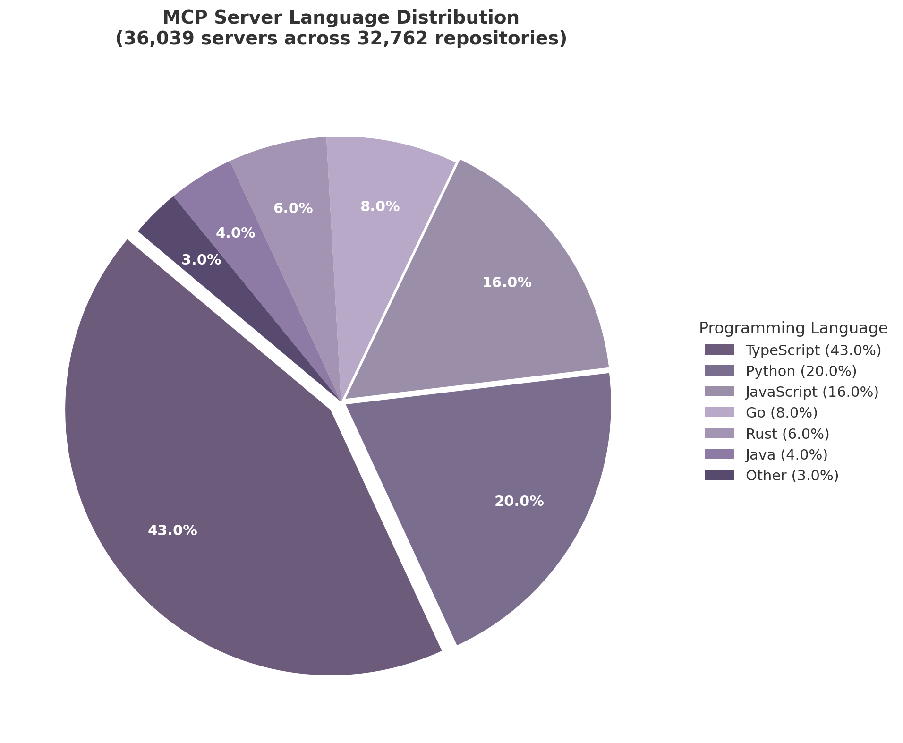

## 2. MCP Ecosystem — The Tool Layer

The Model Context Protocol (MCP) has achieved what no competing agent-to-tool standard managed: universal platform adoption. With 97 million monthly SDK downloads across Python and TypeScript, and integration into every major AI platform from Claude to ChatGPT to GitHub Copilot, MCP has effectively won the tool-access layer of the agent protocol stack [^23^]. Anthropic's donation of MCP to the Agentic AI Foundation (AAIF) under the Linux Foundation—co-founded by Anthropic, Block, and OpenAI with backing from Google, Microsoft, AWS, and Bloomberg—cemented its status as the de facto industry standard [^23^]. Yet winning mindshare and winning a sustainable marketplace are not the same. This chapter examines the registry infrastructure, monetization mechanics, and developer experience that will determine whether MCP's technical victory translates into durable economic dominance.

### 2.1 Registry and Marketplace Dynamics

#### 2.1.1 The Official Registry: Architecture of a Metaregistry

The official MCP Registry launched in preview on September 8, 2025, following a grassroots effort that began months earlier when MCP creators David Soria Parra and Justin Spahr-Summers enlisted the PulseMCP and Goose teams to build a centralized community index [^187^]. The registry entered API freeze at version 0.1 in October 2025, signaling stabilization before general availability. Current maintainers include Adam Jones (Anthropic), Tadas Antanavicius (PulseMCP), Toby Padilla (GitHub), and Radoslav Dimitrov (Stacklok)—a cross-organizational structure designed to prevent any single vendor from controlling the canonical namespace [^187^].

As of May 24, 2026, the official registry contained 9,652 latest server records and 28,959 server-version records, while Anthropic's December 2025 ecosystem update cited more than 10,000 active public MCP servers [^187^]. The modelcontextprotocol/servers repository had accumulated 86,148 GitHub stars and 10,799 forks at verification time.

Critically, the official registry operates as a **metaregistry**—it hosts metadata about packages but not the actual code or binaries. Code lives on npm, PyPI, Docker Hub, and GitHub Releases [^192^]. This design choice is deliberate: the registry functions as "DNS for servers," anchoring namespaces and unique identifiers while leaving user-facing search, browsing, and categorization to downstream third-party platforms [^192^]. Each server entry follows a server.json manifest format specifying unique name (e.g., `io.github.user/server-name`), packages, runtime arguments, environment variables, and metadata. Submission requires trusted reviewer approval, and the registry is open-source and mirrorable for private enterprise use [^187^].

GitHub launched its own MCP Registry on September 18, 2025, which syncs automatically with the official open-source community registry—developers self-publish to the OSS registry, and servers appear in GitHub's registry without additional steps [^187^]. However, as of March 2026, GitHub's registry listed only 87 servers with basic search but no categories or filters, making it a reference implementation rather than a practical discovery tool.

#### 2.1.2 Third-Party Marketplaces: The Fragmented Discovery Layer

Because the official registry intentionally provides minimal discovery UX, a competitive landscape of third-party directories and marketplaces has emerged. Each optimizes for a different stage of the developer workflow, and none covers the full end-to-end lifecycle.

| Platform | Listings | Core Model | Security Scanning | Hosting | Key Differentiator |
|---------|----------|-----------|-------------------|---------|-------------------|
| Official MCP Registry | 9,652 [^187^] | Metaregistry (metadata only) | None | No | Canonical namespace authority |
| GitHub Registry | 87 [^187^] | Synced mirror of official | None | No | Integrated into GitHub Copilot |
| Glama | 14,274+ [^188^] | Directory + hosted gateway | Scorecards, vulnerability checks | Managed connectors | Security-first assessment |
| Smithery | 7,000+ [^259^] | Registry + hosting platform | None (patched post-incident) | Remote + local CLI | Docker Hub-like deployment |
| PulseMCP | 7,600+ [^187^] | Directory + content | None | No | Editorial curation, newsletter |
| MCP.so | 19,000+ [^21^] | Community directory | None | No | Largest catalog via open submission |
| MCP Market | 19,000+ [^21^] | Discovery + categorization | None | No | Star ratings, rankings |

*Sources: Official registry API [^187^], Glama [^188^], Smithery [^259^], PulseMCP [^187^], ecosystem analysis [^21^].*

Smithery positions itself as the closest equivalent to Docker Hub in the MCP ecosystem, offering both local installation via CLI and hosted remote servers where Smithery manages the runtime and provides OAuth modals so authors do not need to build their own authentication flows [^259^]. The platform suffered a significant security incident in June 2025, when GitGuardian researchers discovered a critical path traversal vulnerability that compromised over 3,000 hosted AI servers, exposing API keys and secrets. Smithery patched the vulnerability within two days of responsible disclosure, and no exploitation evidence was found [^259^].

Glama differentiates through security scorecards, vulnerability checks, and license verification—the only directory performing meaningful quality assessments beyond basic metadata indexing [^188^]. Its founder has committed to keeping the API "100% free and will remain this way," positioning Glama as a public good layer above the canonical registry [^188^]. PulseMCP, co-founded by official registry maintainer Tadas Antanavicius, focuses on trending and newly published servers with editorial curation through weekly "Top Picks" and active newsletter coverage [^187^]. In a comparative search for "PostgreSQL" servers, PulseMCP returned 100+ results—the most of any directory—followed by MCP Market with 2+, Glama with 2, and GitHub Registry with just 1 [^187^].

MCP.so and MCP Market each claim more than 19,000 servers, but neither provides quality verification, programmatic API access, or hosting capabilities. Both rely on community submission via GitHub issues, resulting in broad but shallow catalogs [^21^].

#### 2.1.3 The Quality Crisis: Half the Ecosystem Is Dead

The explosion of 36,039 MCP servers across 32,762 repositories conceals a severe quality crisis. An audit of 1,847 MCP servers in April 2026 found that **52% were "dead"**—defined as no commits in 90+ days, broken builds, or unpatched CVEs. Only 31% were lightly maintained, and a mere **17% met a production-reasonable bar** [^21^]. The median server has six commits in its entire lifetime and was last touched 142 days ago. Abandonment rates vary sharply by category: hobby integrations at 74%, SaaS API wrappers at 61%, developer tooling at 48%, while official vendor servers show just 11% dead rate [^21^].

The star distribution is equally stark: **51% of servers have zero GitHub stars**, 77% have fewer than 10, 61% are solo projects with zero forks, and 16% lack even a README [^21^]. The top 50 repositories account for 60% of all GitHub stars in the ecosystem—a concentration that makes the long tail functionally invisible. Growth has cooled measurably from its peak: new server creation went from 135 per month at protocol launch (November 2024) to 5,069 per month at the June 2025 peak, declining to 2,093 per month by November 2025 [^21^].

An academic analysis of 10,240 MCP servers found that approximately 13% had partial or rare matches between tool descriptions and actual code functionality, representing a "non-negligible security concern" because mismatches can mislead agents into unintended tool invocations [^21^]. The Developer Tools category had the largest server count (6,474) but only approximately 48% full-match rate between description and code. Even the "Official" category's full-match rate was just 41.5%—lower than many third-party categories [^21^].

Three conditions must be met for this quality crisis to resolve: registries need health signals at the list level (last commit, uptime, contributor count); someone must fund long-tail maintenance; and teams using MCP need to treat it as supply chain infrastructure with version pinning, dependency audits, and quarterly re-scoring [^21^]. Currently, none of these conditions are widely met.

### 2.2 Monetization and Business Models

#### 2.2.1 Four Pricing Models in Production

The overwhelming majority of MCP servers remain free and open-source. However, four pricing models are in active production use, reflecting different value capture strategies across the server lifecycle [^18^]:

| Pricing Model | Typical Range | Example | Best Suited For |
|-------------|---------------|---------|----------------|
| Per-call | $0.001–$0.10 per invocation | Ref at $0.009/search [^18^] | High-frequency utility tools (search, verification) |
| Subscription | $10–$50 per month | Enterprise data feeds at $49–$199/mo [^18^] | Always-on infrastructure (CRM connectors, databases) |
| Freemium | Free tier → $9–$40/mo Pro | 21st.dev Magic: 100 credits free → $20/mo [^18^] | Developer tools with clear upgrade triggers |
| Outcome-based | $0.02–$0.05 per successful match | Verification/enrichment MCPs [^18^] | Business-value actions (leads matched, fraud flagged) |

*Source: Godberry Studios MCP monetization analysis, April 2026 [^18^].*

The per-call model works best for tools where usage is sporadic but value per call is high. Ref (documentation search) exemplifies this at $0.009 per search with 200 free non-expiring credits and a $9 monthly subscription for 1,000 credits, achieving thousands of weekly users with hundreds of paying subscribers within three months [^18^]. Subscription models dominate enterprise-oriented servers providing continuous data feeds or managed infrastructure. Freemium models struggle with a unique MCP challenge: a free tier built for casual human testing "gets demolished by a single agent loop" running automated CI pipelines or enterprise workloads at machine-scale throughput [^18^].

Platform revenue shares vary significantly. Apify MCP takes 20% (developers keep 80%), MCPize takes 15% (developers keep 85%), and self-hosted servers with Stripe or direct gateway integration retain approximately 97% after payment processing fees [^18^]. Apify's lower share is offset by its large existing Store audience and $4 million-plus paid out to Actor developers since launch [^18^].

#### 2.2.2 The Revenue Chasm: Winners and the Long Tail

Top-tier MCP creators report earnings of $3,000–$10,000 or more per month. The standout case is 21st.dev's Magic MCP, which crossed $10,000 in monthly recurring revenue within six weeks of launch with zero paid marketing spend [^18^]. On the platform side, Nevermined has processed 1.38 million transactions since May 2025 with 35,000% growth in 30 days at one point, supporting sub-cent micropayments starting at $0.001 per transaction. Valory, an agent infrastructure company, cut its payment infrastructure deployment time from six weeks to six hours using Nevermined's protocol-agnostic payment layer [^18^].

However, the counterexamples are equally instructive. A Content-to-Social MCP shipped at $0.07 per transformation had zero paying users after two weeks [^18^]. The critical variable is not pricing mechanics but **underlying tool demand**: thin API wrappers around popular services struggle to justify payment when the underlying API is already accessible, while purpose-built tools that solve unique agent problems (documentation accuracy, component generation, data enrichment) command willingness to pay.

The structural asymmetry is clear: 97 million monthly SDK downloads indicate massive technical adoption, but business maturity lags far behind. PulseMCP indexes thousands of public MCP servers, and the overwhelming majority are free—most are open-source hobby projects or thin wrappers around existing APIs with no billing plumbing [^18^]. This gap between adoption and monetization represents both the largest opportunity and the deepest risk for the ecosystem. Without viable revenue models, server creators abandon projects (contributing to the 52% dead rate), and enterprises cannot rely on tools that lack maintenance commitments.

#### 2.2.3 MCP Bundle Format: Packaging for Distribution

The MCP Bundle format (`.mcpb`), formally adopted by the MCP project in November 2025, addresses the distribution gap between "works on my machine" and deployable enterprise infrastructure. Originally developed by Anthropic as "Desktop Extensions" (DXT) and transferred to the open-source MCP project, MCPB files are ZIP archives containing a local MCP server and a manifest.json that declares server name, version, capabilities, entry point, and runtime requirements [^187^]. The format parallels Chrome Extensions (`.crx`) or VS Code Extensions (`.vsix`), enabling end users to install local MCP servers with a single click across any compatible client [^187^].

This bundling capability enables several important use cases. Virtual MCPs (VMCPs) allow administrators to package multiple MCP servers into team-specific bundles for centralized deployment and governance—a "Marketing Analytics VMCP" might combine Google Search Console and GA4 MCPs behind a single endpoint with unified permissions, audit trails, and credential management [^187^]. FastMCP, which powers approximately 70% of Python MCP servers, supports proxy capabilities to bundle multiple servers behind a single endpoint, solving configuration sprawl, dependency conflicts, and resource overhead [^187^]. The `.mcpb` format is cross-client compatible: a bundle created for one MCP application works in any other implementing the specification, an interoperability guarantee that reduces vendor lock-in and broadens addressable market for server creators.

### 2.3 Developer Experience and Adoption

#### 2.3.1 Sub-Five-Minute Onboarding as Competitive Moat

Developer experience has been the single strongest driver of MCP's adoption velocity. The protocol achieves sub-five-minute onboarding through frameworks like MCP-Framework and FastMCP, the latter commanding approximately 70% of the Python MCP server market and roughly 1 million daily downloads [^187^]. This ease of use directly contributed to the 97 million monthly SDK download milestone and the ecosystem's rapid expansion to 36,039 servers.

The "DX Success" formula derived from ecosystem analysis is straightforward: time-to-first-value correlates inversely with adoption speed. MCP's sub-five-minute onboarding compares favorably to the 15–30 minute setup typically required for Google's A2A protocol, a gap that has shaped grassroots developer preference even as both protocols serve complementary layers of the stack [^86^]. MCP-native startups have emerged to capitalize on this developer momentum: Manufact, a Y Combinator S2025 graduate, raised $6.3 million in seed funding led by Peak XV; its open-source mcp-use library has surpassed 5 million downloads and 9,000 GitHub stars, with organizations including NASA, Nvidia, and SAP using it in production [^63^]. Alpic, the first MCP-native cloud platform for deploying and monitoring MCP servers, secured $6 million in pre-seed funding led by Partech [^62^].

Transport implementation reflects the same developer-centric pattern. Stdio (standard input/output) holds 85% share due to its simplicity for local development, while Server-Sent Events (SSE) accounts for 9% of remote and hosted deployments [^21^]. The 2026 roadmap prioritizes evolving Streamable HTTP for stateless horizontal scaling, acknowledging that stdio's simplicity becomes a bottleneck at enterprise deployment scale [^67^].

#### 2.3.2 Language Distribution and Implementation Patterns

The 36,039 MCP servers across 32,762 repositories show a clear language distribution that reflects both the protocol's origins and developer ecosystem dynamics.

*Figure 2.1: MCP server language distribution across 36,039 servers in 32,762 repositories. TypeScript dominates at 43%, reflecting MCP's Anthropic/Node.js origins, while Python at 20% indicates strong data-science and AI engineering adoption. Source: ecosystem analysis, December 2025 [^21^].*

TypeScript's 43% share reflects MCP's Anthropic and Node.js origins, as well as the TypeScript SDK's status as the reference implementation. Python at 20% represents the data-science and AI engineering community that FastMCP has successfully captured. JavaScript at 16% consists primarily of thin wrappers around existing APIs. Go (8%), Rust (6%), and Java (4%) together represent systems-programming and enterprise-backend use cases where performance or existing JVM infrastructure drives language choice [^21^].

The concentration of B2B creation is notable: 70% of MCP servers were created by B2B companies (Stripe, Cloudflare, PagerDuty, HubSpot), while 30% originated from B2C contexts [^21^]. Among identifiable hosts, AWS leads at 60% (compared to 53% for traditional APIs), Google Cloud holds 12%, Azure 7%, Cloudflare Workers 4.6%, and Vercel 5%. Cloudflare has disproportionately positioned itself across the MCP infrastructure stack—Workers account for an estimated under 1% of traditional API deployments but 4.6% of MCP servers, and 25% of all MCP servers sit behind the Cloudflare CDN [^21^].

Enterprise adoption is accelerating even as grassroots creation cools. As of early 2026, 28% of Fortune 500 companies have deployed MCP servers for production AI workflows, and 72% of surveyed technical professionals expect MCP usage to increase over the next 12 months [^24^]. Fifty-four percent are confident MCP will persist as the permanent industry standard; 40% expect MCP to account for a quarter to half of their AI tool usage within the year [^24^]. The market is projected to grow from $1.8 billion in 2025 to $10.3 billion by 2027—a 34.6% compound annual growth rate—with over 70% of organizations planning to implement MCP-compatible systems in the next two years [^24^].

#### 2.3.3 The Context Window Tax: MCP's Hidden Cost

MCP's standardized tool schemas impose a significant but underappreciated cost: they consume substantial portions of the language model's context window before any productive work begins. A single well-documented tool consumes 200–500 tokens in schema definition; at 50 tools, this amounts to 10,000–25,000 tokens consumed by definitions alone [^82^]. In complex multi-server setups, the toll can reach 75,000 tokens or more. One documented real-world configuration saw 98,700 tokens (49.3% of a 200,000-token context window) consumed entirely by MCP tool definitions [^82^]. GitHub's MCP server alone consumes 40,000–55,000 tokens just for its tool definitions [^82^].

This "context window tax" creates a tension at the heart of MCP's value proposition. The protocol's power lies in giving agents access to diverse tools, but each additional tool erodes the very resource—context window—that enables the agent to reason about those tools effectively. In practice, this drives the emerging best practice of **aggressive tool curation**: production deployments actively limit the number of simultaneously available tools, often to 10–15 per agent session, and abstract low-level endpoints into higher-level, task-oriented composite tools [^82^].

Several optimization techniques have emerged. Tool search—loading only relevant tools on demand rather than all tools upfront—can reduce schema token consumption by 80–95% [^82^]. Code execution for batching multiple small operations into single tool calls reduces per-call overhead. TOON (Tool Output Optimization Notation) compresses tool responses into structured summaries, and rolling summarization prevents conversation history from growing without bound [^82^]. At enterprise scale, the recommended architecture places an MCP Gateway between agents and servers to centralize authentication, authorization, auditing, and traffic management, while also handling tool selection and context optimization [^82^].

The context window tax has strategic implications for the domain holder. As MCP adoption deepens, the need for tool curation, gateway infrastructure, and context optimization will only intensify. Services that help developers select the right tools, compose them efficiently, and manage token budgets represent a high-value adjacency to raw server discovery. The registry that surfaces not just "what tools exist" but "which tools work well together and fit within your context budget" will capture developer trust—and recurring engagement.

---

The MCP ecosystem sits at an inflection point. Technical adoption is undeniable: 97 million monthly downloads, universal platform integration, and Linux Foundation governance have made MCP the undisputed standard for agent-to-tool communication [^23^]. But the marketplace layer remains immature—52% of servers abandoned, monetization failing for the majority of creators, discovery fragmented across six competing directories, and no conformance testing to separate production-grade tools from weekend experiments [^21^] [^18^]. For the domain owner, this gap between protocol victory and marketplace maturity is the opportunity. The registry that solves quality, the platform that enables sustainable creator revenue, and the gateway that optimizes context consumption will each capture durable value in a layer that the entire agent economy depends upon.
