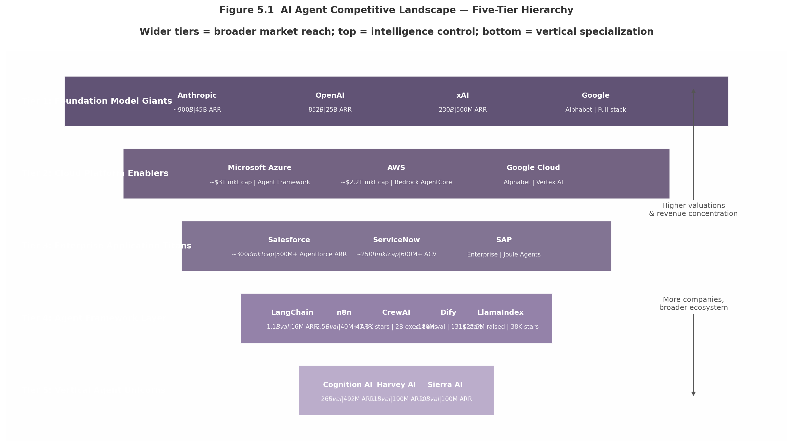
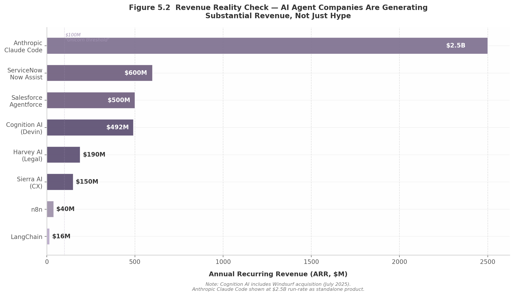

## 5. Competitive Battlefield

The AI agent infrastructure market reached $7.92 billion in 2025 and is projected to grow at a 43.57% compound annual growth rate (CAGR) to $294.66 billion by 2035, with North America holding 41% share and Asia Pacific growing fastest [^132^]. Within this expanding terrain, competition has stratified into five distinct tiers, each with its own logic of value capture, capital intensity, and strategic vulnerability. Understanding the battlefield requires mapping not just who the players are, but where they sit in the stack — because in infrastructure markets, position determines destiny.

The battleground has shifted decisively from model performance benchmarks to agent orchestration. Three control points now determine competitive advantage: the Model Context Protocol (MCP) for agent-to-tool access, the Agent2Agent (A2A) protocol for inter-agent communication, and enterprise distribution platforms that embed agents into existing workflows [^194^][^234^]. Companies that own these control points are capturing disproportionate value regardless of whether they build the "best" models.

### 5.1 The Five Tiers of Competition

#### 5.1.1 Foundation Model Giants ($100B+): Controlling the Intelligence Layer

At the apex of the competitive pyramid sit four companies whose valuations collectively exceed $2 trillion. Their shared strategic objective is to make the foundation model the irreplaceable core of enterprise architecture — not merely a layer in the stack, but the orchestration hub around which all other infrastructure rotates [^190^].

**Anthropic** has executed the most remarkable growth trajectory in enterprise technology history. The company raised $30 billion in Series G funding at a $380 billion post-money valuation in February 2026, with run-rate revenue surging to approximately $45 billion by May 2026 — a fivefold increase in under four months [^191^][^186^]. Claude Code, the company's breakout product, reached $2.5 billion in run-rate revenue and accounted for 4% of all GitHub public commits worldwide by February 2026 [^191^]. Anthropic's most durable moat, however, is MCP. Introduced in November 2024 and donated to the Agentic AI Foundation under the Linux Foundation by December 2025, MCP achieved 97 million monthly SDK downloads and 10,000+ active enterprise servers [^194^]. By giving MCP away freely, Anthropic replicates Google's Android strategy: commoditize the infrastructure layer to monetize the platform above it [^190^]. The primary risk is capacity constraints, which have disrupted customer operations even as investors position for a potential initial public offering as early as October 2026 [^186^].

**OpenAI** remains the most recognized AI brand globally, with 900 million weekly active users and $25 billion in annualized revenue as of February 2026 [^226^]. Enterprise revenue now exceeds 40% of total revenue and is on track to reach parity with consumer by year-end [^226^]. Codex crossed 3 million users in early 2026 — a figure that was "almost zero" at the start of the preceding quarter [^226^]. Yet OpenAI faces a classic innovator's dilemma: consumer subscription growth is maturing, API prices are decreasing exponentially under competitive pressure, and the relationship with Microsoft — its primary distribution channel — is deteriorating as Microsoft develops in-house models [^179^]. Chief Financial Officer Sarah Friar has signaled a shift from token-based pricing to outcome-based revenue sharing [^220^], a conceptually sound but execution-risky evolution.

**xAI** raised $20 billion in Series E funding in January 2026, exceeding its $15 billion target, with investors including NVIDIA, Cisco, and the Qatar Investment Authority [^426^]. Grok reaches approximately 600 million monthly active users across X and Grok apps, with a $200–300 million U.S. Defense Department contract [^414^]. xAI ended 2025 with over one million H100 GPU equivalents [^426^]. Yet enterprise sales remain limited to "hundreds of thousands to millions in revenue," and the company burns approximately $1 billion monthly with projected $13 billion losses for 2025 [^413^]. xAI is fundamentally a wager that infrastructure scale will translate to commercial success before capital runs dry.

**Google** pursues the most comprehensive full-stack strategy. At Cloud Next 2025, Google positioned Gemini as the foundation, Agentspace for business users, and the Agent Development Kit (ADK) for developers [^182^]. By Cloud Next 2026, Vertex AI had been rebranded as the Gemini Enterprise Agent Platform [^371^]. Google's A2A protocol, created in April 2025 and donated to the Linux Foundation in June 2025, garnered 150+ organizational supporters [^234^]. By early 2026, A2A had assumed the agent-to-agent coordination role while MCP dominated agent-to-tool connectivity — the two protocols serving complementary functions [^234^]. Google's vulnerability remains enterprise sales execution.

| Company | Valuation | Primary Moat | Key Vulnerability | Revenue Run-Rate |
|---|---|---|---|---|
| Anthropic | ~$900B [^186^] | MCP standard + Claude Code enterprise adoption | Capacity constraints; copyright liability | ~$45B ARR [^186^] |
| OpenAI | $852B [^172^] | Distribution (900M WAU); brand recognition | API commoditization; Microsoft relationship strain | $25B ARR [^226^] |
| Google (Alphabet) | ~$2T+ market cap | Full-stack platform; A2A protocol; TPU silicon | Enterprise sales execution; slower pace | Integrated within Alphabet |
| xAI | $230B [^426^] | Infrastructure scale (1M+ H100 GPUs); X distribution | ~$1B monthly burn; limited enterprise traction | $500M ARR guidance [^414^] |

The table reveals a critical asymmetry: Anthropic and OpenAI are pure-plays whose valuations depend on continued hypergrowth, while Google and Microsoft absorb agent infrastructure into trillion-dollar market caps that can sustain strategic losses indefinitely. The pure-plays must monetize faster or face painful corrections.

#### 5.1.2 Cloud Platform Enablers: Microsoft Azure, AWS, Google Cloud

The three hyperscalers offer full-stack agent platforms that position cloud infrastructure as the control point. Their strategy is simple: own the substrate on which all agents run, and capture value through compute, storage, and governance regardless of which model wins above.

**Microsoft** shipped Agent Framework 1.0 GA on April 3, 2026, merging AutoGen and Semantic Kernel into a unified SDK with native MCP and A2A interoperability [^133^]. Over 10,000 organizations use Azure AI Foundry Agent Service, while 230,000+ use Copilot Studio [^415^]. Azure AI Foundry offers 11,000+ models from providers including Azure OpenAI, Meta's Llama, Mistral, and Hugging Face [^225^]. Microsoft's convergence strategy — unifying frameworks, supporting all protocols, integrating with Azure's enterprise distribution — is the most methodical in the industry. The primary risk is framework complexity and Azure lock-in concerns.

**AWS** consolidated its agent strategy in April 2026 with Amazon Quick (productivity), Connect verticals, and OpenAI models on Bedrock [^375^]. AWS's approach is classic Amazon: own the infrastructure layer, let others fight application battles. Amazon Bedrock AgentCore, which went generally available in October 2025, offers a seven-component managed platform — Runtime, Gateway, Memory, Identity, Observability, Built-in Tools, and Policy — that is framework-agnostic and supports both MCP and A2A [^48^]. By hosting OpenAI, Anthropic, and open-source models simultaneously, AWS positions itself as the Switzerland of agent infrastructure [^375^].

#### 5.1.3 Enterprise Application Titans: Salesforce, ServiceNow, SAP

The enterprise application vendors have a structural advantage that model providers cannot easily replicate: their software already sits at the point where work happens. Embedding agents into existing workflows eliminates the adoption friction that plagues standalone AI tools.

**Salesforce's** Agentforce surpassed $500 million ARR in Q3 FY2026, up 330% year-over-year, with 18,500 total deals closed including 9,500 paid deals [^227^]. This growth rate marks the fastest ARR ramp of any product in Salesforce's 26-year history [^227^]. The company went through three pricing models — $2 per conversation, Flex Credits at $0.10 per action, and per-user licenses at $125+/month — before landing on a multi-model approach that accommodates different customer maturity levels [^228^]. Agentforce combined with Data 360 reached nearly $1.4 billion in ARR, up 114% year-over-year [^227^]. The key insight from Salesforce's playbook: only approximately 8% of Salesforce's customer base has adopted Agentforce so far, implying a multi-year runway of expansion revenue even without new customer acquisition [^228^].

**ServiceNow's** Now Assist crossed $600 million in annual contract value in Q4 2025, with $1 million+ ACV customers growing 130% year-on-year [^229^]. At Knowledge 2026, ServiceNow introduced A2A protocol integration, AI Agent Fabric for inter-vendor agent communication, and AI Control Tower for governance — positioning the company as the "kill switch" for rogue agents in enterprise environments [^229^]. Chief Executive Officer Bill McDermott's framing is instructive: "AI intelligence is commoditizing, but chaos is coming" [^73^]. ServiceNow's governance-first positioning differentiates it from raw model providers at a moment when 88% of organizations reported confirmed or suspected AI agent security incidents in the past year [^168^].

**SAP** introduced 14 new Joule Agents at SAP Connect 2025 for finance, HR, procurement, and supply chain, with Joule Studio enabling customers to create custom agents [^237^]. SAP's strategic leverage is its position as the system of record for enterprise processes — general-purpose agent platforms cannot match the depth of integration into mission-critical ERP workflows. Gartner predicts 40% of enterprise applications will include task-specific AI agents by end of 2026, up from less than 5% in 2025 [^237^].

#### 5.1.4 Agent Framework Layer: The Build Ecosystem

The framework layer is where developer mindshare is won and lost. These companies provide the libraries, tools, and orchestration primitives that developers use to construct agent applications. Their business model is almost universally open-core: free open-source frameworks for adoption, with premium cloud services and observability tools for monetization.

**LangChain** raised $125 million in Series B at a $1.1–1.3 billion valuation in 2025, reaching $16 million ARR with 50,000+ companies building with the framework [^239^]. The company pivoted to LangGraph for agent orchestration, now running in production at LinkedIn, Uber, and 400+ companies [^241^]. Investors include Sequoia, Benchmark, CapitalG, ServiceNow Ventures, and Databricks [^239^].

**CrewAI** reached 47,800 GitHub stars, 27 million PyPI downloads, and powered 2 billion agentic executions in 12 months, with $18 million total funding led by Insight Partners [^237^]. CrewAI reports usage by nearly half of the Fortune 500, running approximately 450 million agents per month for customers including PwC, IBM, Capgemini, and NVIDIA [^242^].

**Dify** raised $30 million in Series Pre-A at a $180 million valuation in March 2026, with 131,000 GitHub stars and 1.4 million deployments across 175 countries [^235^]. Enterprise customers include Maersk, ETS, and Novartis [^235^]. Dify's visual workflow builder addresses the gap between AI experimentation and production — a gap that accounts for the 46% of proof-of-concept projects that fail to reach production.

**n8n** raised $180 million in Series C at a $2.5 billion valuation in October 2025, with ARR surpassing $40 million and 10x year-over-year usage growth [^275^]. Revenue increased 5x since the company's AI pivot in 2022 [^266^]. n8n's ascent from $270 million to $2.5 billion valuation in under seven months reflects investor conviction that workflow automation is the entry point for enterprise AI adoption.

#### 5.1.5 Vertical Agent Unicorns: Domain-Specific Dominance

The vertical agent unicorns represent a critical pattern: domain-specific agents achieve higher revenue multiples, faster growth, and stickier customer relationships than general-purpose platforms. Vertical-specific AI companies have demonstrated a 62.7% CAGR compared to 46.3% for horizontal platforms, reaching 80% of traditional SaaS contract values while growing 400% year-over-year.

**Sierra AI** raised $350 million in Series C at a $10 billion valuation in September 2025, reaching $100 million ARR in just 7 quarters (21 months) [^273^]. Co-founded by Bret Taylor (former Salesforce co-CEO) and Clay Bavor (former Google VP), Sierra's agents reach over 90% of Americans in retail and over 50% of U.S. families in healthcare [^281^]. The company's outcome-based pricing — customers pay for completed work rather than seat licenses — aligns incentives in ways that subscription models cannot replicate.

**Cognition AI** raised $400 million at a $10.2 billion valuation in September 2025, and subsequently $1 billion at a $26 billion valuation in May 2026, with Devin ARR growing from $1 million in September 2024 to $73 million in June 2025, then to $492 million by April 2026 [^265^][^268^]. The acquisition of Windsurf in July 2025 more than doubled ARR and created the complete product suite for AI coding — both IDE-assisted and autonomous agent modes [^279^]. Cognition's total net burn remained under $20 million across the company's entire history despite explosive growth, demonstrating exceptional capital efficiency [^279^].

**Harvey AI** raised $806 million+ across six rounds, reaching $190 million ARR in January 2026 (up from $100 million in August 2025), with an $11 billion valuation in March 2026, serving 100,000+ lawyers across 1,300+ organizations [^267^][^276^]. Sequoia Capital's repeated leadership of three funding rounds signals extraordinary investor conviction. The legal vertical offers high willingness-to-pay, document-heavy workflows ideal for AI, and regulatory moats that general-purpose legal tools cannot easily penetrate.

The revenue chart reveals the critical reality: this is not speculative technology adoption. Cognition AI's $492 million ARR, Harvey's $190 million, and Sierra's $150 million demonstrate that vertical agents generate substantial revenue from customers paying for measurable outcomes. The gap between Claude Code at $2.5 billion and LangChain at $16 million ARR illustrates a fundamental dynamic: infrastructure touching end-users directly captures multiples more value than developer tooling.

### 5.2 Chinese and International Competition

#### 5.2.1 Alibaba/Qwen: The Transaction-First Approach

Chinese AI companies are pursuing a fundamentally different strategy from Western counterparts — focusing on cost efficiency, vertical integration within super-apps, and transaction completion rather than frontier model benchmarks. Token prices are 5–15x cheaper than U.S. equivalents, creating a pricing umbrella that will pressure Western SaaS providers in global markets.

Alibaba's Qwen model family has over 80 variants integrated across Taobao, DingTalk, AliExpress, and Alipay, with DingTalk executing 200 million+ daily AI interactions [^387^]. By early 2026, Qwen's "one-sentence ordering" generated 200 million+ transactions during the Spring Festival, extending to ride-hailing and physical world execution [^377^]. Users could say "I want to buy Qwen glasses" and complete the purchase in a single conversational turn [^377^]. This transaction-first model captures revenue at the moment of execution rather than through subscription or API fees — a fundamentally different monetization logic.

Baidu's ERNIE 4.5 employs FP8 quantization to lower compute and memory use by 40%, focusing on cost-efficient inference rather than frontier model dominance [^387^]. ByteDance's Doubao powers over 70 million monthly active chatbot users, with Douyin's AI content creation handling over 1 billion tasks daily in captioning, editing, and motion tracking [^387^]. Tencent's Hunyuan acts as the AI backbone for WeChat's enterprise ecosystem, managing over 10 billion agent tool calls per day [^387^].

The strategic implication is clear: Chinese agents will likely win on cost in global markets, creating pricing pressure for Western providers. Differentiation must come from workflow integration, data moats, and vertical expertise — not model performance.

#### 5.2.2 China's Regulatory Moat: GB Standards and TC28/SC42

China is building a regulatory moat through mandatory national standards (GB, Guobiao) advancing through Technical Committee 28/Subcommittee 42 (TC28/SC42) for AI foundation models and TC260 for AI security and ethics. These committees are establishing mandatory conformance requirements for AI agents deployed in Chinese markets — covering data privacy, algorithmic transparency, safety testing, and national security review.

The standards framework creates a two-market structure: Western protocols (MCP, A2A) dominate open markets, while Chinese standards (potentially including domestic variants of agent protocols) govern the world's second-largest economy. For global enterprises operating in both markets, this bifurcation implies dual compliance tracks — increasing complexity and cost, but also creating opportunity for protocol bridging solutions.

#### 5.2.3 EU and US Regulatory Responses

The European Union's AI Act, with full enforcement commencing August 2, 2026, mandates risk-based classification of AI systems, with high-risk applications subject to conformity assessment, CE marking, and 3–7 year audit retention [^167^].

In the United States, NIST released the Cybersecurity for Agentic AI Systems Initiative (CAISI) in February 2026, establishing a voluntary framework aligning with the Cloud Security Alliance's Agentic Trust Framework [^167^]. The four-level maturity model — from "Intern" (human-supervised) through "Principal" (fully autonomous) — provides a structured path for increasing agent autonomy while maintaining governance [^167^].

| Jurisdiction | Primary Regulatory Body | Key Standards/Initiatives | Agent-Specific Requirements | Enforcement Timeline |
|---|---|---|---|---|
| China | TC28/SC42; TC260 | GB national standards | Mandatory conformance for AI agents; algorithmic transparency; national security review | 2026–2027 phased rollout |
| European Union | EU AI Act (2024/1689) | Risk-based classification; CE marking | 3–7 year audit retention; DPIAs mandatory for high-risk agents | Full enforcement August 2, 2026 |
| United States | NIST CAISI (Feb 2026) | Voluntary security framework | Agentic Trust Framework 4-level maturity model; post-market monitoring | Voluntary; expected to become de facto standard |
| Global | Agentic AI Foundation (Linux Foundation) | MCP; A2A; ACP/UCP | Protocol-level governance; cross-vendor interoperability | Active; evolving |

The regulatory divergence creates both risk and opportunity. Enterprises deploying agents across China, the EU, and the United States face a fragmented compliance landscape. Companies that build multi-jurisdictional compliance into their agent infrastructure will capture value from this fragmentation — analogous to how GDPR compliance tools became a multi-billion-dollar category after 2018.

The protocol layer offers a countervailing force. MCP and A2A, donated to the Linux Foundation under the Agentic AI Foundation co-founded by OpenAI, Anthropic, Google, Microsoft, AWS, and Block, represent a rare instance of competing giants agreeing on common infrastructure [^194^]. IBM's Agent Communication Protocol merged into A2A in August 2025, signaling standalone protocol competition is giving way to layered cooperation [^234^]. The emerging four-layer stack — MCP for agent-to-tool, A2A for agent-to-agent, ACP/UCP for commerce, WebMCP for browser-native — provides a governance substrate that can absorb regulatory variation without fragmenting [^10^].

### 5.3 M&A and Consolidation Patterns

#### 5.3.1 Major Deals: Infrastructure, Distribution, and Talent

The agent infrastructure sector is consolidating at an accelerating pace, with acquisition rationales falling into three categories: enterprise platforms buying agent development capabilities, infrastructure players acquiring developer experience layers, and vertical agent companies completing their product suites.

**ServiceNow acquired Moveworks** for $2.85 billion, adding conversational AI and autonomous resolution capabilities that accelerated ServiceNow's agent roadmap by an estimated 18–24 months.

**Meta acquired Manus** for approximately $2 billion in early 2026, securing what was widely regarded as the most capable general-purpose AI agent framework — signaling Meta's intent to compete in the agent infrastructure layer.

**Google acquired Wiz** for $32 billion in 2025 — the largest cybersecurity acquisition in history — adding cloud security capabilities that complement Google's agent platform strategy. As agents gain access to enterprise data, security becomes inseparable from deployment.

**IBM acquired Confluent** for $11 billion, strengthening real-time data streaming, and **DataStax** (with Langflow, 49,000+ GitHub stars) to deepen watsonx capabilities [^422^].

**Workday acquired Flowise** in August 2025, adding a low-code agent builder with 42,000+ GitHub stars [^369^]. Workday subsequently debuted "Workday Build" at Rising 2025, enabling customers to create custom AI agents with low-code visual tools [^375^].

**Cognition AI acquired Windsurf** in July 2025, more than doubling ARR and creating the complete product suite for AI coding [^279^]. The deal came days after Google poached Windsurf's CEO, illustrating the talent war dimension of M&A.

#### 5.3.2 Acquisition Targets: What's Most Attractive

Four categories of agent infrastructure companies are commanding the highest acquisition premiums:

**Orchestration and workflow automation** tops the list. As the 2023–2024 framework chaos consolidates into three winners — Microsoft Agent Framework, LangGraph, and CrewAI — companies that missed the build phase are buying in. Open-source community traction is the primary acquisition driver: Flowise (42,000 stars), Langflow (49,000 stars), and DataStax/Langflow signal that developer adoption is the currency of strategic value.

**Vertical agents in regulated industries** command premium multiples because domain expertise and compliance certifications cannot be replicated quickly. Harvey AI's legal vertical benefits from relationships with the Am Law 200 that no general-purpose platform could penetrate in under three years.

**MCP infrastructure** is increasingly strategic. Companies building MCP registries, conformance testing, security scanning, and managed server hosting are acquisition targets for security vendors and cloud platforms.

**Voice AI** represents the next frontier, as agents transition from text to voice interfaces. Infrastructure for real-time voice synthesis and interruption handling is acquisitionally attractive for platform players seeking to own the multimodal agent interface.

#### 5.3.3 Revenue Reality: Agents Are Generating Real Revenue

The most important competitive signal in the agent market is not valuation or funding but revenue. Agent companies are generating real, recurring revenue at growth rates that exceed historical SaaS benchmarks.

| Company | ARR | Time to Reach | Valuation | Capital Efficiency | Primary Revenue Driver |
|---|---|---|---|---|---|
| Cognition AI (Devin) | $492M [^268^] | 20 months | $26B [^268^] | <$20M total net burn [^279^] | AI coding agents + Windsurf IDE |
| Harvey AI | $190M [^267^] | ~30 months | $11B [^276^] | $806M raised across 6 rounds [^267^] | Legal workflow automation |
| Sierra AI | $150M [^273^] | 21 months | $10B [^273^] | $635M total funding [^273^] | Customer service agents |
| Salesforce Agentforce | $500M+ [^227^] | 15 months | N/A (public) | N/A | CRM-embedded agents |
| ServiceNow Now Assist | $600M+ [^229^] | 18 months | N/A (public) | N/A | IT workflow agents |

The revenue metrics table above demolishes the narrative that AI agents are a technology in search of a business model. Cognition AI's $492 million ARR, achieved with less than $20 million in total net burn, may be the most capital-efficient hypergrowth trajectory in technology history [^268^][^279^]. Sierra's $100 million ARR in 7 quarters makes it the fastest-growing enterprise SaaS company by ARR velocity [^273^]. Harvey AI's growth from $100 million to $190 million ARR in five months signals that the legal vertical's willingness-to-pay is expanding [^267^].

These figures carry strategic implications. Vertical focus demonstrably outperforms horizontal generality — each top revenue generator targets a specific domain. Embedding agents into existing workflows (Salesforce's CRM, ServiceNow's ITSM) accelerates monetization by eliminating adoption friction. Outcome-based pricing (Sierra's pay-for-completed-work model) aligns vendor and customer incentives in ways that drive faster expansion.

The framework layer tells a different story. LangChain's $16 million ARR against a $1.1 billion valuation implies a 69x revenue multiple — justified only if the company captures significantly more of the value it enables. The open-core model is proven but the path from developer adoption to enterprise revenue remains longer and less certain than the vertical agent playbook.

For the domain owner mapping this battlefield, the consolidation pattern suggests three imperatives. First, bet on standards rather than products — MCP and A2A adoption are the most durable competitive advantages. Second, target vertical niches where domain-specific agents command premium pricing. Third, monitor emerging categories — agent observability, governance infrastructure, and payment rails represent the next billion-dollar segments as deployment scales. Eighty-point-nine percent of technical teams have moved past planning into active testing or full deployment of AI agents [^168^], yet 88% reported confirmed or suspected security incidents in the past year [^168^]. The gap between deployment ambition and operational readiness is where the next competitive battles will be won.
