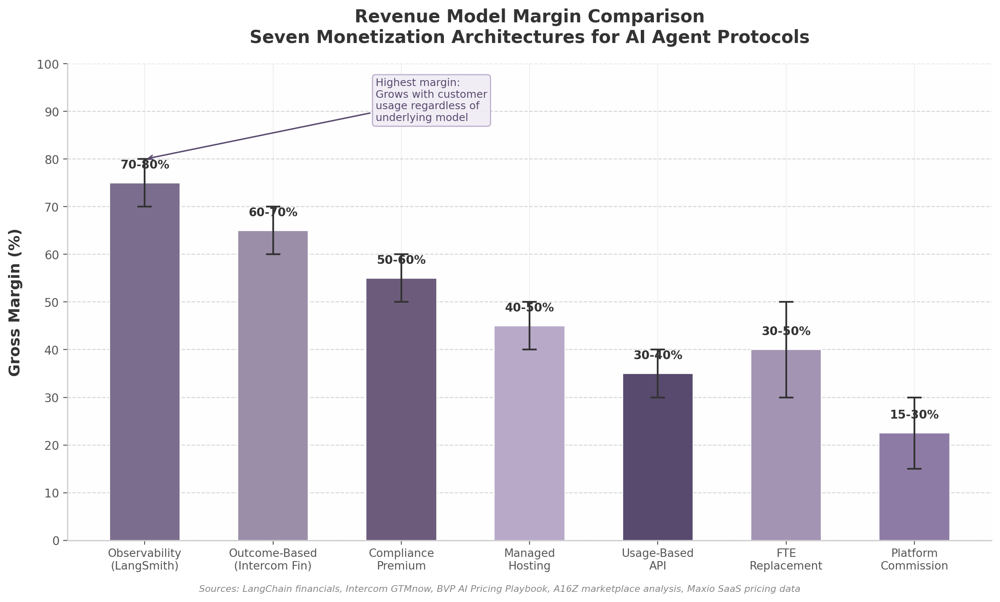

# 6. Business Models & Monetization Playbooks

The AI agent protocol ecosystem has entered a monetization adolescence. After three years of explosive adoption — 97 million monthly SDK downloads for MCP alone — the question has shifted from "will agents work?" to "who gets paid, and how?" The answer is neither simple nor singular: the most successful players run multiple pricing models simultaneously, and the architectures that align revenue with measurable customer value are systematically outperforming those that charge for software access.

This chapter documents every proven revenue architecture, from open-core protocols that built billion-dollar valuations on free code to outcome-based pricing models that grew from $1 million to $100 million annual recurring revenue (ARR) in under 24 months. Each model is analyzed with real financial data, margin structures, and the specific conditions under which it succeeds or fails.

---

## 6.1 Proven Revenue Architectures

Four revenue architectures have demonstrated scalability in the AI agent market. Each represents a fundamentally different relationship between the vendor and the customer, and each carries distinct margin profiles, sales cycle lengths, and defensibility characteristics.

| Revenue Architecture | Flagship Example | Revenue Model | Gross Margin | Sales Cycle | Defensibility |
|:---|:---|:---|:---|:---|:---|
| Open-Core | HashiCorp → IBM ($6.4B) | Free protocol + enterprise subs | 82.1% [^232^] | 6–12 months | High (ecosystem lock-in) |
| Outcome-Based | Intercom Fin ($100M+ ARR) | $0.99 per resolution | 60–70% [^197^] | 1–3 months | Very High (value alignment) |
| FTE-Replacement | Sierra ($150M ARR, $15B val) | $10K–100K/year per digital worker | 30–50% [^351^] | 6–18 months | Medium (performance-dependent) |
| Observability | LangSmith ($1.25B val) | $39/seat + $0.50/1K traces | 70–80% [^280^] | 1–6 months | Very High (data gravity) |

The table reveals a critical trade-off: higher margins correlate with lower per-customer revenue in the observability model, while FTE-replacement commands the largest annual contract values but faces the longest sales cycles and highest service delivery costs. No single architecture dominates; the most successful protocol companies layer multiple models.

### 6.1.1 Open-Core: Free Protocol Drives Adoption, Premium Tooling Captures Revenue

The open-core model has produced the two largest exits in AI infrastructure to date. HashiCorp built a $6.4 billion enterprise value on free developer tools — Terraform, Vault, Consul — that became embedded in production workflows before enterprises ever saw an invoice. The company's revenue reached $654.9 million on a trailing twelve-month basis at 82.1% gross margin, with a revenue mix of 72% support subscriptions, 13% cloud-hosted services, 12% license revenue, and 3% professional services [^232^]. Critically, 96–97% of revenue was recurring, and net revenue retention exceeded 120%, meaning existing customers increased spending by more than 20% annually after their initial purchase [^232^].

IBM acquired HashiCorp in April 2024 despite negative $122.2 million in TTM net income, a transaction that validated a fundamental principle of protocol economics: ecosystem value can transcend near-term profitability when the underlying standard achieves production-critical status. The bottom-up adoption funnel — free tools → production embedding → enterprise upgrade for governance, compliance, and auditability — has become the canonical go-to-market motion for protocol companies.

LangChain adapted this playbook for the generative AI era. The core library, released under the permissive MIT license, accumulated 130 million downloads and 110,000 GitHub stars [^228^]. Monetization flows through LangSmith, an observability platform priced at $39 per seat per month for the Plus tier, with enterprise contracts starting at approximately $5,000 per month [^228^]. A secondary revenue stream, LangGraph Cloud, targets multi-agent deployment management in an orchestration market estimated at $8 billion by 2026 [^229^]. LangChain raised $125 million at a $1.25 billion valuation in October 2025, with LangSmith identified as the primary revenue driver [^285^].

The conversion challenge in open-core is severe: only approximately 1% of free users convert to paid services, and cloud providers offering managed versions of open-source tools capture an estimated 80% of deployment value [^402^]. The vendor typically realizes less than 10% of the total market value their software creates. This structural tension has driven a repeating pattern of license changes that Section 6.3 examines in detail.

### 6.1.2 Outcome-Based: The $0.99-per-Resolution Gold Standard

Intercom's Fin AI Agent represents the most thoroughly documented outcome-based pricing success in the industry. Fin grew from $1 million to over $100 million ARR using a pricing model of $0.99 per resolved customer issue, backed by a performance guarantee of up to $1 million if resolution targets are not met [^197^]. Fin now handles more than 80% of support volume for its deployed customers and resolves approximately 1 million customer issues per week [^197^].

The resolution rate climbed from approximately 27% at launch to 67% on average across 7,000+ customers, with top performers reaching 80–84% [^204^]. This improvement rate of approximately 1% per month creates a virtuous cycle: better resolution performance generates more revenue, which funds further model and infrastructure investment, which drives further resolution improvements [^204^].

Outcome-based pricing fundamentally reorganizes internal incentives. As Intercom President Archana Agrawal noted, "charging $0.99 per resolved issue exposed every weak link. Sales could no longer optimize for licenses, customer success could no longer hide behind usage, revenue operations had to forecast outcomes. And the product had to work, consistently" [^197^]. The $1 million guarantee functioned less as an actual financial risk — the guarantee has never been fully claimed — and more as a psychological mechanism that shifted buyer perception from "software vendor" to "performance partner."

The primary barrier to adoption is predictability. Enterprise CFOs resist variable-cost structures that make quarterly budgeting impossible. Intercom addressed this through three mechanisms: free trials to establish baseline resolution rates before contract signing, annual resolution buckets rather than monthly quotas to absorb volatility, and non-penalizing overages that apply the same contracted discount to all usage above the committed amount [^200^]. Multiple AI companies have since adopted outcome-based mechanisms with varied structures: EvenUp charges per AI-generated demand package, Graph AI per case processed, Leena AI on an ROI basis tied to tickets closed, and Resolve AI on a pay-when-AI-ensures-uptime model [^198^].

### 6.1.3 FTE-Replacement: Pricing Against Headcount Budgets

Sierra AI, founded by former Salesforce co-CEO Bret Taylor, reached $150 million ARR and a valuation exceeding $15 billion by positioning AI agents as direct replacements for human workers [^351^]. The company counts more than 40% of the Fortune 50 among its customers, with agents handling billions of interactions spanning mortgage refinancing, insurance claims processing, returns management, and nonprofit fundraising — use cases that previously required full-time employees [^351^].

The pricing architecture anchors against human salary costs of $50,000–150,000 per year rather than software budgets that are typically an order of magnitude smaller. Sierra charges enterprise customers $10,000–100,000 per year per deployed agent, a figure that represents 15–30% of the fully loaded cost of the human worker replaced [^351^]. This positioning taps headcount budgets that can be ten times larger than IT software allocations, fundamentally expanding the addressable spend per account.

FTE-replacement models carry higher service delivery costs than pure software models because agent performance is contractually tied to business outcomes. Customer success teams must monitor resolution quality, handle human escalation pathways, and continuously retrain models on customer-specific data. The result is a gross margin of 30–50% — substantially lower than observability or outcome-based models — offset by annual contract values that routinely exceed $500,000 for enterprise deployments.

### 6.1.4 Observability: Billing the Infrastructure Tax

LangSmith operates the highest-margin business model documented in the AI agent ecosystem. The platform handles over 1 billion traces — individual records of agent reasoning and tool invocations — and charges on a two-dimensional pricing structure: $39 per seat per month for team access, plus usage-based billing at $0.50 per 1,000 traces beyond the included tier [^280^]. The free tier offers 5,000 traces per month, creating a low-friction entry point that converts to paid tiers as teams move from experimentation to production [^228^].

The observability model achieves 70–80% gross margins because the cost of storing and querying trace data is negligible relative to the value delivered in production environments. A 5-person team running 100,000 traces per month pays approximately $240 total; at enterprise scale with 500 million spans and 20 users, monthly costs reach $125,755 [^284^]. This wide revenue band — from $240 per month for small teams to six figures for enterprises — demonstrates the model's scalability across customer segments.

The strategic defensibility of observability monetization lies in data gravity. Once engineering teams build dashboards, alerts, and incident response workflows around a specific observability platform, switching costs become prohibitive. LangSmith's integration with the LangChain ecosystem — the most widely adopted agent framework — creates a natural funnel: developers start with the free LangChain library, encounter monitoring needs as they deploy to production, and adopt LangSmith as the path of least resistance [^285^].

---

## 6.2 Platform Economics and Marketplace Monetization

Commission-based marketplace models and hybrid pricing architectures represent the second major revenue category. These models capture value from transactions between agents, between developers and enterprises, and between AI services and end users.

### 6.2.1 Commission Models: The 10–30% Platform Tax

The platform commission structure in AI agent marketplaces mirrors the mobile app store standard established by Apple and Google. Apple's standard App Store commission is 30%, with the Small Business Program reducing this to 15% for developers earning under $1 million annually [^355^]. Google Play maintains an identical structure. This 30% benchmark has become the reference point against which all marketplace fees are negotiated, though it faces increasing regulatory challenge — a U.S. district court found that Apple's attempt to impose a 27% fee on web purchases demonstrated "bad faith" and exceeded justifiable platform tax boundaries [^407^].

For AI agent marketplaces specifically, Andreessen Horowitz analysis from 2023 confirms the 10–30% commission range, with specialized high-value agent marketplaces commanding the upper end [^251^]. The optimal commission structure correlates with value delivered: 0–10% for infrastructure and protocol layers, 10–20% for marketplace matchmaking services, and 20–30% for full-stack managed services with guaranteed outcomes [^251^]. Platforms with diversified revenue streams — combining commissions with subscriptions, usage fees, and value-added services — achieve EBITDA margins 2.3 times higher than commission-only models [^121^].

Freemium conversion rates provide a critical benchmark for marketplace design. Platforms implementing freemium models typically convert 3–7% of users to paid tiers, with conversion rates directly correlated to the perceived value gap between free and paid offerings [^251^]. The GPT Store illustrates both the opportunity and the risk: over 3 million custom GPTs were created, but direct monetization remained unlaunched as of mid-2026, forcing creators to rely on external Stripe paywalls [^122^]. Poe, operated by Quora, stands as the only major marketplace with active creator monetization, offering either per-message pricing or subscription revenue sharing that allocates 100% of first monthly payments to creators [^122^].

### 6.2.2 The Salesforce Three-Model Experiment

Salesforce's Agentforce represents the most sophisticated enterprise AI pricing architecture currently deployed. Rather than selecting a single model, Salesforce simultaneously operates three distinct pricing mechanisms: Flex Credits at $0.10 per action, Conversations at $2 per conversation, and per-user licenses at $125 per user per month [^231^]. This multi-model approach drove Agentforce to $540 million ARR by Q3 FY2026, representing 330% year-over-year growth across 18,500 total deals, of which 9,500 were paid [^231^].

| Pricing Model | Unit Price | Credit Structure | Best For | Break-Even Point |
|:---|:---|:---|:---|:---|
| Flex Credits | $0.10/action (20 credits) | $500 per 100,000 credits | High-volume, variable workflows | N/A (base unit) [^230^] |
| Conversations | $2.00 per conversation | Flat per-interaction fee | Predictable support volumes | 20 actions per conversation [^230^] |
| Per-User License | $125/user/month | Unlimited actions within tier | Steady-state enterprise teams | >1,250 actions/user/month [^231^] |

The Flex Credits model offers the finest granularity: each standard action consumes 20 credits ($0.10) and includes processing up to 10,000 tokens, while voice actions consume 30 credits ($0.15) [^230^]. The break-even between Flex Credits and the flat Conversations model occurs at 20 actions per conversation — below this threshold, Flex Credits are cheaper; above it, the Conversations model provides cost predictability. Industry-specific add-ons command premiums of $150 per user per month, while public sector deployments reach $650 per user per month [^231^].

Salesforce's pricing evolution reveals market learning in real time. The company launched with the $2-per-conversation model in October 2024, added Flex Credits in May 2025 as customers demanded granular usage control, and introduced per-user licenses in late 2025 for enterprises that preferred predictable budgeting [^231^]. The willingness to operate three models simultaneously — what would traditionally be considered product confusion — reflects a fundamental insight about enterprise AI procurement: different buying centers (IT operations, line of business, procurement) prefer different pricing metaphors.

The broader market trend confirms this hybrid direction. Over 60% of SaaS companies now use some form of hybrid pricing (subscription plus usage), up from under 30% in 2021 [^246^]. Credit-based pricing models grew 126% year-over-year in 2025, from 35 to 79 tracked companies [^246^]. Seat-based pricing as the primary model dropped from 21% to 15% of companies in just 12 months [^231^]. GitHub Copilot, the pioneer of per-seat AI pricing, moved to usage-based billing in June 2026 with the explicit rationale that "Copilot simply is not the same product it was a year ago — it now powers far more complex, agentic workflows that consume far more compute" [^352^].

### 6.2.3 TCO Reality: The Hidden Multiplier

Enterprise buyers systematically underestimate the total cost of ownership (TCO) for AI agent deployments. Research from multiple sources converges on a 40–60% underestimation gap, with the practical rule of thumb being: true TCO equals the vendor quote multiplied by 1.4 to 1.6 [^41^] [^353^]. This gap explains why only 11% of organizations have AI agents in production despite widespread pilot activity [^41^].

A realistic monthly TCO for a customer support AI agent handling 500 tickets per month ranges from $5,000 to $15,000 when accounting for the full cost stack: human escalation ($1,500–5,000), helpdesk platform fees, evaluation and testing infrastructure, engineering maintenance, and compliance overhead [^353^]. The typical simplified estimate of $65–340 per month captures only API call costs, omitting the operational infrastructure that constitutes the majority of actual spend [^353^]. Human escalation is the single largest hidden cost; even well-performing production agents resolve only 50–70% of tickets autonomously, requiring human intervention for the remainder [^353^].

The TCO transparency problem creates both risk and opportunity for protocol vendors. Vendors that provide clear TCO calculators and bundle operational services into their pricing can differentiate against competitors that compete on headline price alone. Intercom's CTO Darragh Curran identified predictability as "a surprising challenge — predictability getting in the way of usage" — meaning enterprises want consumption-based pricing but need budget certainty [^200^]. Annual resolution buckets, non-penalizing overages, and pay-as-you-go options represent the emerging standard for addressing this tension [^200^].

---

## 6.3 The Winning Playbook for Protocol Owners

For the domain owner controlling canonical protocol namespaces, the monetization question takes on a specific shape: how does a protocol standard — which by definition must be free to adopt — generate sustainable revenue?

### 6.3.1 License Changes Do Not Work

A repeating pattern has emerged across open-source infrastructure: successful projects shift from permissive licenses to restrictive "source-available" licenses after cloud providers offer managed services built on their code. MongoDB initiated this pattern with the Server Side Public License (SSPL) in 2018; Elastic followed in 2021, HashiCorp adopted the Business Source License (BSL) in 2023, and Redis made a similar change in 2024 [^402^]. The motivation is consistent — cloud providers generate billions from managed open-source services without reciprocal contribution, while the originator captures a fraction of the value.

However, no evidence shows that license changes improved vendor revenue trajectories. MongoDB's growth predated the SSPL switch and continued on the same trajectory afterward. Elastic's growth declined post-license-change, prompting a reversal to the Affero GPL in 2024. HashiCorp was acquired by IBM rather than achieving independent sustainable growth [^402^]. Only approximately 1% of users convert to paid services regardless of license terms, and the community backlash from restrictive licensing damages the ecosystem adoption that drives future enterprise sales [^402^].

Foundation-governed projects provide the sustainable alternative. PostgreSQL, Kubernetes, and Linux — all under open governance with neutral foundation oversight — have proven immune to the license-change pattern. These projects achieve longevity because no single vendor controls the standard, and the foundation structure provides credible neutrality that encourages multi-vendor contribution [^402^]. For protocol owners, the implication is clear: donate the protocol specification to a neutral foundation, then build proprietary value on top of the open standard rather than attempting to restrict the standard itself.

### 6.3.2 Protocol-Led Growth: Free Standard to Ecosystem Lock-In

Protocol monetization is primarily indirect. The TCP/IP, HTTP, and DNS protocols generate no direct revenue but enabled trillion-dollar ecosystems built on top of them [^337^]. The same principle applies to AI agent protocols: the standard itself is free, but every layer above it — hosting, tooling, compliance, observability, identity management — generates revenue.

The playbook follows a four-phase sequence. **Phase one** is protocol adoption through exceptional developer experience. MCP's sub-5-minute onboarding time drove 97 million monthly downloads in 13 months, establishing it as the de facto tool-access standard. **Phase two** is ecosystem embedding — developers build applications, integrations, and workflows that depend on the protocol, creating organic switching costs. **Phase three** is the emergence of production requirements: security, compliance, monitoring, and governance features that individual developers do not need but enterprises cannot operate without. **Phase four** is value capture through premium services that address these production requirements.

Ethereum Name Service (ENS) demonstrates protocol revenue through registration fees — a model directly applicable to agent identity and naming systems. ENS generated $55 million in protocol revenue in 2022 from domain registrations priced by character length: $5 per year for 5+ characters, $160 per year for 4 characters, and $640 per year for 3 characters [^337^]. Peak monthly revenue reached $9.6 million in May 2022 [^335^]. At only 3% penetration of non-zero Ethereum addresses, conservative projections estimate $200 million in recurring revenue potential, scaling to $750 million at 15% penetration [^337^]. The scarcity-based pricing structure — shorter names command exponentially higher prices — creates natural market dynamics that an agent identity protocol could replicate.

The strategic calculus for protocol owners is unambiguous: maximize free adoption, minimize friction, and capture value from the services that production deployments inevitably require. The protocol that becomes infrastructure others build on achieves a position no competitor can displace.

### 6.3.3 Revenue Models Ranked by Margin and Defensibility

The following ranking synthesizes margin data, market evidence, and strategic defensibility analysis across the seven monetization architectures evaluated in this chapter.

| Rank | Revenue Model | Gross Margin | Defensibility | Time to Revenue | Best For |
|:---|:---|:---|:---|:---|:---|
| 1 | Observability/Monitoring | 70–80% | Very High (data gravity) | 3–6 months | Protocols with production deployments [^280^] |
| 2 | Outcome-Based Billing | 60–70% | Very High (value alignment) | 3–6 months | Task-specific agents with measurable results [^197^] |
| 3 | Compliance/Security Premium | 50–60% | High (certification moat) | 6–12 months | Enterprise contracts >$50K [^216^] |
| 4 | Managed Hosting | 40–50% | Medium (operational lock-in) | 1–3 months | Teams without infrastructure expertise [^401^] |
| 5 | FTE Replacement | 30–50% | Medium (performance-dependent) | 6–18 months | High-volume transactional workflows [^351^] |
| 6 | Usage-Based API | 30–40% | Low (commoditization risk) | 1–3 months | High-volume, standardized services [^246^] |
| 7 | Platform Commission | 15–30% | Low–Medium (network effects) | 6–12 months | Marketplaces with 10K+ participants [^251^] |

Observability commands the top position because it grows with customer AI usage regardless of which underlying models or frameworks are deployed. Every agent interaction requires monitoring, logging, and trace analysis — these are not optional features but production necessities. LangSmith's 1 billion trace volume [^285^] demonstrates that observability revenue scales automatically with ecosystem adoption, creating a tax-like revenue stream on the entire agent economy.

Outcome-based billing ranks second because it aligns vendor incentives with customer success so completely that switching away requires accepting misaligned incentives. The Intercom model — where the vendor only earns revenue when the customer's problem is actually solved — represents the most defensible pricing relationship possible. The 60–70% margin reflects the efficiency of a model where revenue scales with demonstrated value rather than provisioned capacity.

Compliance and security premiums rank third because they function as enterprise deal enablers rather than cost centers. SOC 2 Type II certification is a deal requirement for AI B2B contracts exceeding $50,000, with total first-year certification costs ranging from $30,000 to $150,000 including compliance software, audit fees, penetration testing, and internal labor [^216^] [^281^]. Organizations with mature AI governance command 15–25% pricing premiums and close deals faster than competitors without demonstrable compliance programs [^151^]. For protocol owners, offering compliance-as-a-service — bundling certification support, audit trails, and governance tooling — creates a monetizable layer on top of the free protocol standard.

The models at the bottom of the ranking — usage-based API billing and platform commissions — are not unviable but are structurally vulnerable to commoditization. API gateway pricing has compressed dramatically: AWS API Gateway charges $3.50 per million calls, while Google Apigee charges $20 per million [^338^]. The 6x price differential for essentially the same service illustrates how quickly API metering becomes a race to the bottom. Platform commissions face similar pressure from regulatory scrutiny and competing marketplaces.

The composite insight for protocol domain owners is to prioritize the top three models — observability, outcome-based billing, and compliance premiums — while using the lower-ranked models as entry points or supplementary revenue layers. A protocol owner operating across multiple layers captures value at the highest margins while competitors fight for share in commoditized segments. The winning architecture is not a single model but a portfolio: free protocol adoption at the base, observability and compliance revenue in production environments, and outcome-based billing for high-value vertical applications. This layered approach maximizes both margin and the total addressable revenue per customer, transforming a protocol standard from a cost center into a revenue-generating ecosystem platform.

