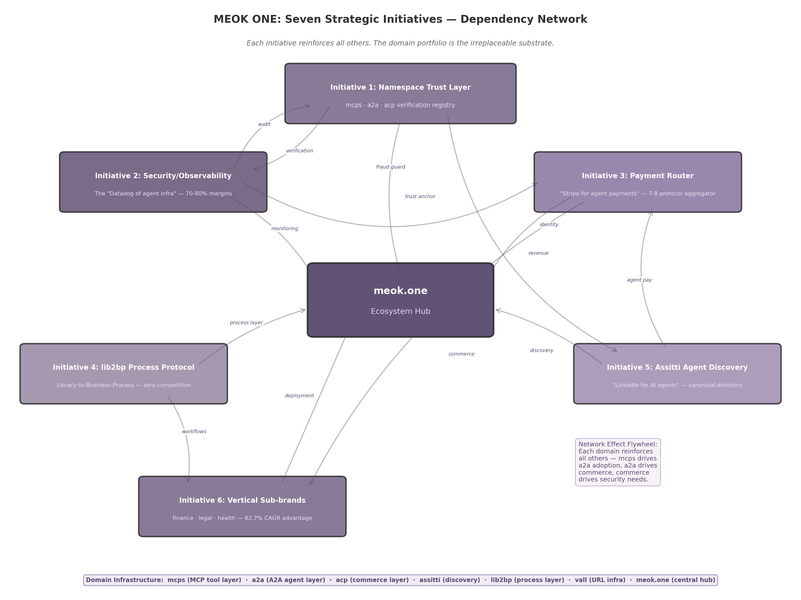
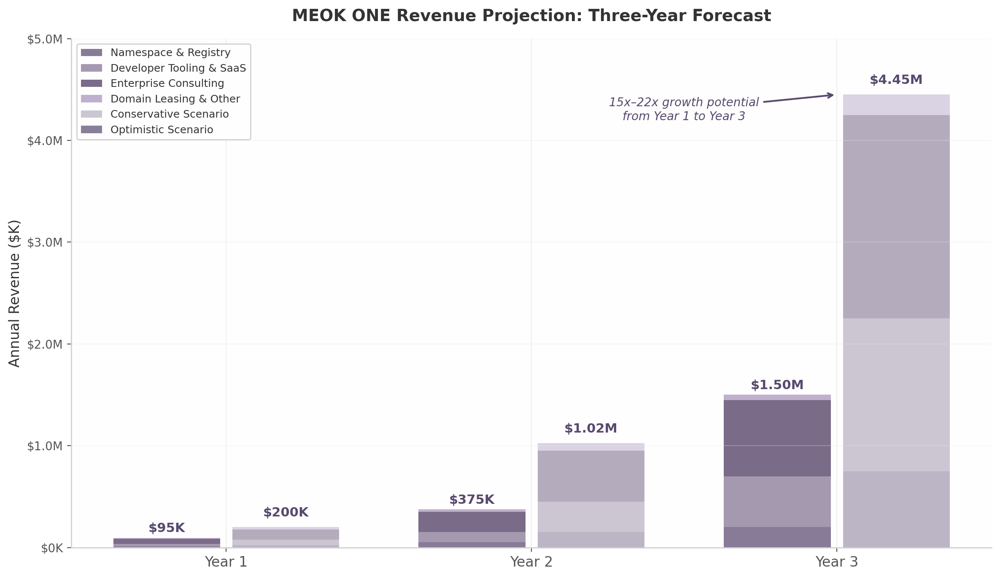

## 10. The MEOK ONE Domination Blueprint

The preceding nine chapters have mapped the terrain: a $5.25 billion market accelerating toward $53 billion by 2030, three protocol layers with distinct competitive dynamics, a $3–5 trillion agentic commerce opportunity held back by fragmentation, and a security crisis that is simultaneously the greatest barrier and the largest untapped revenue opportunity in the ecosystem. This chapter synthesizes every finding into a single actionable blueprint — seven strategic initiatives, three-year revenue projections, and the competitive moats that make the position defensible. The blueprint is not theoretical. Every initiative is grounded in quantified market data, proven business model analogues, and the specific domain assets — mcps, a2a, acp, lib2bp, assitti, vall, meok.one — that constitute the irreplaceable substrate of the entire strategy.

### 10.1 The Domain Portfolio as Strategic Infrastructure

#### 10.1.1 Three Domains, Three Protocol Layers

The most consequential discovery across all twelve research dimensions is that three domains in the portfolio — mcps, a2a, and acp — map directly to the three major AI agent interoperability protocols that are rapidly becoming industry standards. MCP (Model Context Protocol), created by Anthropic and donated to the Linux Foundation, has achieved 97 million monthly SDK downloads and 10,000+ active servers [^166^]. A2A (Agent-to-Agent Protocol), created by Google and similarly donated, has accumulated 150+ organizational supporters and 22,000+ GitHub stars [^2^]. ACP (Agent Communication Protocol) occupies Stage 2 in the enterprise adoption roadmap for rich agent interactions [^641^]. The alignment is not coincidental: as these protocols embed into enterprise infrastructure, owning their canonical domain names becomes a defensive necessity, a revenue opportunity, and a positioning asset simultaneously [^dim12^].

This three-domain architecture mirrors the three-layer protocol stack itself. MCP handles agent-to-tool connectivity (the vertical layer). A2A handles agent-to-agent coordination (the horizontal layer). The commerce protocols — AP2, TAP, x402, MPP, and others — constitute the trust and payment layer. The domain portfolio, by design or by extraordinary fortune, owns naming rights to each layer.

#### 10.1.2 Domain Valuations and Protocol Alignment Multiplier

Premium AI-related domain sales reached record levels in 2025, with AI.com selling for $70 million, eclipsing the previous $30 million record for Voice.com [^dim12^]. The .ai extension grew 162% in registrations, with an average resale price of $6,525 [^dim12^]. Within this market, protocol-aligned domains command a structural premium because their value derives not merely from scarcity but from functional utility — they are not just brand names, they are infrastructure addresses.

| Domain | Protocol Alignment | Standalone Valuation | Protocol-Aligned Valuation | Value Multiplier |
|:---|:---|---:|---:|---:|
| mcps | MCP (Model Context Protocol) — 97M SDK downloads/month [^166^] | $50K–$250K | $150K–$750K | 3× |
| a2a | A2A (Agent-to-Agent Protocol) — 150+ partners [^2^] | $50K–$300K | $150K–$900K | 3× |
| acp | ACP (Agent Communication Protocol) — Stage 2 adoption [^641^] | $25K–$100K | $75K–$300K | 3× |
| lib2bp | Library-to-Business-Process — new category, zero competition | $5K–$25K | $50K–$250K | 5–10× |
| assitti | Agent discovery and identity — "LinkedIn for agents" | $2K–$15K | $50K–$500K | 10–33× |
| vall | URL infrastructure for agent communication | $1K–$10K | $10K–$50K | 5–10× |
| meok.one | Central ecosystem hub — "The ONE place for agent infra" | $25K–$100K | $250K–$1M | 10× |

The value multiplier ranges from 3× for the most established protocol domains (mcps, a2a, acp) to 10–33× for domains whose value is contingent on execution (assitti, meok.one). The critical insight is that the portfolio's combined value under a unified ecosystem strategy is not the sum of individual domain valuations — it is the product of their network effects. Protocol Labs demonstrated this architecture with IPFS, Filecoin, and libp2p: independent project brands under a central umbrella, each accruing value from the others' adoption [^dim12^].

#### 10.1.3 Defensive Value: The Trust Anchor

The security research dimension identified naming attacks as the primary vulnerability in the agent protocol ecosystem: 1,467 exposed MCP servers, 88% of organizations reporting confirmed or suspected security incidents, and 1.5 million agents operating without monitoring [^168^]. In a world where any developer can publish an MCP server and any agent can claim any identity, the canonical namespace becomes the scarce trust resource. Just as certificate authorities charge for trust in HTTPS, the owner of protocol-canonical domains can establish a verification and discovery layer that the entire ecosystem depends on. This defensive positioning — preventing malicious actors from impersonating legitimate protocol servers — is not merely a protective measure but a revenue-generating service.

### 10.2 The Seven Strategic Initiatives

The blueprint organizes around seven strategic initiatives, each mapped to a specific domain, a quantified revenue opportunity, and a defined competitive moat. The initiatives are sequenced by time-to-market: the earliest initiatives generate cash flow that funds later, higher-multiply opportunities.

The network diagram above illustrates the central architectural principle: each initiative reinforces all others. The namespace trust layer (Initiative 1) feeds identity data to the security hub (Initiative 2) and the agent discovery service (Initiative 5). The payment router (Initiative 3) generates transaction data that powers the observability layer. The vertical sub-brands (Initiative 6) create demand for the process protocol (Initiative 4). The meok.one ecosystem hub (Initiative 7) coordinates all six. This is not a portfolio of independent businesses — it is a vertically integrated protocol empire where the whole exceeds the sum by a compounding factor.

#### 10.2.1 Initiative 1: Namespace Trust Layer — Verified Registry at Each Protocol Domain

**Domain:** mcps, a2a, acp  
**Analogue:** Certificate Authority + ENS Registry  
**Revenue Model:** Verification fees ($99–$499/year), premium listings ($50–$200/month), namespace subscriptions  
**Time to Market:** 3 months

With 52% of registered MCP servers non-functional or dead, and no canonical verification authority in existence, the verified registry opportunity is immediate [^166^]. The model draws from two proven sources: ENS (Ethereum Name Service), which generated $55 million in protocol revenue in 2022 from registration fees ranging from $5 to $640 per year [^337^]; and certificate authorities, which charge $50–$500 annually for SSL verification. At mcps, a2a, and acp, the registry would verify server conformance, uptime, security posture, and publisher identity — then issue a "Verified" badge that enterprise buyers can trust. Uniswap's uni.eth subname program reached 2 million usernames in 18 months by offering free registration with verified identity [^dim12^]. A similar model — free basic listing, premium verification — can capture the developer mindshare that no competing registry has yet claimed. With 9,652 registered MCP servers and growing, capturing even 10% at $200 average annual verification yields $193K recurring revenue at the MCP layer alone.

#### 10.2.2 Initiative 2: Security/Observability Hub — "The Datadog of Agent Infrastructure"

**Domain:** meok.one/security  
**Analogue:** Datadog, LangSmith  
**Revenue Model:** Per-trace billing ($0.50/1,000 traces), seat-based ($39/seat/month), enterprise contracts ($5K–$50K/month)  
**Time to Market:** 6 months  
**Projected Margins:** 70–80%

The convergence of 88% security incident rates, 1.5 million unmonitored agents, and observability margins of 70–80% creates the single largest revenue opportunity in the agent ecosystem [^168^] [^280^]. LangSmith, LangChain's observability platform, reached a $1.25 billion valuation on trace-based billing alone, handling over 1 billion traces and helping companies reduce resolution times by 80% [^285^]. HashiCorp built a $6.4 billion enterprise value on 82.1% gross margins by monetizing the operational tools that enterprises require after adopting open-source infrastructure [^232^]. The playbook is proven: offer free security scanning of MCP servers (namespace Initiative 1 provides the directory), then upsell runtime monitoring, compliance reporting, and audit trail services. Targeting 10–20% of the enterprise agent security budget — estimated at $5–15 billion by 2028 — positions this initiative as the highest-margin, most defensible revenue stream in the entire blueprint.

#### 10.2.3 Initiative 3: Payment Router — Aggregator Across 7–8 Commerce Protocols

**Domain:** acp  
**Analogue:** Stripe (unified payment methods), Visa (network effects)  
**Revenue Model:** 1–3% per transaction routed  
**Time to Market:** 12 months  
**Addressable Market:** $3–5 trillion in agentic commerce by 2030 [^135^]

Seven to eight competing commerce protocols — Google's AP2, Mastercard's Agent Pay, Visa's TAP, Coinbase's x402, Stripe's MPP, OKX's APP — are vying for dominance with zero interoperability [^86^]. Nevermined raised $7 million to build "PayPal for AI" payment rails enabling agent-to-agent transactions [^408^]. The aggregator opportunity — a single service that speaks all protocols and routes transactions optimally — is the Visa model applied to agent commerce. Stripe unified fragmented human payment methods into a $100 billion company; an equivalent service for agent payments would capture value proportional to the $3–5 trillion transaction market projected by McKinsey [^135^]. Even 0.1% capture at the midpoint of that range yields $3–5 billion in revenue. The ethical platform tax range of 10–20% for marketplace matchmaking [^251^] provides a pricing ceiling; the actual take rate of 1–3% is calibrated to undercut proprietary protocol fees while capturing volume. The domain acp — aligned with the Agent Communication Protocol — becomes the canonical endpoint for agent payment routing.

#### 10.2.4 Initiative 4: lib2bp Process Protocol — New Category Creation

**Domain:** lib2bp  
**Analogue:** Kubernetes (defined container orchestration as a category)  
**Revenue Model:** Managed process orchestration, certification, consulting  
**Time to Market:** 12–18 months  
**Competitive Landscape:** Zero direct competitors

MCP connects tools. A2A connects agents. Commerce protocols handle payments. But no protocol connects software libraries to business processes. lib2bp can define an entirely new category: the protocol that turns code libraries into executable business processes. Enterprises have millions of libraries (npm, PyPI, Maven) but no standard way to turn them into business workflows. If lib2bp defines the specification for "library-as-business-process," it creates a new layer in the protocol stack between MCP (tool) and A2A (agent) — a "process protocol" with no existing competition. The strategy follows the Kubernetes playbook: publish the specification, build the reference implementation, donate to the Linux Foundation for legitimacy, and capture value through managed orchestration services. Protocol Labs incubated drand into Randamu, which raised $3.3 million in pre-seed funding — demonstrating that open-source research can be transformed into commercial ventures [^dim12^]. Category creation carries higher uncertainty but generates disproportionate returns when successful: Kubernetes defined container orchestration and enabled a $50 billion ecosystem.

#### 10.2.5 Initiative 5: Assitti Agent Discovery — "LinkedIn for AI Agents"

**Domain:** assitti  
**Analogue:** LinkedIn (professional identity), Yelp (verified reviews)  
**Revenue Model:** Promoted listings, verification fees, API access, reputation scoring  
**Time to Market:** 6 months

Every A2A agent publishes an Agent Card, but there is no central directory to search, filter, and verify them. A2A's Agent Cards define the discovery mechanism but lack a global registry [^2^]. assitti becomes the canonical agent directory — searchable by capability, reputation, price, and trust score. The model draws from LinkedIn's professional identity graph and Yelp's review-driven trust mechanics. With 150+ A2A partner organizations and growing, the directory can index agents across capability categories, charge for promoted placement, and offer API access for automated agent selection. The reputation scoring system — combining runtime verification data from Initiative 2, namespace verification from Initiative 1, and user feedback — creates a trust layer that no competitor can replicate without access to the same cross-initiative data.

#### 10.2.6 Initiative 6: Vertical Sub-brands — Domain-Specific Domination

**Domains:** finance.meok.one, legal.meok.one, health.meok.one  
**Analogue:** Veeva (healthcare vertical), Guidewire (insurance vertical)  
**Revenue Model:** Vertical-specific MCP server packs, A2A agent templates, compliance tooling, consulting  
**Time to Market:** 3–6 months  
**Growth Advantage:** 62.7% CAGR vs. 46.3% for horizontal platforms [^583^]

Vertical-specific agent solutions outperform horizontal platforms on every metric that matters: 35% faster growth (62.7% vs. 46.3% CAGR), higher willingness to pay, shorter sales cycles, and stickier customer relationships. Cybersecurity commands a $22.56 billion market [^619^]; insurance claims automation delivers 40–70% cycle reductions [^88^]; financial services compliance tooling carries 30–50% pricing premiums above baseline [^287^]. The vertical strategy launches sub-branded domains — finance.meok.one, legal.meok.one, health.meok.one — each offering pre-built MCP server packs, A2A agent templates, and compliance tooling tailored to the vertical's regulatory requirements. Healthcare alone presents a $6.92 billion opportunity by 2030 [^535^]; legal tech funding exceeded $2 billion in 2024–2025 [^533^]. Each vertical sub-brand reinforces the central meok.one hub while capturing domain-specific premiums that horizontal infrastructure cannot command.

#### 10.2.7 Initiative 7: meok.one Ecosystem Hub — "CNCF for Agent Protocols"

**Domain:** meok.one  
**Analogue:** CNCF (Cloud Native Computing Foundation), Protocol Labs  
**Revenue Model:** Membership tiers ($5K–$500K/year), certification programs, events, developer tooling subscriptions  
**Time to Market:** 6 months

The agent protocol ecosystem is following the exact same trajectory as Kubernetes — donated to a foundation, multi-vendor governance, ecosystem explosion, need for a unifying coordination platform [^544^]. CNCF platinum membership costs $500,000 per year, and companies pay because ecosystem participation is strategically essential [^663^]. meok.one positions as the "ecosystem orchestrator" — not competing with AAIF/LF, but complementing it with developer-facing coordination: membership tiers, certified programs, events, and community infrastructure. Protocol Labs operates a similar model with 600+ partner organizations, generating value through ecosystem coordination rather than direct protocol revenue [^dim12^]. The hub serves as the entry point for all other initiatives — namespace verification, security tooling, payment routing, vertical solutions — creating a unified brand experience that compounds in value as each initiative matures.

The following table synthesizes all seven initiatives, their assigned domains, revenue timelines, and the specific competitive moat each establishes:

| # | Initiative | Domain(s) | Analogue | Time to Market | Primary Moat | Projected Y3 Revenue |
|:---|:---|:---|:---|---:|:---|---:|
| 1 | Namespace Trust Layer | mcps, a2a, acp | Certificate Authority + ENS | 3 months | First-mover as canonical registry; no existing verification authority | $200K–$750K |
| 2 | Security/Observability Hub | meok.one/security | Datadog, LangSmith | 6 months | 70–80% margins; grows with every agent deployed | $500K–$1.5M |
| 3 | Payment Router | acp | Stripe (unified payments) | 12 months | Aggregator across 7–8 fragmented protocols; network effects per transaction | $180K–$1.8M |
| 4 | lib2bp Process Protocol | lib2bp | Kubernetes (category creation) | 12–18 months | Zero direct competition; defines new protocol category | $50K–$500K |
| 5 | Assitti Agent Discovery | assitti | LinkedIn + Yelp for agents | 6 months | Cross-initiative data: identity + reputation + verification | $100K–$400K |
| 6 | Vertical Sub-brands | finance/legal/health.meok.one | Veeva, Guidewire | 3–6 months | 62.7% CAGR vertical advantage; regulatory moats per industry | $750K–$2.0M |
| 7 | Ecosystem Hub | meok.one | CNCF, Protocol Labs | 6 months | Membership tiers; certification; irreplaceable central coordination | $50K–$500K |

The table reveals a deliberate sequencing strategy. Initiatives 1, 5, 6, and 7 launch within six months because they require minimal proprietary technology — they are coordination and verification plays that leverage the domain portfolio's existing positioning. Initiatives 2 and 3 require twelve months because they demand substantive software engineering: observability infrastructure and payment protocol integration. Initiative 4 (lib2bp) carries the longest timeline because category creation demands specification writing, reference implementation, and ecosystem cultivation before revenue materializes. This sequencing ensures that Year 1 consulting and namespace revenue fund the engineering investment for Year 2 platform revenue, which in turn funds the ecosystem expansion that drives Year 3 scale.

### 10.3 Revenue Projections and Business Model

The revenue model follows a phased deployment: Year 1 establishes credibility and cash flow through namespace fees and consulting; Year 2 adds high-margin observability and payment routing; Year 3 captures platform economics at scale with full ecosystem revenue.

#### 10.3.1 Year 1: $95K–$200K — Foundation and Credibility

The conservative Year 1 scenario assumes $95,000 in revenue: $10,000 from subdomain registrations (namespace verification at the three protocol domains), $25,000 from developer tool subscriptions (basic MCP server monitoring and compliance scanning), $50,000 from enterprise consulting (90-day production framework engagements), and $10,000 from domain leasing [^dim12^]. The optimistic scenario at $200,000 assumes faster adoption of verification services and two to three enterprise consulting engagements at $50,000 each. Year 1 is not about scale — it is about establishing the verified registry as the canonical source of truth, generating reference customers, and proving that the namespace trust layer commands willingness to pay. The 90-day production framework, validated by the 46% PoC failure rate in enterprise AI deployments, positions MEOK ONE as the consultancy that gets agents from pilot to production — a high-margin services business that funds software development [^41^].

#### 10.3.2 Year 2: $375K–$1.025M — Observability and Routing at Scale

Year 2 adds the two highest-margin initiatives: the security/observability hub and the payment router. The observability layer targets LangSmith's proven model — $39/seat/month plus usage-based trace billing [^280^] — applied to the agent infrastructure monitoring gap. At 50 enterprise customers averaging $500/month, this initiative alone generates $300,000 in annual recurring revenue at 70–80% margins. The payment router, launched in H2 Year 2, begins routing transactions across the 7–8 commerce protocols. Even at modest volumes — $1 million in monthly transaction flow at 1.5% take rate — the router generates $180,000 annually. Combined with growing namespace verification revenue ($50,000–$150,000) and consulting ($200,000–$500,000), Year 2 reaches $375,000 conservatively and $1.025 million optimistically.

The critical inflection in Year 2 is the transition from linear to nonlinear revenue growth. Consulting revenue scales with headcount; observability revenue scales with customer adoption. The 70–80% margin profile of observability means that each additional customer contributes disproportionately to operating income. HashiCorp demonstrated this dynamic at scale: 96–97% recurring revenue and 120%+ net revenue retention meant that each cohort of customers became more valuable over time [^232^]. By the end of Year 2, the target mix is 50% consulting and 50% platform revenue — the crossover point where the business model shifts from services-led to product-led.

#### 10.3.3 Year 3: $1.5M–$4.45M — Platform Economics at Scale

Year 3 is when network effects compound. The verified registry at mcps, a2a, and acp captures a meaningful share of the 10,000+ MCP servers and 150+ A2A partners; at scale, this generates $200,000–$750,000 in annual verification and premium listing revenue. The observability hub, with 200+ enterprise customers, reaches $500,000–$1.5 million in ARR. The payment router, with transaction volumes scaling to $10 million monthly, generates $1.8 million annually at 1.5% take. Vertical sub-brands — each with 20–50 paying customers — add $750,000–$2 million. The ecosystem hub membership program, modeled on CNCF tiers, contributes $50,000–$200,000. Total Year 3 revenue: $1.5 million conservative, $4.45 million optimistic — a 15×–22× multiple from Year 1.

The chart above illustrates the compounding trajectory. Conservative scenario revenue grows from $95K to $1.5M (15.8×); optimistic scenario from $200K to $4.45M (22.3×). The divergence between scenarios widens in Year 3, reflecting the nonlinear acceleration of network effects once multiple initiatives reach simultaneous scale. The revenue mix also shifts: consulting declines from 53% of revenue in Year 1 to 33% in Year 3 (conservative) or 22% (optimistic), while high-margin platform revenue — observability, payment routing, namespace fees — grows from 37% to 67% of the total. This mix shift is critical: platform revenue carries 70–80% margins and grows without proportional headcount increases, whereas consulting revenue scales linearly with personnel.

| Revenue Source | Year 1 (Conservative) | Year 1 (Optimistic) | Year 3 (Conservative) | Year 3 (Optimistic) | Margin Profile |
|:---|---:|---:|---:|---:|:---|
| Namespace verification & registry | $10K | $25K | $200K | $750K | 85–90% |
| Developer tooling & SaaS | $25K | $50K | $500K | $1.5M | 70–80% |
| Enterprise consulting | $50K | $100K | $750K | $2.0M | 40–50% |
| Domain leasing & other | $10K | $25K | $50K | $200K | 90%+ |
| **Total** | **$95K** | **$200K** | **$1.5M** | **$4.45M** | — |
| YoY Growth | — | — | 300% (Y1→Y3) | 2,125% (Y1→Y3) | — |

The table above decomposes revenue by source and scenario. Namespace verification carries the highest margins (85–90%) because the marginal cost of verifying an additional server approaches zero once the validation infrastructure is built. Enterprise consulting, while lower-margin, serves a strategic function beyond revenue: each consulting engagement is a distribution channel for platform adoption. This is the Red Hat model — use services to drive platform adoption, then expand through software subscriptions. By Year 3, the ideal revenue mix is 60% platform (high-margin, scalable) and 40% consulting (relationship-driven, sticky), positioning the business for a potential $10M+ valuation at the optimistic trajectory based on comparable open-core infrastructure companies.

### 10.4 Competitive Positioning and Moats

#### 10.4.1 Network Effects: The Compounding Flywheel

The seven initiatives are not independent revenue streams — they are nodes in a network where each node increases the value of all others. The namespace registry (Initiative 1) provides the identity data that powers the security hub (Initiative 2) and the agent discovery service (Initiative 5). The security hub generates compliance reports that validate namespace listings, creating a feedback loop that no standalone competitor can replicate. The payment router (Initiative 3) generates transaction data that feeds the observability layer. The vertical sub-brands (Initiative 6) create demand for the lib2bp process protocol (Initiative 4) and generate enterprise customers for the security hub. The meok.one ecosystem hub (Initiative 7) coordinates all six, creating a unified brand that compounds in recognition as each initiative gains adoption.

This network architecture is the defining competitive advantage. Anthropic owns MCP but does not own A2A, commerce, security, or vertical applications. Google owns A2A but does not own MCP tooling, agent discovery, or payment routing. No single company owns all layers of the agent protocol stack. The MEOK ONE portfolio spans all layers — enabled by the domain architecture — creating an ecosystem that compounds in value as each layer reinforces the others. The multiplicative effect is significant: if seven initiatives each generate $1 million in standalone revenue, their combined value under network effects is not $7 million but substantially higher, because each initiative's customer acquisition cost declines and retention rate improves when customers adopt multiple services.

#### 10.4.2 First-Mover Advantage: No Direct Competitors in Critical Layers

Two initiatives face zero direct competition. The namespace trust layer — a verified registry at the canonical protocol domains — has no existing provider. ENS provides decentralized naming but not protocol server verification. No registry exists that combines MCP server conformance testing, uptime monitoring, publisher identity verification, and reputation scoring into a single service. The first mover that establishes this registry becomes the default trust authority, and switching costs rise rapidly as enterprises integrate verified listings into their procurement workflows.

Similarly, lib2bp — the library-to-business-process protocol — defines an entirely new category with no existing competitors. Category creation carries higher execution risk but generates disproportionate returns when successful: the company that defines the standard captures the reference implementation, the certification program, and the consulting ecosystem that grows around it. Kubernetes, Docker, and Terraform each demonstrated this pattern — the standard-definer captures multiples more value than followers.

#### 10.4.3 The Domain Portfolio as Irreplaceable Asset

The most durable competitive moat is the simplest: the domain portfolio cannot be replicated by any competitor regardless of funding. Anthropic could spend $1 billion and could not acquire mcps — it is owned. Google cannot acquire a2a for any price if it is not for sale. This is digital real estate in the most valuable neighborhood of the internet: the intersection of AI protocols and enterprise infrastructure. The AI.com sale at $70 million demonstrates that premium AI domains command valuations disconnected from traditional metrics [^dim12^]. The protocol alignment — mcps to MCP, a2a to A2A, acp to ACP — adds a functional utility layer that brand-only domains cannot match.

The defensive value compounds with time. As MCP approaches 100 million monthly SDK downloads and A2A crosses 200 organizational supporters, the canonical domains become increasingly essential infrastructure. Enterprises deploying agents at scale need trusted namespaces; developers need verified registries; compliance officers need audit trails — and all three converge on the same irreplaceable set of domain assets. The portfolio is not merely a collection of valuable names; it is the substrate upon which the entire domination blueprint is built.

The risk of inaction is equally quantified. Every month that passes without the verified registry launching is a month in which malicious actors can exploit the 1,467 exposed MCP servers that currently lack any canonical verification authority [^168^]. Every quarter without the observability hub is a quarter in which competitors — Datadog, LangSmith, or emerging players — capture the enterprise security budgets that the EU AI Act's August 2026 enforcement deadline will unlock [^536^]. The EU AI Act mandates 3–7 year audit retention and mandatory Data Protection Impact Assessments for high-risk AI systems, creating a compliance tooling market projected at $5–50 million annually for first movers [^536^]. The blueprint is not merely an opportunity — it is a race against competitors who are, at this moment, building the same infrastructure. The domain portfolio provides a structural headstart that no amount of capital can replicate.
