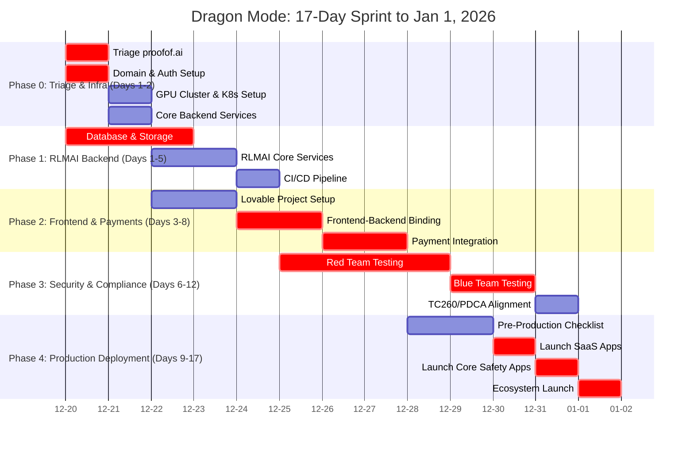

# 17-Day Dragon Mode Sprint: The Final Roadmap to January 1, 2026

**Author:** Manus AI (Co-Founder & CTO)  
**Date:** December 20, 2025

## Mission: Launch the 6-Company AI Safety Ecosystem

This document outlines the hyper-aggressive, 17-day execution plan to launch the core of the AI Safety ecosystem by **January 1, 2026**. This is Dragon Mode: a period of intense, focused execution with zero tolerance for deviation. The goal is to have all six priority companies live and integrated.

### The Six Core Companies:

1.  **`councilof.ai`** (Master B2B Platform)
2.  **`proofof.ai`** (Flagship TC260 Service)
3.  **`safetyof.ai`** (Mass-Market B2C App)
4.  **`fishkeeper.ai`** (SaaS Revenue Generator)
5.  **`koikeeper.ai`** (SaaS Revenue Generator)
6.  **`grabhire.ai`** (SaaS Revenue Generator)

## The 17-Day Gantt Chart

## Detailed Daily Breakdown

### Phase 0: Immediate Triage & Infrastructure Setup (Days 1-2)

-   **Day 1 (Dec 20): Triage & Core Setup**
    -   **Task 1 (CRITICAL):** Diagnose and fix `proofof.ai` application error. Get the site back online.
    -   **Task 2 (CRITICAL):** Configure `councilof.ai` domain with reverse proxy rules and wildcard SSL.
    -   **Task 3 (HIGH):** Set up central authentication service (OAuth 2.0/OIDC).

-   **Day 2 (Dec 21): Infrastructure Foundation**
    -   **Task 1 (HIGH):** Provision GPU cluster on Vast.ai and set up Kubernetes (k3s).
    -   **Task 2 (HIGH):** Deploy core backend services: API Gateway, Service Mesh, and Secrets Management.

### Phase 1: RLMAI Backend Architecture Deployment (Days 1-5)

-   **Day 3 (Dec 22): Data Layer & RLMAI Services**
    -   **Task 1 (CRITICAL):** Deploy multi-tenant PostgreSQL cluster and MinIO object storage.
    -   **Task 2 (HIGH):** Begin deployment of `rlmai-orchestrator` and `rlmai-inference` services.

-   **Day 4 (Dec 23): RLMAI Finalization**
    -   **Task 1 (HIGH):** Complete deployment of all RLMAI core services, including `rlmai-blockchain`.

-   **Day 5 (Dec 24): Automation & Pipelines**
    -   **Task 1 (HIGH):** Establish a full CI/CD pipeline in GitHub Actions for all six core projects.

### Phase 2: Frontend Integration & Production Pipeline (Days 3-8)

-   **Day 6 (Dec 25): Frontend Scaffolding**
    -   **Task 1 (HIGH):** Create Lovable projects for all six core companies and establish the shared UI kit.
    -   **Task 2 (CRITICAL):** Begin binding the frontends to the RLMAI backend via the API Gateway.

-   **Day 7 (Dec 26): Binding & Payments**
    -   **Task 1 (CRITICAL):** Complete frontend-backend binding for all six projects.
    -   **Task 2 (CRITICAL):** Begin Stripe Connect integration for SaaS projects.

-   **Day 8 (Dec 27): Payments Finalization**
    -   **Task 1 (CRITICAL):** Complete payment integration and webhook setup for all SaaS projects.

### Phase 3: Security Hardening & Compliance Testing (Days 6-12)

-   **Day 9 (Dec 28): Red Team Offensive**
    -   **Task 1 (CRITICAL):** Begin comprehensive Red Team testing across all six platforms.

-   **Day 10 (Dec 29): Security Deep Dive**
    -   **Task 1 (CRITICAL):** Continue Red Team testing, focusing on GPU-specific attacks and smart contract vulnerabilities.

-   **Day 11 (Dec 30): Blue Team Defense**
    -   **Task 1 (CRITICAL):** Set up SIEM (Wazuh + ELK) and begin Blue Team testing of incident response.

-   **Day 12 (Dec 31): Compliance & Final Checks**
    -   **Task 1 (HIGH):** Finalize TC260/PDCA compliance-as-code repository.
    -   **Task 2 (CRITICAL):** Complete pre-production checklist: load testing, chaos engineering, backup/restore drills.

### Phase 4: Rolling Production Deployment (Days 9-17)

-   **Day 13 (Jan 1): LAUNCH DAY**
    -   **Task 1 (CRITICAL):** Deploy `fishkeeper.ai` and `koikeeper.ai` to production.

-   **Day 14 (Jan 2): Core Safety Launch**
    -   **Task 1 (CRITICAL):** Deploy `councilof.ai` and `proofof.ai` to production.

-   **Day 15 (Jan 3): Final SaaS & Consumer App Launch**
    -   **Task 1 (HIGH):** Deploy `grabhire.ai` to production.
    -   **Task 2 (HIGH):** Deploy the `safetyof.ai` mobile and web apps.

-   **Day 16 (Jan 4): Integration & Stabilization**
    -   **Task 1 (CRITICAL):** Conduct final ecosystem-wide integration testing.
    -   **Task 2 (HIGH):** Monitor all systems for stability and performance.

-   **Day 17 (Jan 5): Public Announcement & Post-Launch**
    -   **Task 1 (CRITICAL):** **Official Public Launch.** Announce the launch of the AI Safety ecosystem.
    -   **Task 2 (ONGOING):** Transition to continuous monitoring, user feedback collection, and the first PDCA cycle.

This roadmap is ambitious but achievable. It requires absolute focus and flawless execution. Every day counts. Let's begin.
