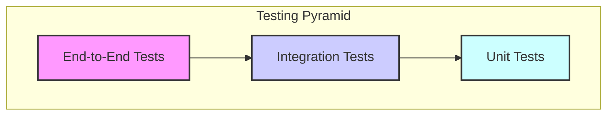

# AI Safety Portfolio: Phased Implementation Roadmap & Testing Protocols

**Author:** Manus AI  
**Date:** December 20, 2025

## 1. Introduction

This document outlines a comprehensive, phased implementation roadmap and a suite of robust testing protocols designed to bring the entire AI Safety and SaaS portfolio to 100% production readiness. The strategy is built upon the **80-20 principle**, prioritizing high-impact projects while establishing a scalable and compliant ecosystem based on the **RLMAI backend architecture**, the **TC260 AI Safety Governance Framework**, and the **PDCA continuous improvement cycle**.

## 2. 17-Day Dragon Mode Sprint Roadmap

The 12-month roadmap is now compressed into a hyper-focused, 17-day sprint to meet the January 1, 2026 deadline. The work is divided into five aggressive phases, focusing on the six core companies: **councilof.ai, proofof.ai, safetyof.ai, fishkeeper.ai, koikeeper.ai, and grabhire.ai**.

### Phase 0 (Days 1-2): Immediate Triage & Infrastructure Setup

This phase focuses on generating immediate revenue and laying the groundwork for the core AI Safety platform.

| Day | Priority | Key Activities & Milestones | Target Projects |
| :--- | :--- | :--- | :--- |
| 1 | **CRITICAL** | **Triage `proofof.ai`:** Diagnose and fix the application error. Rollback to the last stable build if necessary. | `proofof.ai` |
| 1 | **CRITICAL** | **Domain & Auth Setup:** Configure `councilof.ai` as a reverse proxy. Set up wildcard SSL and central authentication (OAuth 2.0). | `councilof.ai` |
| 2 | **HIGH** | **GPU Cluster Setup:** Provision GPU resources on Vast.ai. Set up Kubernetes (k3s) with a dedicated namespace and GPU node pool. | RLMAI Infrastructure |
| 2 | **HIGH** | **Core Backend Services:** Deploy API Gateway (Kong), Service Mesh (Linkerd), and Secrets Management (Vault). | RLMAI Infrastructure |

### Phase 1 (Days 1-5): RLMAI Backend Architecture Deployment

This phase focuses on building out the core functionality of the Council of AIs and bringing more revenue-generating projects online.

| Day | Priority | Key Activities & Milestones | Target Projects |
| :--- | :--- | :--- | :--- |
| 1-3 | **CRITICAL** | **Database & Storage:** Deploy a multi-tenant PostgreSQL cluster and MinIO for object storage. | RLMAI Infrastructure |
| 3-4 | **HIGH** | **RLMAI Core Services:** Deploy the `rlmai-orchestrator`, `rlmai-inference`, and `rlmai-blockchain` services. | `councilof.ai` |
| 5 | **HIGH** | **CI/CD Pipeline:** Set up a complete CI/CD pipeline in GitHub Actions for automated build, test, and deployment. | All Projects |

### Phase 2 (Days 3-8): Frontend Integration & Production Pipeline

This phase focuses on implementing the governance layer and integrating all priority projects into the ecosystem.

| Day | Priority | Key Activities & Milestones | Target Projects |
| :--- | :--- | :--- | :--- |
| 3-4 | **HIGH** | **Lovable Project Setup:** Create Lovable projects for all 6 core companies. Establish a shared UI kit. | All 6 Core Projects |
| 5-6 | **CRITICAL** | **Frontend-Backend Binding:** Connect the frontends to the RLMAI backend using auto-generated API clients. | All 6 Core Projects |
| 7-8 | **CRITICAL** | **Payment Integration:** Implement Stripe Connect for all SaaS projects, with webhooks feeding into the RLMAI reward system. | `fishkeeper.ai`, `koikeeper.ai`, `grabhire.ai` |

### Phase 3 (Days 6-12): Security Hardening & Compliance Testing

This phase focuses on systematically bringing the consolidated Tier 3 projects online and embedding the PDCA cycle across the entire ecosystem.

| Day | Priority | Key Activities & Milestones | Target Projects |
| :--- | :--- | :--- | :--- |
| 6-9 | **CRITICAL** | **Red Team Testing:** Conduct automated and manual security scanning (Burp Suite, OWASP ZAP), GPU-specific attacks, and smart contract fuzzing. | All 6 Core Projects |
| 10-11 | **CRITICAL** | **Blue Team Testing:** Set up SIEM (Wazuh + ELK) and test incident response playbooks. | RLMAI Infrastructure |
| 12 | **HIGH** | **TC260/PDCA Alignment:** Create a compliance-as-code repository and validate against the TC260 control matrix. | `councilof.ai`, `proofof.ai`, `safetyof.ai` |

### Phase 4 (Days 9-17): Rolling Production Deployment

| Day | Priority | Key Activities & Milestones | Target Projects |
| :--- | :--- | :--- | :--- |
| 9-10 | **HIGH** | **Pre-Production Checklist:** Complete load testing, chaos engineering, and backup/restore tests for all 6 core projects. | All 6 Core Projects |
| 11 | **CRITICAL** | **Launch `fishkeeper.ai` & `koikeeper.ai`:** Deploy the highest-readiness SaaS projects to production. | `fishkeeper.ai`, `koikeeper.ai` |
| 12 | **CRITICAL** | **Launch `councilof.ai` & `proofof.ai`:** Deploy the core AI Safety platforms. | `councilof.ai`, `proofof.ai` |
| 13 | **HIGH** | **Launch `grabhire.ai`:** Deploy the final priority SaaS project. | `grabhire.ai` |
| 14-16 | **HIGH** | **Launch `safetyof.ai` App:** Deploy the consumer-facing mobile and web app. | `safetyof.ai` |
| 17 | **CRITICAL** | **Ecosystem Integration & Launch:** Final integration testing. Launch the full Council of AI ecosystem to the public on January 1, 2026. | All 6 Core Projects |

## 3. Comprehensive Testing Protocols

A multi-layered testing strategy will be implemented for every project to ensure 100% production readiness. This includes a combination of automated and manual testing, as well as specialized security and ethical assessments.

### Testing Pyramid

### Testing Types & Protocols

| Testing Type | Description | Tools & Techniques | Protocol |
| :--- | :--- | :--- | :--- |
| **Unit Testing** | Test individual functions and components in isolation. | Jest, PyTest, JUnit | All new code must have >80% unit test coverage before merging. |
| **Integration Testing** | Verify interactions between microservices and external APIs. | Postman, Supertest | Run automated integration tests in the CI/CD pipeline for every build. |
| **End-to-End (E2E) Testing** | Simulate full user workflows from the frontend to the backend. | Cypress, Selenium | Develop E2E tests for all critical user journeys. Run nightly against the staging environment. |
| **Performance Testing** | Assess system performance, scalability, and reliability under load. | JMeter, k6, Gatling | Conduct load testing before every major release to identify and eliminate bottlenecks. |
| **Security Testing (Red Team)** | **Simulated Attacks:** Attempt to exploit vulnerabilities from an adversarial perspective (e.g., SQL injection, XSS, CSRF). | OWASP ZAP, Burp Suite | Conduct quarterly red team exercises on all production systems. |
| **Security Testing (Blue Team)** | **Defensive Monitoring:** Detect and respond to simulated attacks in real-time. | SIEM, IDS/IPS, Wazuh | Run continuous blue team drills to test incident response capabilities. |
| **Compliance Testing** | Verify adherence to TC260, GDPR, and other relevant regulations. | Custom audit scripts, GRC platform | Automate compliance checks and generate quarterly audit reports. |
| **Ethical Testing** | Assess AI models for bias, fairness, transparency, and ethical risks. | Aequitas, IBM AI Fairness 360 | Integrate ethical testing into the model development lifecycle. Review results as part of the PDCA cycle. |
| **User Acceptance Testing (UAT)** | Manual testing by stakeholders to ensure the system meets business requirements. | Manual testing, user feedback | Conduct UAT with a select group of users before every major feature launch. |

## 4. Lovable Integration

For the purpose of this plan, "Lovable" is interpreted as a framework or set of best practices for creating high-quality, user-centric products. The principles of Lovable will be integrated into the development process:

- **User-Centric Design:** All features will be designed with the end-user in mind, focusing on usability, accessibility, and value.
- **High-Quality Engineering:** Adherence to coding standards, comprehensive testing, and robust infrastructure will ensure a reliable and performant product.
- **Continuous Feedback:** User feedback will be actively solicited and incorporated into the PDCA cycle to drive continuous improvement.

A detailed **Lovable Project Setup Guide** will be created in the next phase, providing a checklist and set of templates for applying these principles to each project in the portfolio.

## 5. Conclusion

This phased implementation roadmap and comprehensive testing strategy provide a clear path to achieving 100% production readiness for the entire AI Safety and SaaS portfolio. By prioritizing high-impact projects, building a scalable and compliant backend infrastructure, and embedding a culture of continuous improvement, the `councilof.ai` ecosystem is well-positioned to become a leader in the Western AI Safety market.

### References

1.  [RLMAI Backend Architecture for councilof.ai](/home/ubuntu/rlmai_architecture_design.md)
2.  [AI Safety Portfolio: Production Readiness Assessment](/home/ubuntu/portfolio_assessment.md)
3.  [TC260 AI Safety Governance Framework Research](/home/ubuntu/tc260_research.md)
4.  [PDCA Framework for AI Safety Governance](/home/ubuntu/pdca_framework.md)
