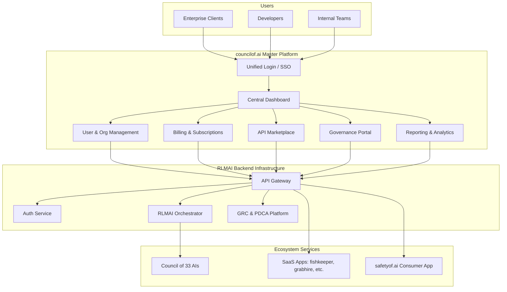

# Council of AI: Master Platform Architecture

**Author:** Manus AI (Co-Founder & CTO)  
**Date:** December 20, 2025

## 1. Vision: The Central Nervous System of the AI Safety Ecosystem

`councilof.ai` is not merely a website; it is the master platform, the central nervous system, and the primary user interface for the entire AI Safety ecosystem. It serves as the single pane of glass through which enterprise clients, developers, and internal teams will manage, monitor, and interact with the Council of 33 AIs and the suite of SaaS applications.

This document outlines the architecture for `councilof.ai`, designed to be the ultimate B2B governance and orchestration platform, fully integrating the RLMAI backend, AEO principles, and the Dragon Mode strategic objectives.

## 2. High-Level Architecture Diagram

## 3. Core Components & Features

### 3.1. Unified User & Organization Management

- **Single Sign-On (SSO):** Users will have a single identity across the entire ecosystem. The platform will leverage the central **Auth Service** (OAuth 2.0/OIDC) from the RLMAI backend.
- **Organization & Team Management:** Enterprise clients can create organizations, invite team members, and assign roles and permissions (e.g., Admin, Developer, Auditor).
- **Role-Based Access Control (RBAC):** Granular control over which users can access which services, data, and features.

### 3.2. Centralized Billing & Subscription Management

- **Unified Subscription:** Clients will subscribe to the `councilof.ai` platform through tiered pricing plans (e.g., Free, Pro, Enterprise).
- **Metered & Usage-Based Billing:** Consumption of individual AI services (e.g., API calls to `proofof.ai`, reports from `transparencyof.ai`) will be metered and billed accordingly.
- **Stripe Connect Integration:** The platform will act as the central Stripe Connect platform, with each SaaS application (`fishkeeper.ai`, `grabhire.ai`, etc.) operating as a connected account for seamless revenue sharing and payouts.
- **Invoice Management:** A centralized portal for clients to view and manage their invoices and payment history.

### 3.3. The Governance Portal: Orchestrating the Council of AIs

This is the core of the `councilof.ai` platform, providing the interface to manage and interact with the Council of 33 AIs.

- **Council Configuration:** Admins can configure the voting weights, quorum thresholds, and operational parameters of the Council.
- **Task Orchestration:** Users can submit complex tasks to the Council (e.g., "Audit this AI model for all 33 TC260 risk categories"). The `rlmai-orchestrator` will break down the task and distribute it to the relevant AI services.
- **Real-Time Voting Visualization:** A live dashboard will visualize the voting process of the Council members, showing the confidence scores and decisions of each AI.
- **Certificate Minting:** Upon successful completion and verification of a task, the platform will interface with the `rlmai-blockchain` service to mint a verifiable certificate of compliance on the blockchain.

### 3.4. API Marketplace & Developer Hub

- **Public API Documentation:** A comprehensive developer portal with interactive API documentation (e.g., using Swagger/OpenAPI) for all public-facing AI services.
- **API Key Management:** Developers can generate, manage, and rotate their API keys for accessing the ecosystem services.
- **SDKs & Client Libraries:** Provide SDKs in multiple languages (Python, JavaScript/TypeScript, etc.) to simplify integration.
- **Third-Party Monetization:** Enable third-party developers to build and sell their own AI safety services on the platform, creating a network effect.

### 3.5. Reporting, Analytics & Compliance

- **Unified Dashboard:** A customizable dashboard providing a high-level overview of the health, performance, and security posture of the entire AI ecosystem.
- **TC260 Compliance Scorecard:** A real-time scorecard that measures the organization's compliance against the TC260 framework, based on data from the GRC platform.
- **PDCA Cycle Tracker:** Visualize the progress of ongoing PDCA cycles, from planning and implementation to checking and acting.
- **Audit Trail & Reporting:** Generate comprehensive audit reports for regulatory purposes, with a full, immutable history of all actions and decisions made by the Council.

## 4. Technology Stack

- **Frontend:** Next.js (React) with TypeScript for a fast, modern, and type-safe user experience.
- **UI Kit:** A shared component library built with Tailwind CSS and published as a private NPM package to ensure brand consistency.
- **State Management:** TanStack Query for efficient data fetching, caching, and state synchronization with the backend.
- **API Client:** Auto-generated API clients from the OpenAPI specifications of the backend services.
- **Backend:** The `councilof.ai` frontend will communicate with the **RLMAI Backend Infrastructure** via the central API Gateway.

## 5. Integration Strategy

- **`safetyof.ai`:** The consumer app will use the same SSO as the master platform. Anonymized, aggregated data from `safetyof.ai` will be fed back into the RLMAI backend as a valuable data source for training and improving the Council of AIs.
- **SaaS Portfolio:** Each SaaS application will be integrated as a connected account in Stripe and will use the central authentication service. They will also feed relevant data (with user consent) into the RLMAI data lake.
- **`proofof.ai` & other AI Safety Services:** These will be the core microservices that make up the Council of 33 AIs, exposed via the API Gateway and orchestrated by the Governance Portal.

This architecture positions `councilof.ai` as the indispensable command center for the AI Safety revolution, providing unparalleled governance, transparency, and control for the enterprise, while driving the entire ecosystem forward.
