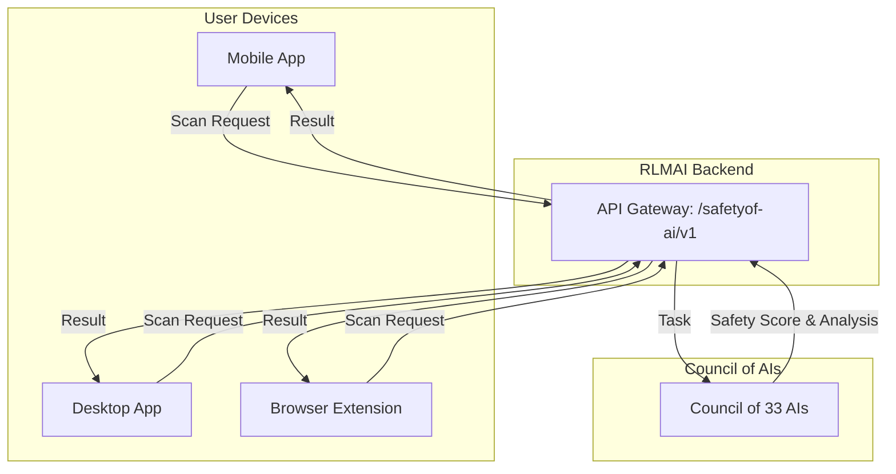

# safetyof.ai: The AI Safety App for Everyone

**Author:** Manus AI (Co-Founder & CTO)  
**Date:** December 20, 2025

## 1. Vision: An Antivirus for AI

`safetyof.ai` is the consumer-facing shield of the AI Safety ecosystem. Its mission is to protect everyday internet users from the growing threats of malicious AI, such as deepfakes, phishing, misinformation, and scams. It is designed to be as simple and essential as an antivirus program, providing peace of mind in the age of AI.

This document outlines the product and technical architecture for `safetyof.ai`, the mass-market B2C application that complements the B2B governance platform, `councilof.ai`.

## 2. Multi-Platform Strategy: Safety Everywhere

To achieve mass adoption, `safetyof.ai` will be available on every major platform, ensuring users are protected wherever they are.

- **Mobile App (iOS & Android):** Protects users on the go, scanning links, messages, and content within other apps.
- **Desktop App (Windows & macOS):** Provides system-wide protection, scanning files, emails, and desktop applications.
- **Browser Extension (Chrome, Firefox, Safari):** Offers real-time protection within the browser, scanning web pages, social media feeds, and downloads.
- **Web Dashboard:** A central hub for users to manage their account, view their safety reports, and access educational content.

## 3. Core Features: Simple, Intuitive, Powerful

The user experience will be centered around simplicity and clarity. The app will do the heavy lifting in the background, providing users with simple, actionable insights.

| Feature | Description | User Benefit |
| :--- | :--- | :--- |
| **Real-time Threat Scanner** | Automatically scans text, images, audio, and links for AI-generated threats using the power of the Council of 33 AIs. | Instant protection from deepfakes, phishing, scams, and misinformation. |
| **AI Safety Score** | Provides a simple, color-coded safety score (e.g., Green, Yellow, Red) for websites, emails, and social media posts. | At-a-glance understanding of potential risks without needing technical knowledge. |
| **Personal Safety Dashboard** | A personalized dashboard showing the user's risk exposure, the number of threats blocked, and their safety history. | Empowers users with visibility and control over their digital safety. |
| **One-Click Reporting** | A simple button to report suspicious content directly to the `councilof.ai` for analysis by the full Council of AIs. | Allows users to actively participate in making the AI ecosystem safer for everyone. |
| **Educational Hub** | A curated library of simple, easy-to-understand articles and videos about AI safety. | Educates users about emerging threats and best practices for staying safe online. |

## 4. Architecture & Technology Stack

`safetyof.ai` is designed as a lightweight client that leverages the immense power of the central RLMAI backend. This client-server architecture ensures the app remains fast and responsive on all devices.

### High-Level Diagram

### Technology Stack

- **Mobile App:** **React Native (with Expo)** to enable a single codebase for both iOS and Android, ensuring rapid development and consistency.
- **Desktop App:** **Tauri** or **Electron** to wrap the web application into a native desktop experience for Windows and macOS.
- **Browser Extension:** Standard **WebExtensions API** for cross-browser compatibility.
- **Web Dashboard:** **Next.js** with TypeScript, using the same shared UI kit as `councilof.ai`.
- **Backend Communication:** All clients will communicate with the RLMAI backend via a dedicated, public-facing endpoint on the central **API Gateway** (e.g., `https://api.councilof.ai/safetyof-ai/v1/scan`).

## 5. Data Strategy: The Privacy-First Data Moat

`safetyof.ai` is not only a shield for users but also the primary intelligence-gathering engine for the entire ecosystem.

- **Privacy-First by Design:** The app will collect the minimum amount of data necessary to provide its service. All user data will be anonymized and aggregated on the backend.
- **The Data Moat:** The vast, real-world dataset of AI-related threats collected from millions of users is the single most valuable asset of the ecosystem. This data will be used to continuously train and improve the Council of 33 AIs, creating an unreplicable competitive advantage.
- **User as a Partner:** Users are not just consumers; they are partners in building a safer internet. By using the app and reporting threats, they are actively contributing to the training data that powers the entire AI Safety ecosystem.

## 6. Monetization: Freemium Model

A freemium model will be used to drive mass adoption while creating a sustainable revenue stream.

- **Free Tier:**
  - Real-time scanning of links and text
  - AI Safety Score for websites
  - Basic personal dashboard

- **Premium Tier ($5/month):**
  - All free features, plus:
  - Proactive scanning of emails and social media feeds
  - Deepfake detection for images and videos
  - Detailed threat reports and analytics
  - Family safety features (e.g., protecting children's devices)
  - Priority support

## 7. Integration with the `councilof.ai` Ecosystem

`safetyof.ai` is inextricably linked to `councilof.ai` and the RLMAI backend.

- **The Eyes and Ears:** It is the primary sensor network for the Council of AIs, feeding it a constant stream of real-world threat data.
- **A Symbiotic Loop:** The Council of AIs processes the data from `safetyof.ai` to become smarter and more accurate. In turn, the improved models are pushed back to the `safetyof.ai` app, providing better protection for users.
- **Unified Identity:** Users will log in using the same central authentication service as `councilof.ai`, allowing for a seamless experience across the B2C and B2B platforms.

By launching `safetyof.ai`, we are not just building an app; we are building a global, distributed immune system for the internet, powered by a collective of specialized AIs and a community of engaged users.
