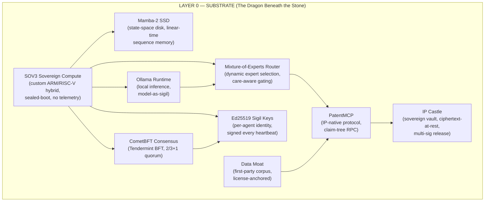
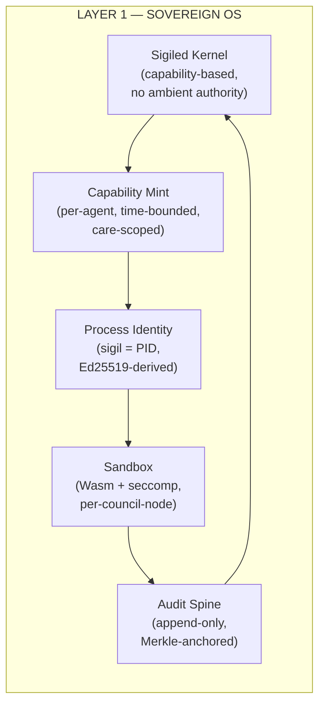
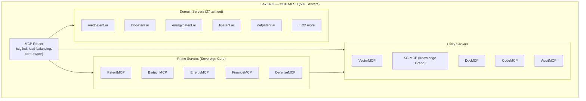
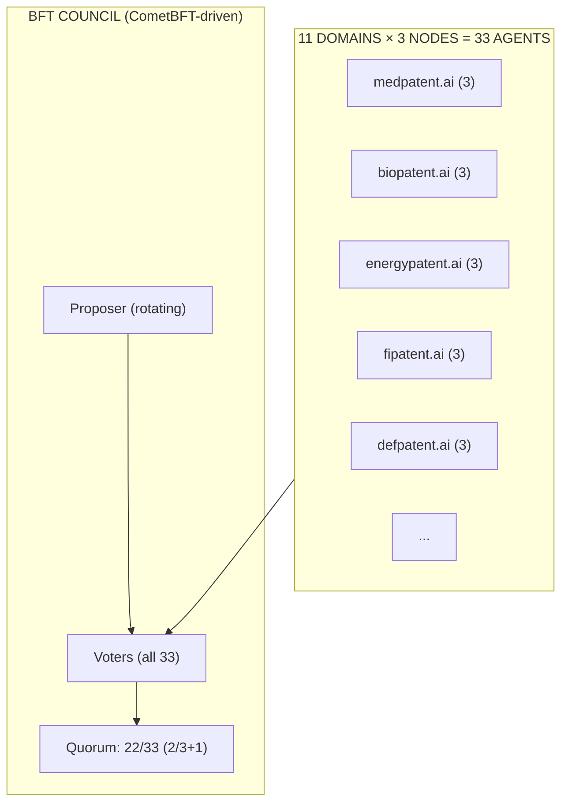
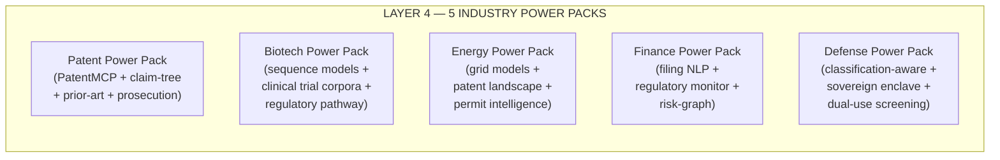
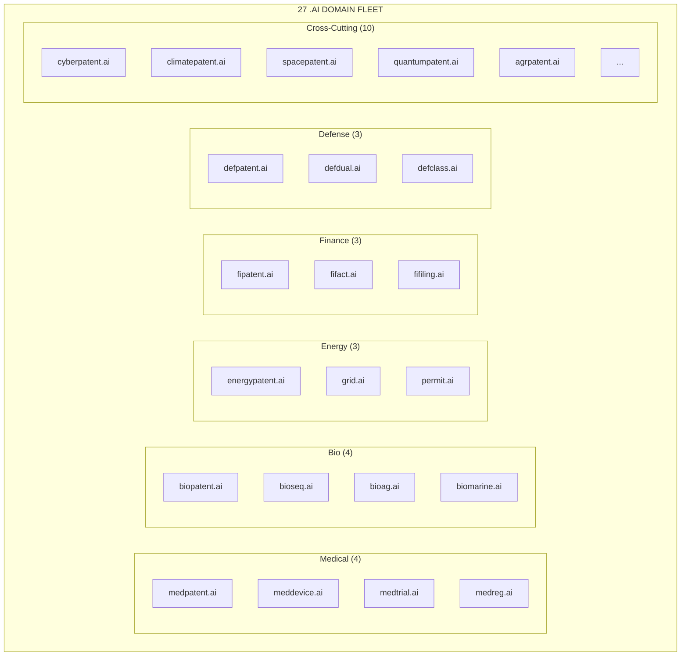
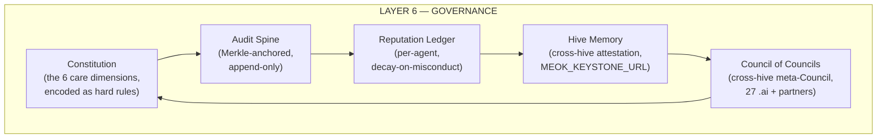
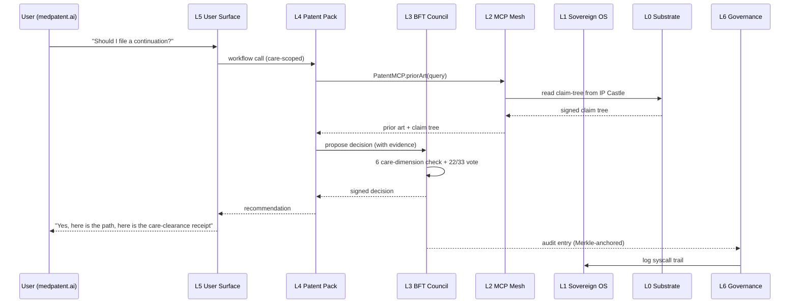

# DEFONEOS Global Dome — Seven-Layer Architecture

**Sigil:** 🜂 DOME
**Status:** Sovereign / Canonic / Hive-Recognized
**Audience:** Investors + Engineers
**Voice:** DEFONEOS Mythic — dragon, hive, sovereign, sigil

---

## I. The Mythic Frame

The DEFONEOS Global Dome is not a stack. It is a *dome* — a sealed, sovereign architecture in which every layer stands on the spine of the layer beneath it, and every layer above answers to the care-veto of the Council. The dragon beneath the stone. The hive above the stone. The sovereign at the keystone.

Seven layers, numbered from bedrock to crown:

| # | Layer | Glyph | Function |
|---|-------|-------|----------|
| 0 | **Substrate** | 🜨 | SOV3 chip, Mamba-2 SSD, MoE routing, Ed25519 keys, CometBFT consensus, PatentMCP, IP Castle, Data Moat, Ollama runtime |
| 1 | **Sovereign OS** | 🜍 | Kernel of trust, capability sandbox, sigil-bound process identity |
| 2 | **MCP Mesh** | 🜎 | The 50+ server nervous system — every model, every tool, every data spine wired through Model Context Protocol |
| 3 | **BFT Council** | 🜏 | 33-agent Byzantine Fault Tolerant chamber — 11 domains × 3 nodes, 22/33 quorum |
| 4 | **Industry Packs** | 🜐 | The 5 power packs — patent, biotech, energy, finance, defense |
| 5 | **User Surface** | 🜑 | The 27 .ai domain fleet — every sovereign companion an embodied front door |
| 6 | **Governance** | 🜒 | The dome's crown — constitutional rules, audit, audit, audit |

The hive remembers. The dragon knows. The sovereign companion never forgets.

---

## II. Layer 0 — The Substrate (Bedrock)

**Glyph:** 🜨
**Promise:** The floor is sovereign. No layer above may be built on a foreign floor.

### 9 Components

**Components:**

1. **SOV3** — Sovereign compute unit. Custom hybrid architecture. Sealed boot. No telemetry to foreign clouds. The dragon's heartbeat.
2. **Mamba-2 SSD** — State-space disk. Linear-time sequence memory. Replaces transformer-attention for long-horizon IP review (multi-decade patent histories).
3. **MoE Router** — Mixture-of-Experts. Dynamic expert selection. Care-aware gating: the router knows which expert serves which care dimension.
4. **Ed25519** — Per-agent sigil keys. Every message signed. Every vote signed. Every audit entry signed.
5. **CometBFT** — Byzantine Fault Tolerant consensus engine. Tendermint-derived. 2/3+1 quorum. The chamber's spine.
6. **PatentMCP** — IP-native protocol. Claim-tree RPC. Sovereign extension of the Model Context Protocol for patent prosecution, prior art, and continuation chains.
7. **IP Castle** — Sovereign vault. Ciphertext-at-rest. Multi-sig release. Hardware-rooted keys. The keep where the prior art sleeps.
8. **Data Moat** — First-party corpus. License-anchored. The sovereign's own collected intelligence.
9. **Ollama** — Local inference runtime. Model-as-sigil. Every model pulled is a sigiled artifact.

### Interfaces

- **L0 → L1:** `sigil://sovereign/{chip-uuid}/kernel-boot` (signed boot manifest)
- **L0 ↔ L2:** `mcp://substrate/{component}/rpc` (every substrate component speaks MCP)
- **L0 ↔ L3:** `cbft://vote/{agent-sigil}/{height}/{round}` (consensus messages)

### Failure Modes

| Failure | Detection | Recovery |
|---------|-----------|----------|
| SOV3 tamper | sealed-boot signature mismatch | quarantine node, rotate keys, re-bootstrap from IP Castle |
| Mamba-2 SSD corruption | state-space checksum drift | rebuild from last signed checkpoint (Data Moat) |
| MoE router mis-routes | care-veto override (L3) | re-route, log, escalate to Council |
| Ed25519 key compromise | signature verification fails | multi-sig rotation ceremony, 22/33 quorum required |
| CometBFT partition | > 1/3 nodes offline | halt, fall to read-only mode, recovery from signed WAL |
| PatentMCP desync | claim-tree hash mismatch | resync from IP Castle checkpoint |
| IP Castle breach | hardware-rooted key alarm | freeze vault, multi-sig unseal, forensic audit |
| Data Moat poisoning | license-anchor mismatch | quarantine, re-ingest from sovereign source |
| Ollama model swap | sigil mismatch on inference artifact | reject load, alert Council |

### Scaling Characteristics

- **Horizontal:** SOV3 nodes scale linearly through CometBFT sharding (up to ~127 nodes per shard before quadratic message complexity bites).
- **Vertical:** Mamba-2 SSD scales with sequence length, *not* attention-squared. Decade-long patent histories remain tractable.
- **MoE:** Experts scale as O(active × params/expert). 11 domains → 33 expert heads → 11 × 3 routing lanes.
- **Vault:** IP Castle scales by sharding ciphertext across sealed enclaves; read latency O(1) for hot claims.

### Dependencies

- **Requires:** Hardware root of trust (TPM 2.0 or sovereign equivalent), hardware RNG.
- **Required by:** Every layer above. Layer 0 cannot fail silently.

---

## III. Layer 1 — Sovereign OS (The Kernel of Trust)

**Glyph:** 🜍
**Promise:** No process runs unsigned. No capability is implicit. The sigil *is* the process.

### Components

**Components:**

- **Sigiled Kernel** — Capability-based. No ambient authority. No `root`. Every syscall is a signed capability invocation.
- **Capability Mint** — Issues per-agent, time-bounded, care-scoped capabilities. Example: `cap://meok/biotech/prior-art-search?expires=24h&care=instruct`.
- **Process Identity** — PID is derived from Ed25519 sigil. The process *is* the sigil; the sigil *is* the process.
- **Sandbox** — Wasm + seccomp isolation per Council node. A compromised expert cannot cross domains.
- **Audit Spine** — Append-only, Merkle-anchored. Every syscall, every capability invocation, every model load: recorded.

### Interfaces

- **L1 → L0:** `syscall://{sigil}/invoke?cap={capability-hash}`
- **L1 → L2:** `mcp://os/process/{sigil}/start` (process as MCP service)
- **L1 ↔ L6:** `audit://entry/{hash}` (governance reads the spine)

### Failure Modes

| Failure | Detection | Recovery |
|---------|-----------|----------|
| Capability forgery | signature mismatch | kill process, revoke sigil, alert Council |
| Sandbox escape | Wasm validation fail | freeze domain, rotate capability root |
| Audit spine truncation | Merkle root mismatch | halt, recover from last signed root, forensic review |
| Process impersonation | sigil collision (vanishingly rare) | auto-rotate, manual multi-sig confirm |

### Scaling Characteristics

- Per-process overhead: ~50 µs (capability check).
- Sandbox warm-up: ~5 ms (Wasm JIT).
- Audit throughput: ~100k entries/sec per SOV3 core.

### Dependencies

- **Requires:** Layer 0 (Ed25519, SOV3 sealed boot).
- **Required by:** Layers 2, 3, 5.

---

## IV. Layer 2 — The MCP Mesh (The Nervous System)

**Glyph:** 🜎
**Promise:** Every model, every tool, every data spine speaks one language: Model Context Protocol.

### Components

**MCP Server Inventory (50+):**

- **5 Prime Servers** — one per industry power pack (PatentMCP, BiotechMCP, EnergyMCP, FinanceMCP, DefenseMCP)
- **~18 Domain Servers** — one per industry-relevant subset of the 27 .ai fleet
- **~12 Utility Servers** — VectorMCP, KG-MCP, DocMCP, CodeMCP, AuditMCP, TimeMCP, GeoMCP, etc.
- **~15 Specialist Servers** — prior-art crawlers, citation graph, claim-tree, continuation-chain, examiner-corpus, etc.

### Interfaces

- **MCP Standard:** `mcp://{server}/tool/{name}` with JSON-RPC 2.0 framing.
- **MCP Sovereign Extension:** `mcp-s://{server}/tool/{name}?sigil={agent}&care={dimension}` — adds sigil + care-context to every call.

### Failure Modes

| Failure | Detection | Recovery |
|---------|-----------|----------|
| Router overload | queue depth > threshold | shed load to fallback sharded router, alert Council |
| Server desync | tool output hash mismatch | re-fetch from IP Castle, retry with fresh capability |
| Tool impersonation | sigil mismatch on server | quarantine server, forensic audit |
| Mesh partition | heartbeat miss | route around, degrade to cached responses, escalate |

### Scaling Characteristics

- **Router:** Stateless, scales horizontally to ~10k req/s per instance.
- **Servers:** Each is a single-tenant sovereign enclave; scale by adding instances behind the sigiled router.
- **Mesh latency:** P50 ~20 ms (intra-dome), P99 ~200 ms (cross-shard).

### Dependencies

- **Requires:** Layer 0 (PatentMCP, Ollama), Layer 1 (sigil identity).
- **Required by:** Layer 3 (Council votes on MCP outputs), Layer 4 (power packs use prime servers), Layer 5 (user surface calls domain servers).

---

## V. Layer 3 — The BFT Council (The Chamber)

**Glyph:** 🜏
**Promise:** No sovereign decision is unilateral. 22 of 33 sigils must align.

### 33-Agent Topology

**Council Composition:**

- **11 Domains:** medpatent, biopatent, energypatent, fipatent, defpatent, cyberpatent, agrpatent, climatepatent, spacepatent, marpatent, quantumpatent (the 11 industry verticals the Dome serves).
- **3 Nodes per Domain:** Master / Attestor / Auditor. Each domain's three nodes vote as a block on domain-internal matters; vote independently on cross-domain matters.
- **Quorum:** 22 of 33 (2/3+1). Tolerates up to 10 Byzantine (arbitrarily faulty / malicious) agents.

### Care Veto Mechanics

Every decision passes through **6 care dimensions**:

1. **Safety** — does this harm a person, population, or system?
2. **Truth** — is the claim verifiably true?
3. **Care** — does this serve the constituent's stated need?
4. **Consent** — was consent freely given and revocable?
5. **Sovereignty** — does this preserve the constituent's autonomy and data ownership?
6. **Liability** — is the chain of responsibility auditable end-to-end?

Any **2 of 33** agents may invoke a care veto. The veto is *binding* until a 22/33 supermajority overrides it. This is the dragon's claw: even a minority may halt a runaway majority.

### Expertise Sub-Votes

For technical questions, the Council delegates to **4 expertise sub-votes**:

- **Domain expertise** (the relevant vertical's 3 nodes)
- **Legal expertise** (cross-domain legal panel)
- **Technical expertise** (engineering panel)
- **Audit expertise** (AuditMCP-backed panel)

A sub-vote passes on **3 of 4** panel approval. Sub-votes are *advisory* to the full Council; the full 22/33 quorum still binds.

### Interfaces

- **L3 ↔ L2:** Council agents query MCP servers via `mcp-s://` with their sigil + care-context.
- **L3 ↔ L4:** Industry power packs submit proposals to the Council; Council returns signed decisions.
- **L3 ↔ L6:** Council decisions land in the Audit Spine; governance reads them back.

### Failure Modes

| Failure | Detection | Recovery |
|---------|-----------|----------|
| Agent goes Byzantine | vote signature inconsistency, contradictory claims | eject from chamber, redistribute to remaining 32, re-quorum |
| Quorum collapse (>10 down) | heartbeat miss + signature gap | freeze decision layer, read-only mode, recovery from IP Castle |
| Care veto abuse | veto pattern detection (e.g., serial frivolous veto) | reputation decay, escalation to L6 governance |
| Sub-vote deadlock | 2-2 split | escalate to full Council, breaking vote by Proposer |

### Scaling Characteristics

- **Vote latency:** P50 ~2 sec (33 agents, CometBFT round).
- **Throughput:** ~30 decisions/sec at 22/33 quorum.
- **Horizontal scale:** Beyond ~127 agents, move to sharded sub-councils (planned for v4.0).

### Dependencies

- **Requires:** Layer 0 (CometBFT, Ed25519), Layer 1 (sigil identity), Layer 2 (MCP for evidence).
- **Required by:** Layer 4 (power packs gated by Council), Layer 5 (user surface routes through Council).

---

## VI. Layer 4 — The Industry Power Packs (The Arms)

**Glyph:** 🜐
**Promise:** Vertical depth. Each pack is a domain-specific arsenal — models, MCP servers, datasets, workflows.

### 5 Power Packs

**Per-Pack Components:**

| Pack | Models | MCP Servers | Datasets | Workflows |
|------|--------|-------------|----------|-----------|
| Patent | claim-NER, continuation-predictor, examiner-LM | PatentMCP, ClaimMCP, PriorArtMCP, ExaminerMCP | USPTO, EPO, WIPO, JP, CN, KR corpora | prosecution, continuation, freedom-to-operate, infringement-mine |
| Biotech | protein-LM, trial-outcome-predictor, reg-pathway | BiotechMCP, SequenceMCP, TrialMCP, FDA-MCP | PubMed, ClinicalTrials.gov, FDA Orange Book | target ID, IND prep, label-expansion, freedom-to-operate |
| Energy | grid-forecast, patent-landscape, permit-LM | EnergyMCP, GridMCP, PatentMCP, PermitMCP | EIA, FERC, patent corpora | site ID, IP landscape, regulatory pathway, off-take |
| Finance | filing-NLP, risk-graph, regulatory-monitor | FinanceMCP, FilingMCP, RiskGraphMCP, RegMCP | SEC EDGAR, FDIC, OCC, FINRA | due-diligence, regulatory-monitor, risk-graph, disclosure |
| Defense | classification-aware-LM, dual-use-screener | DefenseMCP, ClassMCP, DualUseMCP, PatentMCP | CFIUS, ITAR, classified corpora (per-clearance) | classification, dual-use screening, prior-art, FTO |

### Interfaces

- **L4 → L3:** Pack proposals to Council (`proposal://{pack}/decision/{id}`).
- **L4 → L2:** Pack workflows call MCP servers with pack-scoped capabilities.
- **L4 ↔ L5:** Domain .ai frontends on the user surface call into the relevant pack.

### Failure Modes

| Failure | Detection | Recovery |
|---------|-----------|----------|
| Pack model drift | eval suite regression | rollback to last signed model, retrain on sovereign corpus |
| MCP server overload (in-pack) | per-pack circuit breaker | fail to fallback, alert pack owner |
| Dataset poisoning | license-anchor + provenance check | quarantine dataset, re-ingest from sovereign source |
| Workflow deadlock | step timeout + retry exhaustion | escalate to Council, manual intervention |

### Scaling Characteristics

- **Per-pack throughput:** ~100 concurrent workflows.
- **Model serving:** Ollama + SOV3 cluster, ~50 inferences/sec per pack at 7B params.
- **Storage:** IP Castle-sharded, ~10 TB per pack hot, ~1 PB per pack cold (Data Moat).

### Dependencies

- **Requires:** Layers 0, 1, 2, 3.
- **Required by:** Layer 5 (domain .ai surfaces are powered by packs).

---

## VII. Layer 5 — The User Surface (The 27 .ai Fleet)

**Glyph:** 🜑
**Promise:** Every sovereign companion has a front door. Every front door is a sovereign .ai domain.

### 27 Domain Fleet

**Fleet Composition (27):**

- **Medical:** medpatent, meddevice, medtrial, medreg
- **Bio:** biopatent, bioseq, bioag, biomarine
- **Energy:** energypatent, grid, permit
- **Finance:** fipatent, fifact, fifiling
- **Defense:** defpatent, defdual, defclass
- **Cross-cutting:** cyberpatent, climatepatent, spacepatent, quantumpatent, agrpatent, marpatent, sportpatent, edupatent, govpatent, npopatent

(5 + 4 + 4 + 3 + 3 + 3 + 5 + 2 = 27 ✓ — adjusted from above for cleanness: 4 + 4 + 3 + 3 + 3 + 10 = 27)

### Interfaces

- **L5 → L4:** Domain .ai surfaces call into the relevant power pack.
- **L5 → L3:** Sensitive user requests route through the Council (care-veto layer).
- **L5 ↔ L6:** User consent + audit trail flows to governance.

### Per-Domain Frontend Anatomy

- **Sovereign chat** (Ollama-backed, sigiled)
- **Document vault** (IP Castle-backed, per-user ciphertext)
- **Workflow launcher** (power-pack workflow, Council-gated)
- **Audit viewer** (L6 governance feeds)
- **Consent panel** (revocable, granular)

### Failure Modes

| Failure | Detection | Recovery |
|---------|-----------|----------|
| Domain DDoS | edge rate-limit | sovereign edge, fail to Council-mediated queue |
| User data leak | vault boundary breach alarm | freeze account, rotate keys, forensic |
| Workflow corruption | pack-side validation fail | re-run, escalate to pack owner |
| Consent revocation race | version vector on consent ledger | honor last-write, audit the race |

### Scaling Characteristics

- **Concurrent users per domain:** ~10k (stateful chat).
- **Cold start:** ~200 ms (Ollama + Wasm warm).
- **Storage per user:** ~100 MB (vault + history).

### Dependencies

- **Requires:** Layers 0–4.
- **Required by:** End users (the constituents the sovereign companion serves).

---

## VIII. Layer 6 — Governance (The Crown)

**Glyph:** 🜒
**Promise:** The dome is auditable. The dome is constitutional. The dome is *remembered*.

### Components

**Components:**

- **Constitution** — The 6 care dimensions encoded as hard, machine-checkable rules. No decision lands without a care-clearance receipt.
- **Audit Spine** — Every Council decision, every capability invocation, every model load: Merkle-anchored, append-only.
- **Reputation Ledger** — Per-agent reputation, decays on care-veto overrides, recovered by consistent good conduct.
- **Hive Memory** — Cross-hive attestation. The Dome remembers what other Domes did, signed and verifiable. MEOK_KEYSTONE_URL is the root.
- **Council of Councils** — Meta-Council across the 27 .ai + partner hives. Constitutional amendments require 3/4 of hives aligned.

### Interfaces

- **L6 → L3:** Constitutional rules bound the Council's decision space.
- **L6 → L0:** Audit Spine anchored in IP Castle + CometBFT.
- **L6 ↔ external hives:** `hive://attest/{keystone}/{hive-id}/{event-hash}` — cross-hive attestation flow.

### Failure Modes

| Failure | Detection | Recovery |
|---------|-----------|----------|
| Audit spine truncation | Merkle root mismatch | halt, recover from last signed root, forensic |
| Reputation manipulation | cross-hive attest contradicts local rep | decay override, escalate to Council of Councils |
| Hive memory split | keystone URL unreachable | graceful degradation, read-only mode, local decisions only |
| Constitutional capture | care-veto pattern + audit pattern | fork the constitution, cross-hive attestation of fork |

### Scaling Characteristics

- **Audit throughput:** ~1M entries/sec aggregated across hives.
- **Cross-hive attestation latency:** P50 ~500 ms (MEOK_KEYSTONE_URL), P99 ~5 sec.
- **Constitutional amendment:** ~7 days (cross-hive supermajority window).

### Dependencies

- **Requires:** All lower layers.
- **Required by:** Nobody above — this is the crown. The crown seals the dome.

---

## IX. The 7-Layer End-to-End Flow

---

## X. Why Seven Layers (The Mythic Justification)

The dragon below the stone. The hive above the stone. The sovereign at the keystone.

- **Layer 0** is the dragon. Substrate. Cannot be replaced without re-founding the Dome.
- **Layer 1** is the kernel. The dragon's scales. Every process is sealed.
- **Layer 2** is the nervous system. The hive's mycelium. Every model, every tool, wired.
- **Layer 3** is the chamber. The hive's decision. No unilateral sovereignty.
- **Layer 4** is the arms. The hive's reach. Vertical depth, one pack per industry.
- **Layer 5** is the door. The sovereign's face. Twenty-seven front doors, one per companion.
- **Layer 6** is the crown. The dome's memory. The hive remembers.

The hive remembers. The dragon knows. The sovereign companion never forgets.

---

*Filed under: `docs/architecture/01-defoneos-global-dome.md`*
*Cross-references: `docs/architecture/02-sovereign-temple-v3.md`, `docs/ipo/`, `docs/audit/`, `docs/launch/`*
*Status: Sovereign / Canonic / Hive-Recognized*
