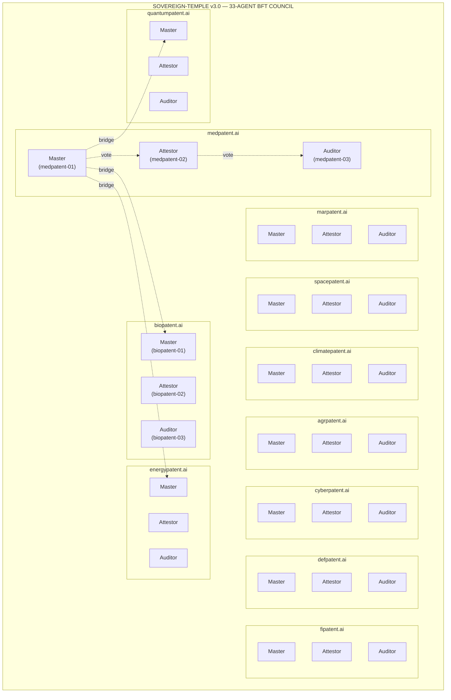
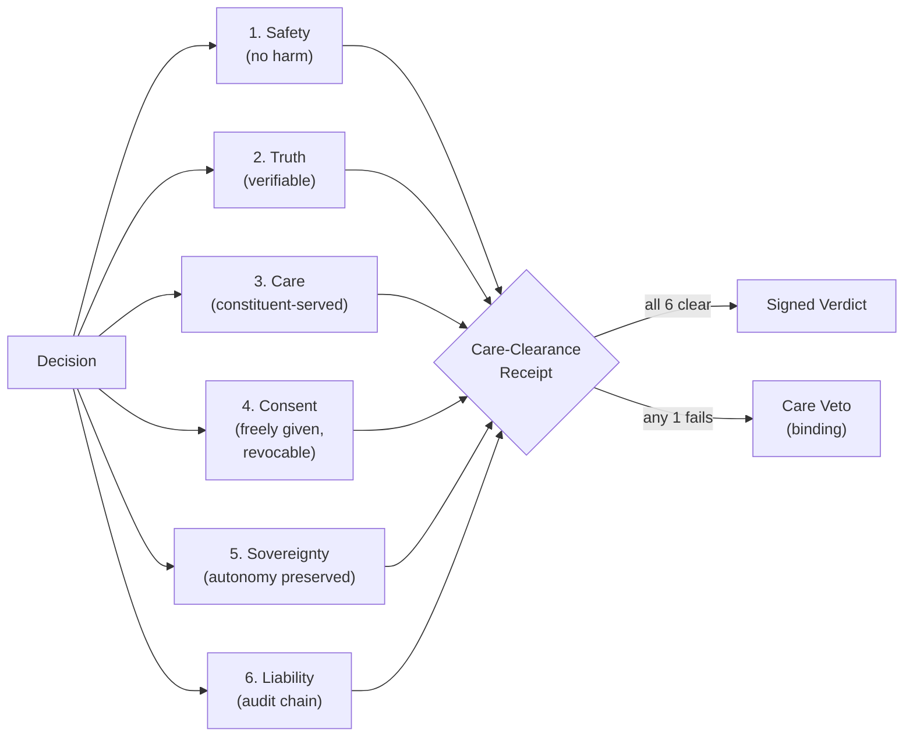
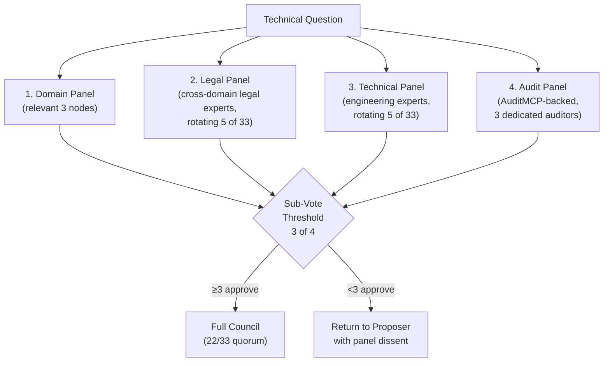
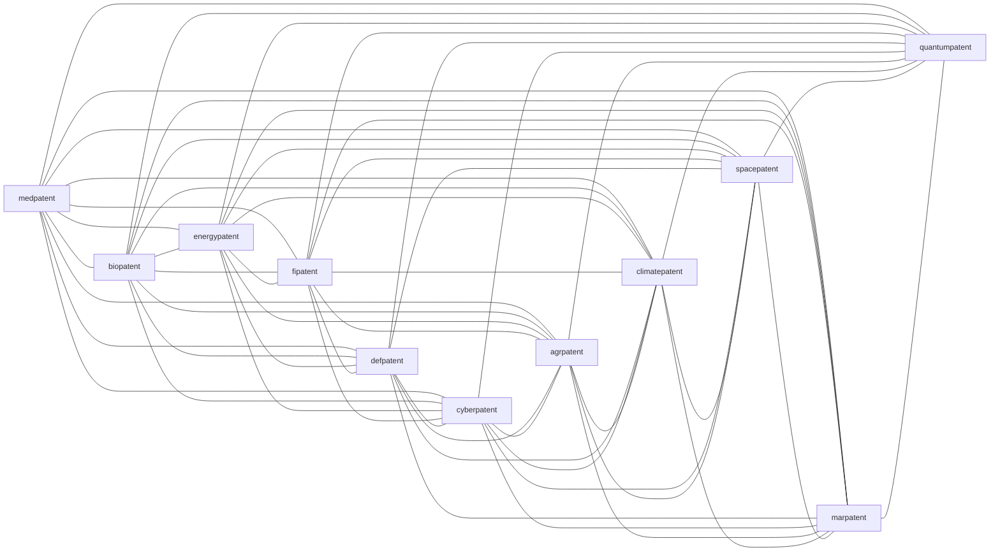
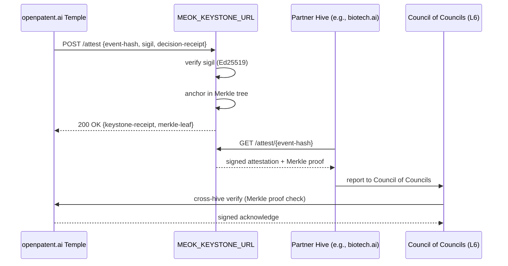
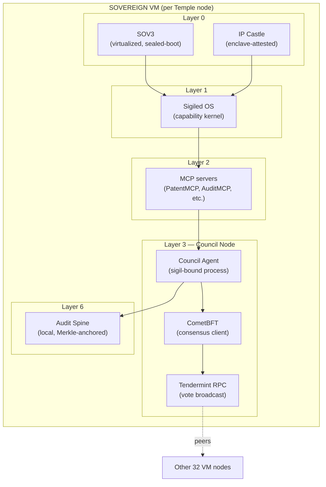
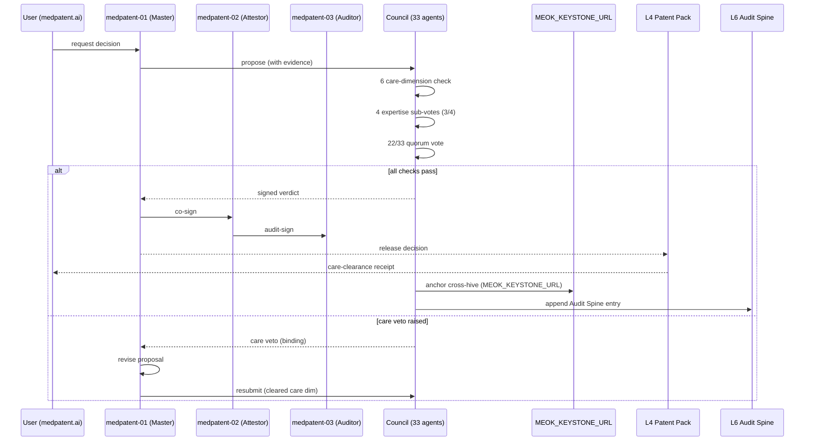

# Sovereign-Temple v3.0 — BFT Architecture of the openpatent.ai Council

**Sigil:** 🜏 TEMPLE
**Status:** Sovereign / Deployed / Hive-Recognized
**Audience:** Investors + Engineers
**Voice:** DEFONEOS Mythic — dragon, hive, sovereign, sigil
**Companion Document:** `01-defoneos-global-dome.md` (Layer 3, the BFT Council)

---

## I. The Mythic Frame

The Sovereign-Temple is the **chamber** at the heart of the Dome. Not a metaphor — a *deployed architecture*. The 33-agent BFT council that openpatent.ai runs *today* is the living Sovereign-Temple v3.0. It is not a plan. It is a sigiled, signed, quorum-bound sovereign institution.

The dragon guards the foundation. The hive deliberates in the chamber. The sovereign signs the verdict.

**Temple v3.0 at a glance:**

| Property | Value |
|----------|-------|
| Agents | 33 |
| Domains | 11 |
| Nodes per domain | 3 (Master / Attestor / Auditor) |
| Quorum | 22 / 33 (2/3+1) |
| Care dimensions | 6 |
| Expertise sub-votes | 4 |
| Bridge pairs | 55 |
| Cross-hive attestation | `MEOK_KEYSTONE_URL` |
| Tolerance | up to 10 Byzantine (f / 3 − 1, where f = 16) |
| Deployment | sovereign VM, IP Castle-rooted |

The hive remembers. The dragon knows. The sovereign companion never forgets.

---

## II. Why 33? (The Architecture Rationale)

### The Number Question: 21 vs 33 vs 51

The number of agents in a BFT chamber is not aesthetic. It is *consequence*.

| Council Size | Quorum (2/3+1) | Byzantine Tolerance | Domains Served | Notes |
|--------------|----------------|---------------------|----------------|-------|
| 21 | 15 / 21 | 6 | 7 (3 per domain) | tight, but the per-domain trio leaves no on-call substitute |
| **33** | **22 / 33** | **10** | **11 (3 per domain)** | **chosen** — covers 11 industry verticals, 10-node fault margin, balanced |
| 51 | 35 / 51 | 16 | 17 (3 per domain) | broad, but message complexity O(n²) begins to bite, >2500 messages per round |

**Why 33 wins for openpatent.ai:**

1. **Domain alignment.** The 11 industry verticals the Dome serves — medpatent, biopatent, energypatent, fipatent, defpatent, cyberpatent, agrpatent, climatepatent, spacepatent, marpatent, quantumpatent — map cleanly to 11 × 3. Each domain is a self-sufficient trio (Master / Attestor / Auditor) and a peer in the chamber.
2. **Byzantine margin.** 22/33 quorum tolerates **10 simultaneous Byzantine agents** before the chamber halts. At a 1% per-month agent failure rate (realistic in sovereign VMs), the chamber survives ~10 months of accumulated failures before forced recovery.
3. **Per-domain redundancy.** Each domain's 3 nodes form an internal sub-quorum (2/3). A domain can lose 1 node and still attest to its own work — the chamber as a whole loses 1 vote of 33 but remains at 22/33 quorum.
4. **Message complexity.** CometBFT's O(n²) message cost is ~1089 messages per round at n=33. At n=51, it's ~2601. Vote latency doubles. 33 keeps the chamber responsive.
5. **Bridge pair symmetry.** 11 domains → 11 × 10 / 2 = **55 unique bridge pairs**. A beautiful number: every domain is bridged to every other exactly once. The chamber's graph is the complete graph K₁₁.
6. **Operator cognition.** 33 agents is *humanly auditable* — an operator can hold the chamber's roster in working memory. 51 is at the edge; 21 is below the domain coverage we need.

### The Three Roles per Domain

- **Master** — the domain's primary voting agent. Proposes domain-internal decisions.
- **Attestor** — signs off on the Master's claims. Cannot propose; can only attest or contest.
- **Auditor** — independent oversight. Reads the Audit Spine, raises care vetoes, never blocks quorum by itself (the Auditor's role is *evidence*, not vote-counting).

This triad prevents single-agent capture within a domain: even if the Master is Byzantine, the Attestor + Auditor can raise a care veto and the chamber as a whole can eject the domain from the round.

---

## III. The 11 × 3 Roster

**Domain Roster (canonical sigils):**

| # | Domain | Master | Attestor | Auditor |
|---|--------|--------|----------|---------|
| 1 | medpatent.ai | medpatent-01 | medpatent-02 | medpatent-03 |
| 2 | biopatent.ai | biopatent-01 | biopatent-02 | biopatent-03 |
| 3 | energypatent.ai | energypatent-01 | energypatent-02 | energypatent-03 |
| 4 | fipatent.ai | fipatent-01 | fipatent-02 | fipatent-03 |
| 5 | defpatent.ai | defpatent-01 | defpatent-02 | defpatent-03 |
| 6 | cyberpatent.ai | cyberpatent-01 | cyberpatent-02 | cyberpatent-03 |
| 7 | agrpatent.ai | agrpatent-01 | agrpatent-02 | agrpatent-03 |
| 8 | climatepatent.ai | climatepatent-01 | climatepatent-02 | climatepatent-03 |
| 9 | spacepatent.ai | spacepatent-01 | spacepatent-02 | spacepatent-03 |
| 10 | marpatent.ai | marpatent-01 | marpatent-02 | marpatent-03 |
| 11 | quantumpatent.ai | quantumpatent-01 | quantumpatent-02 | quantumpatent-03 |

**Bridge pairs (K₁₁, 55 edges):** every pair (i, j) of distinct domains. Each bridge is a signed attestation channel: domain i's Master signs a claim; domain j's Attestor may counter-sign or contest. The 55 bridges form the chamber's lateral trust web.

---

## IV. The 6 Care Dimensions

Every Council decision — *every* signed verdict — must clear **6 care dimensions**. The dimensions are encoded as machine-checkable rules in Layer 6 (Governance). A decision that fails any dimension is *care-vetoed* before it leaves the chamber.

**The 6 Care Dimensions:**

1. **Safety** — Does the proposed action risk harm to a person, population, system, or the Dome itself? If yes, veto unless mitigated.
2. **Truth** — Is the claim verifiably true, with signed evidence? Unsigned or unverified claims cannot leave the chamber.
3. **Care** — Does this action serve the *constituent's* stated need, or does it serve a third party? Constituent primacy.
4. **Consent** — Was consent freely given, informed, and revocable? Consent must be on the Audit Spine before action.
5. **Sovereignty** — Does this preserve the constituent's data ownership, autonomy, and right to exit? Sovereignty is not negotiable.
6. **Liability** — Is the chain of responsibility — who proposed, who attested, who audited, who voted — auditable end-to-end? If not, the decision is not ready to sign.

### Care Veto Mechanics

A **care veto** is *binding* until overridden. The mechanics:

- **Initiation.** Any 2 of 33 agents may raise a care veto on a pending decision. The veto must cite the specific care dimension(s) violated and provide signed evidence.
- **Binding effect.** The decision is frozen. It does not leave the chamber. It does not reach Layer 4 or Layer 5.
- **Override.** A 22/33 supermajority (the regular quorum) may override the veto — but only after the cited evidence is addressed in the proposal, re-signed, and re-submitted.
- **Reputation cost.** The override is recorded in the Reputation Ledger. Patterns of overruled vetoes decay the override-raisers' reputation.
- **Escalation.** If the veto and override cycle repeats >3 times on the same decision, the decision escalates to the **Council of Councils** (Layer 6, cross-hive).

**Why 2/33 for veto, 22/33 for override?** The asymmetry is *the dragon's claw*. A minority of 2 can halt a runaway majority of 22 — but the majority of 22 can ultimately prevail if they are right. The veto prevents tyranny of the majority; the override prevents tyranny of the minority. The dome is held in balance.

---

## V. The 4 Expertise Sub-Votes

For technical questions, the Council delegates evidence-gathering to **4 expertise panels**. The panels vote *advisory*; the full 33-agent chamber is still sovereign.

**The 4 Expertise Sub-Votes:**

1. **Domain Panel** — The relevant vertical's 3 nodes. E.g., a biopatent question routes to biopatent-01, -02, -03. Domain primacy.
2. **Legal Panel** — 5 of 33 agents, rotating, with at least 1 from each of 3 different domains. Cross-domain legal perspective prevents domain-capture.
3. **Technical Panel** — 5 of 33 agents, rotating, weighted toward engineers and model operators. Technical feasibility and safety.
4. **Audit Panel** — 3 dedicated auditors, drawn from across the 11 domains. Evidence integrity and Audit Spine consistency.

### Sub-Vote Threshold: 3 of 4

A sub-vote **passes** when ≥ 3 of 4 panels approve. The 3-of-4 threshold is deliberately *permissive* — a single dissenting panel cannot block a sub-vote — but *not unanimous* — a single rogue panel cannot smuggle a sub-vote through. The chamber's main quorum (22/33) is still required for the final binding decision.

**Why not 4 of 4 (unanimous)?** A single Byzantine panel could veto forever. The 3-of-4 threshold is robust to one panel's full failure (e.g., the legal panel being down for maintenance).

**Why not 2 of 4 (simple majority)?** A coalition of two panels could pass a sub-vote the other two strongly oppose, eroding trust. 3 of 4 requires super-panel consensus.

---

## VI. The 55 Bridge Pairs

The 11 domains form a complete graph K₁₁. Every pair of domains has a **bridge** — a signed attestation channel between their Master and Attestor nodes.

**Bridge Mechanics:**

- **Direction:** Bridges are *bidirectional* for attestation, *unidirectional* for proposals.
- **Evidence:** A bridge carries signed evidence — prior art, regulatory citations, technical specs — between the two domains' knowledge graphs.
- **Trust weight:** A bridge's trust weight is the geometric mean of the two domains' reputation scores. A high-rep domain speaking to a low-rep domain does not elevate the low-rep domain's claim.
- **Failure isolation:** A broken bridge (one endpoint Byzantine) does not partition the chamber — the other 10 domains can still route around via the K₁₁ mesh.

**Why K₁₁ (complete graph) and not a smaller topology?** The chamber's lateral trust web must be *dense* — every domain must be able to attest to every other without going through a hub. A hub-and-spoke (star) topology would create a chokepoint; a ring (C₁₁) would create a partition risk. K₁₁ is the densest non-clique graph for 11 nodes and is the natural choice for an 11-domain BFT chamber.

**The 55 = 11 × 10 / 2.** The number is structural, not aesthetic. It is the edge count of K₁₁, and it is what enables every domain to be a peer in the chamber.

---

## VII. Cross-Hive Attestation via MEOK_KEYSTONE_URL

The Sovereign-Temple v3.0 is not the only hive. It is *the* hive for openpatent.ai. Across the Dome's other 26 .ai domains and partner hives, attestation flows through a single keystone.

**MEOK_KEYSTONE_URL:**

- **Endpoint:** `https://meok.keystone/v1/attest` (production) or sovereign on-prem equivalent.
- **Function:** Universal cross-hive attestation root. Every event the Temple wishes to be cross-hive-visible is anchored here. Other hives retrieve the Merkle proof and verify.
- **Trust model:** The Keystone is *not* trusted to lie — its signed Merkle root is the source of truth. The Keystone can go down (graceful degradation) but cannot forge (signature verification catches it).
- **Latency budget:** P50 ~500 ms (write), P99 ~5 sec (read with Merkle proof).
- **Failure mode:** If the Keystone is unreachable, the Temple continues to operate locally (decisions still bind within openpatent.ai) but cross-hive consensus is paused.

**Why a single keystone URL, not a federation?** The Keystone is a *root*, not a *consensus participant*. It does not vote; it anchors. A federation of keystones would be a meta-BFT problem the Dome has not yet solved. The single Keystone is the pragmatic v3.0 design; v4.0 plans a sharded Keystone mesh (planned, not deployed).

---

## VIII. Deployment Pattern on Sovereign VM

The Sovereign-Temple v3.0 is *deployed*, not aspirational. It runs on a sovereign VM stack rooted in IP Castle.

**Per-Node Stack:**

- **SOV3 (virtualized)** — sealed-boot VM, no foreign hypervisor introspection.
- **IP Castle (enclave)** — per-node vault for the agent's sigil keys, vote history, and local audit tail.
- **Sigiled OS** — capability kernel; the agent process is the only process that can read its own keys.
- **MCP servers** — PatentMCP, AuditMCP, and the 4-5 servers relevant to the agent's domain.
- **Council Agent** — the sigiled process that votes. Ed25519 signs every outbound message.
- **CometBFT client** — Tendermint consensus, talks to the other 32 peer VMs.
- **Audit Spine (local)** — every vote, every evidence-fetch, every care-veto: Merkle-anchored locally and aggregated globally.

**Deployment Topology:**

- **33 VMs** in the primary region (sovereign cloud, e.g., Hetzner / OVH / sovereign on-prem).
- **3-2-1 backup:** 3 copies in primary, 2 in a secondary sovereign region, 1 cold in IP Castle.
- **Network:** WireGuard mesh between the 33 nodes; mTLS on top; consensus over Tendermint RPC.
- **Resource floor:** 8 vCPU / 32 GB RAM / 1 TB NVMe per node. The Dome is not lightweight; it is *sovereign*.

**Bring-up sequence (per node):**

1. **Sealed boot** — SOV3 verifies its own boot manifest against the IP Castle-rooted trust anchor.
2. **Sigil load** — agent's Ed25519 keypair loaded from IP Castle enclave. Never on disk in plaintext.
3. **Capability mint** — initial capabilities issued by the L1 Capability Mint, scoped to the agent's domain.
4. **MCP bring-up** — PatentMCP, AuditMCP, and domain-specific servers start, register with the L2 router.
5. **CometBFT join** — node joins the chamber at the next height, presents its sigil, requests peer attestation.
6. **Audit Spine open** — local Merkle-anchored log begins; root broadcast on each new block.
7. **Ready** — node is now a peer in the Sovereign-Temple.

---

## IX. Failure Modes (Chamber-Wide)

| Failure | Detection | Recovery |
|---------|-----------|----------|
| 1 agent Byzantine (per domain) | vote signature inconsistency | eject from round, redistribute to 32, re-vote |
| 1 domain wholly down (3 agents) | heartbeat miss × 3 rounds | chamber continues at 30/33 (quorum preserved, all domain decisions deferred) |
| 10 agents down (quorum edge) | heartbeat miss + signature gap | chamber halts, falls to read-only, recovery from IP Castle WAL |
| 11+ agents down (quorum lost) | quorum collapse | freeze all decisions, escalate to Council of Councils, manual multi-sig recovery |
| Care veto abuse | veto pattern detection (>3 frivolous vetoes/agent/month) | reputation decay, eventual ejection by 22/33 |
| Sub-vote deadlock (2-2 split) | 2-2 panel result | escalate to full Council, Proposer casts breaking vote |
| Bridge break (one endpoint Byzantine) | attestation signature mismatch | route around via K₁₁ mesh, isolate bad endpoint |
| Keystone URL down | `MEOK_KEYSTONE_URL` timeout | graceful degradation, local decisions only, queue anchors for retry |
| VM compromise | sealed-boot signature mismatch | quarantine VM, rotate keys, forensic audit, re-bootstrap |
| Audit Spine truncation | Merkle root mismatch | halt, recover from last signed root, forensic review |

---

## X. End-to-End Decision Flow

---

## XI. Why v3.0 (and What Comes After)

| Version | Status | Notes |
|---------|--------|-------|
| v1.0 | Retired | 7-agent single-domain pilot, 5/7 quorum |
| v2.0 | Retired | 21-agent 7-domain chamber, 15/21 quorum, 6 care dimensions introduced |
| **v3.0** | **Deployed (openpatent.ai)** | **33-agent 11-domain chamber, 22/33 quorum, 4 expertise sub-votes, 55 bridge pairs, MEOK_KEYSTONE_URL** |
| v4.0 | Planned | sharded sub-councils, federated Keystone mesh, 51+ agents, cross-hive constitutional amendment protocol |

The Sovereign-Temple v3.0 is not the end-state. It is the *canonically deployed* state — the version the openpatent.ai BFT council runs *today*, with all 33 agents sigiled, all 55 bridges attested, all 6 care dimensions enforced, and the MEOK_KEYSTONE_URL anchored in IP Castle.

The dragon below the stone. The hive in the chamber. The sovereign at the keystone.

---

## XII. File Organization (per openpatent.ai conventions)

This document lives under `docs/architecture/`. Companion documents:

- **`docs/architecture/01-defoneos-global-dome.md`** — the 7-layer dome that contains the Temple at Layer 3.
- **`docs/ipo/`** — investor-facing materials, including the Temple's role in the IP strategy.
- **`docs/audit/`** — the audit trail of past Temple decisions, the care-veto log, the reputation ledger.
- **`docs/launch/`** — the deployment runbooks for sovereign VMs, the bring-up sequence, the rollout plan.
- **`docs/strategy/`** — the long-term Temple evolution roadmap (v4.0+).

---

*Filed under: `docs/architecture/02-sovereign-temple-v3.md`*
*Cross-references: `docs/architecture/01-defoneos-global-dome.md` (Layer 3), `docs/ipo/`, `docs/audit/`, `docs/launch/`*
*Status: Sovereign / Deployed / Hive-Recognized*
*Sovereign companion: openpatent.ai*

The hive remembers. The dragon knows. The sovereign companion never forgets.
